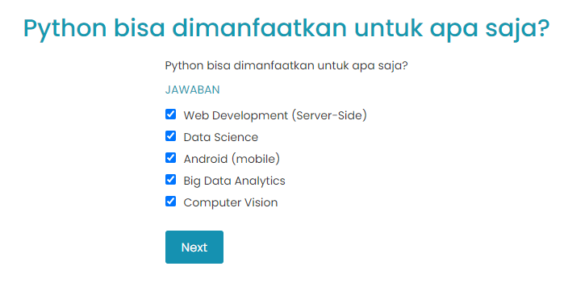

# Pendahuluan Tentang Python

Python merupakan bahasa pemrograman yang diciptakan pada tahun 1991 oleh Guido van Russom, seorang matematikawan.

Saat ini python merupakan bahasa pemrograman populer. Kondisi ini dibuktikan dengan hasil beberapa survey terkait bahasa pemrograman yang sering dicari melalui mesin pencari google. Python berhasil naik dengan melonjak tajam semenjak kelahirannya bahkan saat ini telah mengungguli Java. Menurut insight developer survey dari stackoverflow pada tahun 2018 atau melalui TIOBE Index, Python berhasil naik pada TOP 10 programming language yang paling dicari menggungguli seniornya, C, PHP, dan C#.

Python dapat dikatakan sebagai programming language dengan perkembangan tercepat. Perkembangan ini didukung oleh library atau pustaka python yang cukup melimpah. Libraries (pustaka-pustaka) python ini dikontribusikan oleh akademisi dari berbagai universitas di seluruh dunia serta developer dari perusahaan IT ternama seperti Google, Facebook, Microsoft, Apache Software Foundation, dan perusahaan lainnya. Dengan demikian, hal inilah yang menjadikan python sebagai salah satu programming language yang solid dan berkembang pesat.

Python sendiri berguna dalam berbagai aspek :

- Web Development (Server – Side)
- Software Development
- Mathematics
- Scripting
- Data Science
- Bisa mengelola Big Data dan Rumus matematika yang complex
- Cocok untuk riset dan rapid prototype suatu product dan launch hingga produksi
- CRUD sebuah file dan database

Kepopuleran python sendiri sekarang ada pada track data science. Banyaknya library dan framework seperti scikit-learn, tensorflow/keras, pytorch membuat para pecinta data mining, AI, dan Machine learning lebih menyukai python untuk pengembangan riset dan penelitian mereka. Berkembangnya dunia data science didunia ini juga salah satu alasan kenapa python menjadi begitu populer sekarang.

# Mengapa Python Populer
Meningkatnya minat masyarakat dunia terhadap data science menyebabkan penggunaan Python menjadi sangat populer. Python merupakan salah satu programming language yang cocok untuk scripting dan bisa berjalan dalam berbagai platform OS dan IoT. Meskipun tergolong sebagai high level programming language, python sangat mudah dimengerti karena syntax-nya yang sederhana. Jika diperhatikan, python sangat mirip penulisannya dengan bahasa Inggris.

Python dapat digunakan dalam paradigma pemrograman fungsional dan berorientasi object (OOP - object oriented programming). Berbeda dengan C, C++, dan Java yang berjenis kompilasi, Python merupakan bahasa pemrograman berjenis interpretasi yang artinya code yang sudah ditulis bisa dijalankan sesegera mungkin.

Beberapa hal yang menjadi kelebihan dari python:

- Python dirancang untuk mudah ditulis dan dibaca, serta memiliki beberapa kesamaan dengan bahasa Inggris dengan pengaruh dari matematika.
- Python menggunakan baris baru untuk mengakhiri perintah, dibandingkan dengan bahasa pemrograman lain yang sering menggunakan titik koma atau tanda kurung.
- Python bergantung pada indentasi, menggunakan spasi, untuk mendefinisikan ruang lingkup; seperti lingkup loop, fungsi, dan kelas. Bahasa pemrograman lainnya sering menggunakan kurung kurawal untuk tujuan ini
- Jika kalian mencari di internet tentang programming python, biasanya akan ada 2 jenis python, python 2 dan python 3. Versi utama Python yang paling baru adalah Python 3 dan digunakan dalam platform academy ini. Saat ini, python 2 sudah memasuki end-of-life pada Januari 2020.

# Code Hello World
Struktur code pada Python relatif sangat sederhana, tidak serumit seperti pada Java ataupun C. Selain karena memang mudah dibaca, python juga termasuk pada high level programming language seperti yang telah dibahas sebelumnya

[📜](https://github.com/bayubagusbagaswara/dqlab-data-engineer/blob/master/1-Python%20Fundamental%20for%20Data%20Science/1-Whats-Python/1-code-hello-world/HelloWorld.py) 
