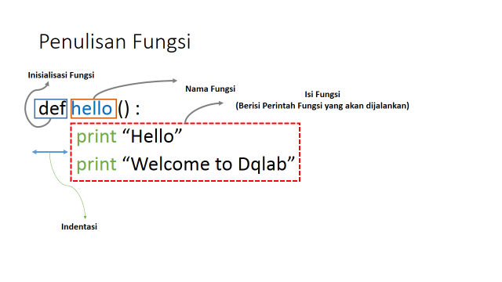
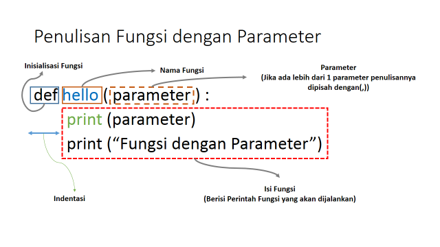
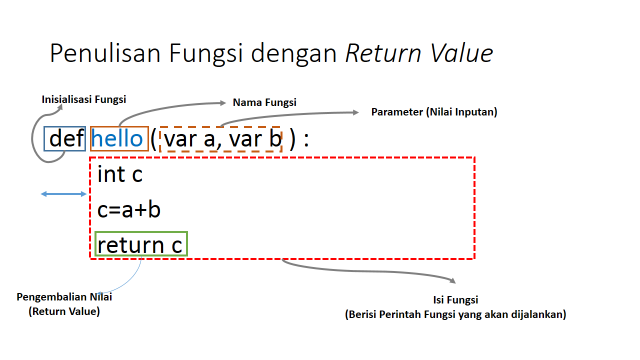

# Pendahuluan
Pada pembuatan program yang kompleks dan memiliki banyak fitur, kita diharuskan menggunakan fungsi. Hal ini bertujuan supaya kita tidak kesulitan untuk menulis kode programnya. Kesulitan ini bisa muncul karena banyak kode yang harus ditulis. Seiring berjalannya waktu, kode bisa menjadi sulit dibaca dan dirawat (maintenance).

Dalam hal ini, fungsi dapat dianalogikan sebagai sebuah perangkat untuk tujuan tertentu. Perangkat dengan tujuan tertentu ini merupakan fitur dari program kita yang dapat dipanggil kapanpun sesuai dengan kebutuhan. Untuk membuat sebuah fungsi perlu didasari pada tujuan tertentu apa yang akan dihasilkan oleh fitur program kita.

Dengan demikian, sebuah fungsi ini bersifat reusable atau dapat digunakan secara berulang. Di samping itu, penggunaan fungsi membuat program menjadi lebih terstruktur dan mudah dirawat.

# Membuat fungsi sendiri
Fungsi pada Python, dibuat dengan kata kunci def  kemudian diikuti dengan nama fungsinya.

|Code 	|               Title              	|
|:----:	|:--------------------------------:	|
| [📜](https://github.com/bayubagusbagaswara/dqlab-data-engineer/blob/master/1-Python%20Fundamental%20for%20Data%20Science/5-Function/1-membuat-fungsi-sendiri/Function.py) | Membuat Fungsi |

# Parameter pada fungsi
Sekarang, bagaimana kalau kita ingin memberikan input nilai ke dalam fungsi? Kita bisa menggunakan parameter. Parameter adalah variabel yang menampung nilai untuk diproses kedalam suatu fungsi.

|Code 	|               Title              	|
|:----:	|:--------------------------------:	|
| [📜](https://github.com/bayubagusbagaswara/dqlab-data-engineer/blob/master/1-Python%20Fundamental%20for%20Data%20Science/5-Function/2-parameter-pada-fungsi/FunctionParameter.py) | Parameter pada Fungsi |

# Fungsi dengan Return Value
Fungsi yang tidak mengembalikan nilai biasanya disebut dengan prosedur. Namun, kadang kita butuh hasil proses dari fungsi untuk digunakan pada proses berikutnya. Maka fungsi harus mengembalikan nilai dari hasil pemrosesannya. Cara mengembalikan nilai adalah menggunakan kata kunci return lalu diikuti dengan nilai atau variabel yang akan dikembalikan.

|Code 	|               Title              	|
|:----:	|:--------------------------------:	|
| [📜](https://github.com/bayubagusbagaswara/dqlab-data-engineer/blob/master/1-Python%20Fundamental%20for%20Data%20Science/5-Function/3-fungsi-return-value/FunctionReturnValue.py) | Fungsi Return Value |