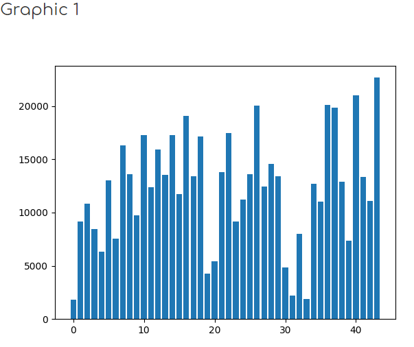
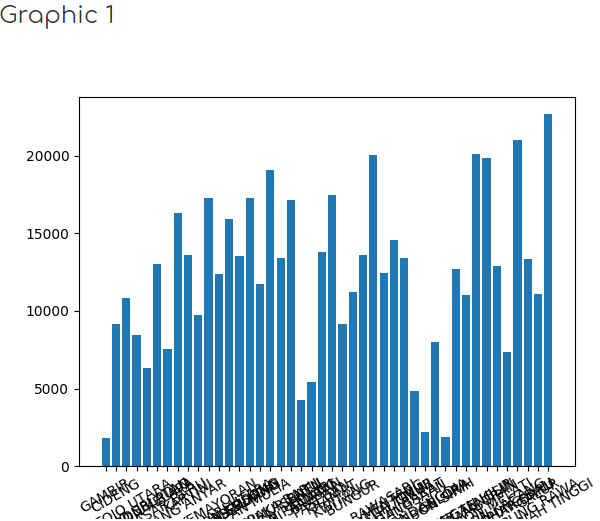
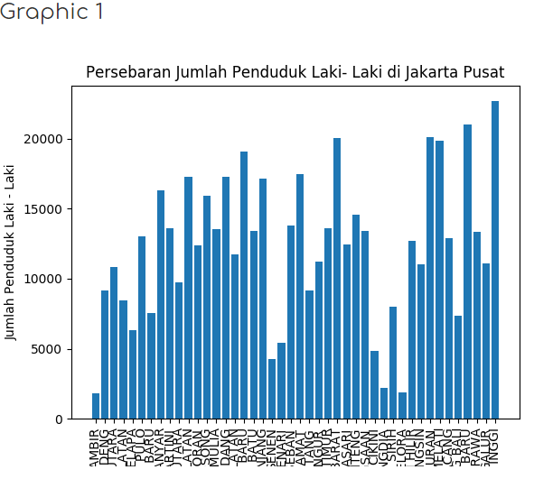

# Pendahuluan
Grafik merupakan salah satu perangkat visualisasi. Visualisasi sendiri sudah menjadi salah satu challenge atau poin penting dalam data science. Selain bisa mempermudah seseorang untuk memahami data, visualisasi bisa meningkatkan analisa atau memunculkan knowledge yang tidak sempat terekspos ketika tidak menggunakan visualisasi. Pada sesi kali ini, kita akan menggunakan matplotlib untuk melakukan visualisasi data yang sudah ada.

# Bar Chart
Sebelum masuk pada membuat grafik bar, kita akan membahas library yang akan gunakan. Python punya banyak library untuk visualisasi. Salah satu yang paling sering digunakan adalah matplotlib karena memang sudah ada sejak lama dan relatif stabil dalam perkembangannya. Maka dari itu, matplotlib dipilih untuk belajar visualisasi pada sesi kali ini.

Matplotlib sendiri menyediakan banyak jenis grafik mulai dari scatter/plot, line, bar, dan lain-lain. Pada praktik ini, akan ada tambahan library selain dengan menggunakan matplotlib dan pandas, yaitu menggunakan numpy. Numpy sendiri pada praktek kali ini digunakan untuk melakukan manipulasi data dari csv untuk memudahkan visualisasi.

|Code 	|               Title              	|
|:----:	|:--------------------------------:	|
| [📜](https://github.com/bayubagusbagaswara/dqlab-data-engineer/blob/master/1-Python%20Fundamental%20for%20Data%20Science/8-Grafik-Dasar-dengan-Matplotlib/1-bar-chart/BarChart.py) | Bar Chart |

# Parameter dalam Grafik (Memberikan Nilai Axis dari data CSV)
Jika ditelisik lebih dalam pada CSV, dari sana ada nama kelurahan yang merupakan variabel atau seharusnya menjadi nilai AXIS pada grafik ini. Di praktek kali ini, kita akan mencoba bagaimana menempatkan nama kelurahan pada grafik.

|Code 	|               Title              	|
|:----:	|:--------------------------------:	|
| [📜](https://github.com/bayubagusbagaswara/dqlab-data-engineer/blob/master/1-Python%20Fundamental%20for%20Data%20Science/8-Grafik-Dasar-dengan-Matplotlib/2-parameter-dalam-grafik/ParameterDalamGrafik.py) | Parameter dalam Grafik |

# Menambah Title dan Label pada Grafik
Pada implementasi grafik, pemberian label pada AXIS dan Ordinat sangat penting untuk menjelaskan maksud grafik. Pada praktik kali ini, kita akan mencoba memberikan label dan title pada grafik yang telah dibuat sebelumnya.

|Code 	|               Title              	|
|:----:	|:--------------------------------:	|
| [📜](https://github.com/bayubagusbagaswara/dqlab-data-engineer/blob/master/1-Python%20Fundamental%20for%20Data%20Science/8-Grafik-Dasar-dengan-Matplotlib/3-menambah-title-dan-label/AddTitleAndLabel.py) | Menambahkan Title dan Lable |

