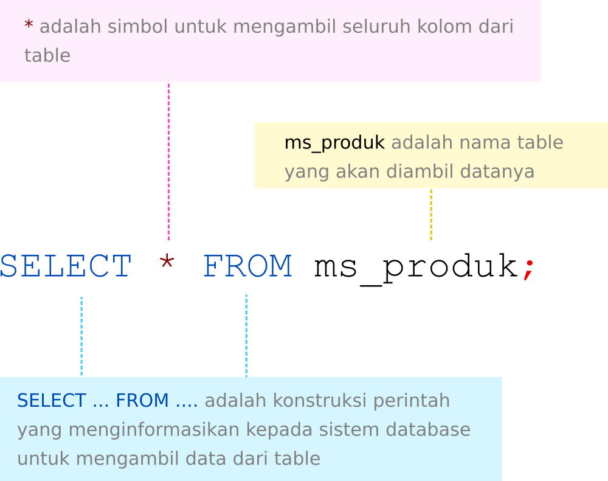
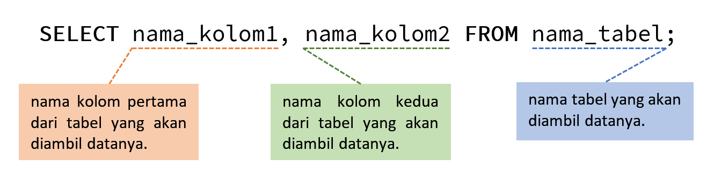
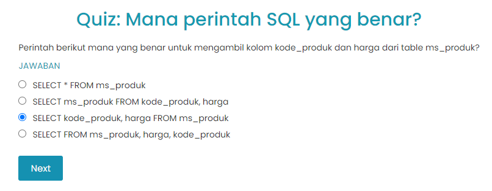
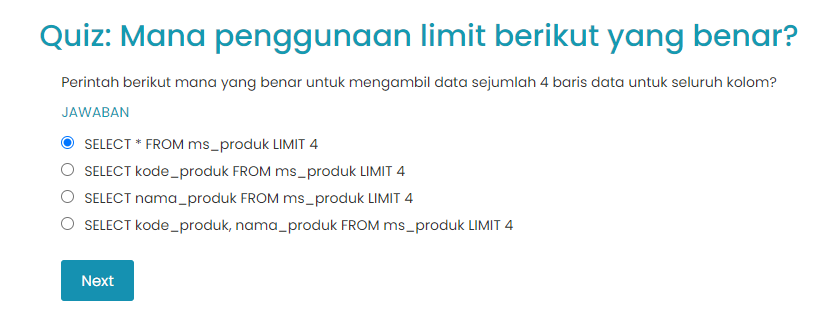

# Pendahuluan

Kalau mau pakai perintah SELECT untuk akses data, lebih baik belajarnya langsung praktik.

# Mengambil Seluruh Kolom dalam suatu Tabel

“Untuk mengakses data di database, kita dapat menggunakan SELECT statement. Pada SELECT statement kita menyatakan kolom - kolom mana saja yang ingin kita tampilkan dari suatu tabel di database. SELECT statement tidak berdiri sendiri. Setelah menyatakan kolom - kolom yang ingin ditampilkan, kita melanjutkan dengan FROM. Di FROM inilah kita menyatakan dari tabel mana data yang ingin kita tampilkan berada. SELECT… FROM… adalah statement paling sederhana di SQL, dan merupakan bagian utama dari query. Kita tidak bisa meng-query data tanpa menggunakan statement ini,” jelas Senja.

Senja juga menunjukkan padaku Query dasar dan sederhana perintah SELECT yang berfungsi untuk menampilkan seluruh kolom, sebagai berikut:

- Kata awal, yaitu SELECT digunakan untuk menginformasikan kepada sistem bahwa kita ingin mengambil data. 
- Tanda * (bintang) artinya seluruh kolom perlu diambil dari tabel yang dirujuk. Tanda ini sering juga disebut sebagai wildcard.
- FROM [NAMA_TABLE], artinya table yang akan diambil datanya.
- Tanda ; (titik koma) adalah tanda yang menyatakan akhir dari perintah SELECT atau SQL lain.

|Code 	|               Title              	|
|:----:	|:--------------------------------:	|
| [📜](https://github.com/bayubagusbagaswara/dqlab-data-engineer/blob/master/2-Fundamental%20SQL%20using%20SELECT%20Statement/3-Penggunaan%20Perintah%20SELECT%20...%20FROM/1-memanggil-seluruh-kolom.sql) | Mengambil Seluruh Kolom |

# Mengambil Satu Kolom dari Tabel
Aku sudah cukup paham dengan penjelasan Senja tadi. Tapi, masih ada satu yang mengganjal. “Bagaimana kalau aku hanya ingin menampilkan satu kolom saja dari suatu tabel/data, Nja?”

“Secara umum penggunaan perintah SELECT untuk mengambil satu kolom dinyatakan oleh sintaks berikut ini,” ujar Senja sambil menggeser layar laptopnya agar bisa kuperhatikan:

“Kita coba ya dengan menampilkan data pelanggan yang ada di database. Kita sudah menggunakan perintah SELECT sebelumnya untuk mengambil seluruh kolom. Nah, berikut adalah contoh query untuk mengambil satu kolom saja yaitu nama_produk,” tambah Senja.

|Code 	|               Title              	|
|:----:	|:--------------------------------:	|
| [📜](https://github.com/bayubagusbagaswara/dqlab-data-engineer/blob/master/2-Fundamental%20SQL%20using%20SELECT%20Statement/3-Penggunaan%20Perintah%20SELECT%20...%20FROM/2-mengambil-satu-kolom.sql) | Mengambil Satu Kolom |

# Mengambil Lebih dari Satu Kolom dari Tabel

Tabel ms_produk memiliki lebih dari satu kolom data. Kalau aku ingin mengambil kolom lainnya, aku hanya perlu menuliskan tiap kolom yang ingin ditampilkan dipisahkan dengan tanda koma, seperti contoh berikut untuk dua kolom.

|Code 	|               Title              	|
|:----:	|:--------------------------------:	|
| [📜](https://github.com/bayubagusbagaswara/dqlab-data-engineer/blob/master/2-Fundamental%20SQL%20using%20SELECT%20Statement/3-Penggunaan%20Perintah%20SELECT%20...%20FROM/3-mengambil-lebih-dari-satu-kolom.sql) | Mengambil Lebih dari Satu Kolom |

# Membatasi Pengambilan Jumlah Row Data

Selain pembatasan kolom, aku bisa membatasi jumlah baris data yang diambil. Seperti yang aku pelajari di materi RDMS sebelumnya, bahwa untuk tiap produk RDBMS, caranya agak berbeda-beda. Untuk MySQL dan PostgreSQL, aku dapat menggunakan LIMIT. Secara umum syntaxnya dinyatakan sebagai berikut

|Code 	|               Title              	|
|:----:	|:--------------------------------:	|
| [📜](https://github.com/bayubagusbagaswara/dqlab-data-engineer/blob/master/2-Fundamental%20SQL%20using%20SELECT%20Statement/3-Penggunaan%20Perintah%20SELECT%20...%20FROM/4-membatasi-pengambilan-jumlah-row-data.sql) | Membatasi Pengambilan Jumlah Row Data |

# Penggunaan SELECT DISTINCT statement

Untuk menghilangkan data duplikasi, aku bisa menggunakan SELECT DISTINCT statement. Dengan SELECT DISTINCT, data yang sama atau duplikat akan dieliminasi dan akan ditampilkan data yang unik saja.

|Code 	|               Title              	|
|:----:	|:--------------------------------:	|
| [📜](https://github.com/bayubagusbagaswara/dqlab-data-engineer/blob/master/2-Fundamental%20SQL%20using%20SELECT%20Statement/3-Penggunaan%20Perintah%20SELECT%20...%20FROM/5-select-distinct.sql) | Select Distinct |

# Kesimpulan
Aku mengambil catatanku, dan mulai menulis apa yang aku pelajari, sebelum aku melanjutkan belajarku:

- Perintah SELECT dapat digunakan untuk menentukan apa saja kolom yang akan diambil dengan menuliskan nama-nama kolom yang diinginkan menggunakan pemisah tanda koma.
- Perintah SELECT juga dapat digunakan untuk membatasi jumlah data yang dikeluarkan. Namun untuk berbagai produk bisa berbeda penulisannya. MySQL menggunakan LIMIT untuk tujuan tersebut.
- Perintah SELECT DISTINCT dapat digunakan untuk menghilangkan duplikasi baris dalam tabel dan hanya menampilkan baris data yang unik tanpa duplikasi.