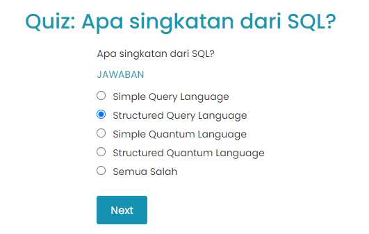
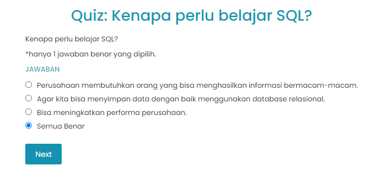

# Apa itu SQL?
SQL yang merupakan singkatan dari Structured Query Language, yaitu bahasa komputer standar yang digunakan untuk berinteraksi dengan suatu sistem database - atau lebih tepatnya sistem manajemen database relasional. Jadi, user dapat menambahkan, mengubah, mengupdate, mencari dan menghapus data dari suatu sistem database dengan menggunakan SQL.

SQL dilafalkan dengan membaca tiap karakternya S Q L (es kiu el) atau sikuel.

# Quiz 



# Contoh komunikasi SQL
Terdapat dua kategori dari interaksi SQL: 

Data Definition Language (DDL), yaitu berbagai perintah yang berfungsi lebih kepada memanipulasi struktur database, seperti Membuat (CREATE), meubah (ALTER), dan menghapus (DROP) struktur penyimpanan data, yaitu database, table, kolom dan tipe data.
Data Manipulation Language (DML), yaitu berbagai perintah yang digunakan untuk Menyisipkan data (INSERT), Mengambil data atau query (SELECT), Meubah data (UPDATE) dan Menghapus data (DELETE).

Berikut adalah satu contoh query atau perintah untuk mengambil data:

```bash
SELECT nama_produk FROM ms_produk;
``` 

Dengan perintah tersebut, sistem database akan mengerti bahwa ‘dia’ harus menampilkan data ‘nama_produk’ dari suatu tabel yang namanya ‘ms_produk’ seperti berikut.

```bash
nama_produk                        
------------------------------------
Kotak Pensil DQLab                 
Flashdisk DQLab 64 GB              
Gift Voucher DQLab 100rb           
Flashdisk DQLab 32 GB              
Gift Voucher DQLab 250rb           
Pulpen Multifunction + Laser DQLab 
Tas Travel Organizer DQLab         
Gantungan Kunci DQLab              
Buku Planner Agenda DQLab          
Sticky Notes DQLab 500 sheets      
```

Terlihat ada sepuluh nama peralatan kantor dengan label DQLab yang ditampilkan. Ini menunjukkan bahwa interaksi antara SQL dan sistem database telah berjalan dengan baik.

# Mengapa Perlu Belajar SQL?

“Pada dasarnya, setiap perusahaan memiliki sistem penyimpanan data, khususnya untuk perusahaan yang memiliki sistem IT. Sistem penyimpanan ini bukan di komputer atau laptop dalam bentuk file atau folder, tetapi di suatu sistem database. Nah, sistem database ini biasanya diakses menggunakan SQL. Sebagai analyst, tugas kita tidak hanya menganalisa data yang sudah tersedia tetapi juga mampu untuk mengambil, memodifikasi dan mengakses sendiri data tersebut dari sumber datanya, yaitu dari database” 

- Manajemen memerlukan laporan dengan informasi yang semakin beragam, seperti: tren penjualan bulan ke bulan, pertumbuhan pelanggan, apakah perusahaan mencapai target, dan lain-lain. Dan ini membutuhkan keahlian SQL yang mumpuni.
- Programmer yang membangun sistem aplikasi hampir dipastikan selalu bergantung kepada sistem database SQL agar aplikasinya berjalan dengan baik. Dengan demikian, penguasaan SQL adalah hal mutlak.
- Bisa meningkatkan kinerja perusahaan karena informasi yang kaya dapat dihasilkan melalui SQL.

# Quiz



# Dimana saja SQL Digunakan?
Perusahaan – perusahaan yang sudah menerapkan sistem IT pasti memiliki sistem database dan bisa dipastikan menyimpan datanya dalam suatu database. Contohnya perusahaan berbasis teknologi, seperti e-commerce, menyimpan data baik itu data profile user, data transaksi pembelian dan penjualan, data produk dan data traffic kunjungan user ke halaman website di sistem database - atau lebih tepatnya sistem manajemen database atau database management system (DBMS).

Semua informasi ataupun analisa yang dibutuhkan oleh manajemen, umumnya bersumber dan diolah dari data DBMS ini. Dan di perusahaan, sistem database biasanya tidak hanya satu, bisa dua, tiga bahkan puluhan. Oleh karena itu, SQL sangat berperan disini, karena dengan menggunakan SQL dapat memenuhi kebutuhan manajemen tersebut. Tanpa penguasaan SQL  akan kesulitan memperoleh data yang dibutuhkan, dan akan kesulitan dalam melakukan analisa dan menghasilkan informasi yang dibutuhkan manajemen dan perusahaan.

Akan tetapi, perlu diketahui bahwa tidak semua sistem database mendukung SQL. Hanya sistem database berbasis relational database management system (RDBMS) yang mendukung bahasa ini. Untuk RDBMS sendiri akan dijelaskan kemudian.

```
SQL hanya digunakan di sistem database berbasis Relational Database Management System.
```

# Kesimpulan
SQL singkatan dari Structured Query Language, adalah sebuah bahasa komputer sederhana yang menjadi standar untuk memungkinkan seseorang berkomunikasi dengan suatu sistem database manajemen relasional (RDBMS).

Karena RDBMS bisa dikatakan digunakan oleh sistem IT oleh seluruh perusahaan di dunia dan di Indonesia, maka pengetahuan SQL menjadi aset yang penting di perusahaan. Walaupun sederhana, aspek SQL sangat luas.
