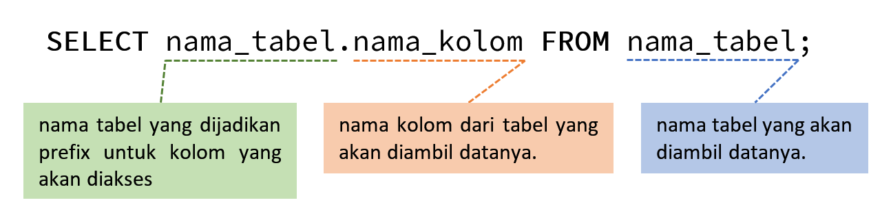
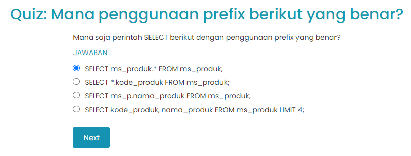
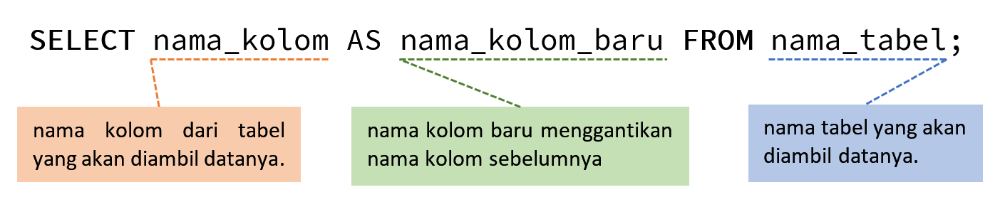
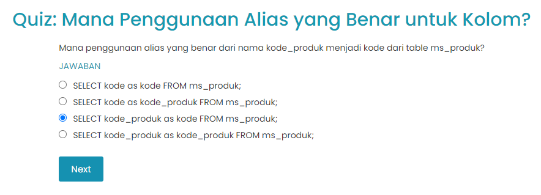
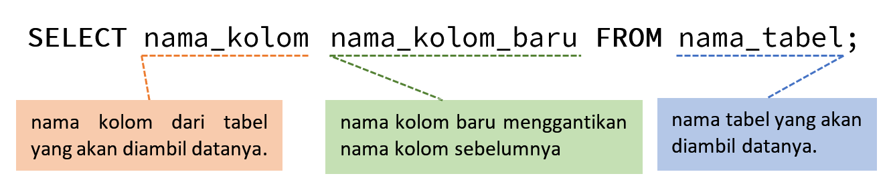
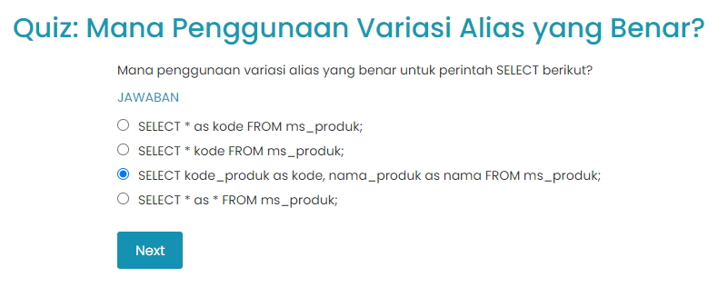
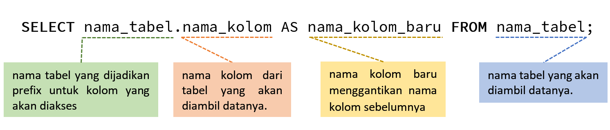
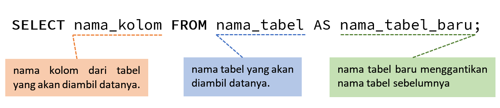
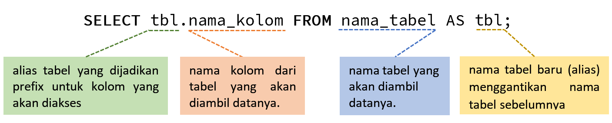
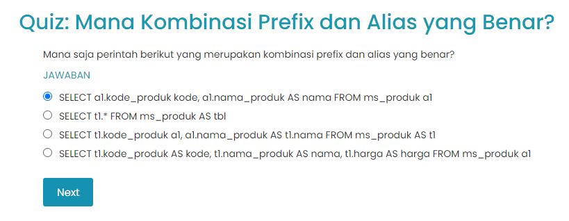

# Pendahuluan

- Prefix, dimana kita akan menambahkan nama tabel di depan nama kolom.
- Alias, dimana kita memberikan alias atau nama lain untuk tabel maupun kolom.

# Menggunakan Prefix pada Nama Kolom

Pertama, kita mulai dengan menggunakan prefix pada kolom. Pada dasarnya, penulisan nama kolom yang lengkap perlu mencantumkan nama tabel di depan nama kolom tersebut, dengan tanda penyambung berupa tanda titik. Umumnya, jika kita hanya mengambil kolom dari satu tabel, prefix ini jarang digunakan karena sudah jelas dari tabel mana kolom itu berasal. Tetapi ketika kita mengambil data dari dua tabel, misalnya dengan menggabungkan 2 tabel menggunakan JOIN, dan terdapat 2 kolom dengan nama yang sama, maka penggunaan prefix menjadi penting untuk menghindari error karena ambiguitas.

Penggunaan nama lengkap prefix ini akan sangat berguna ketika ingin mengidentifikasi data dari beberapa tabel, yang akan dipelajari pada course SQL untuk topik JOIN.

Tugas:
Gantilah seluruh code yang ada pada code editor dengan perintah SELECT untuk menampilkan kolom kode_produk dari tabel ms_produk dengan penulisan menggunakan prefix nama tabel.

|Code 	|               Title              	|
|:----:	|:--------------------------------:	|
| [📜](https://github.com/bayubagusbagaswara/dqlab-data-engineer/blob/master/2-Fundamental-SQL-using-SELECT-Statement/4-Prefix-dan-Alias/PrefixPadaNamaKolom.sql) | Prefix pada Nama Kolom |

# Quiz

# Menggunakan Alias pada Kolom

Selain prefix, aku dapat mengubah identitas nama kolom yang diambil dengan SELECT dengan menggunakan keyword AS. Ini dinamakan alias. Perubahan nama tabel bersifat temporary, artinya hanya berubah ketika mengambil/meng-query data, sedangkan nama kolom di tabel dalam database tidak akan berubah.

Catatan: alias tidak bisa digunakan untuk wildcard (*)

Tugas:
Coba ubah perintah SELECT di atas untuk mengubah nama kolom dengan details berikut:
- no_urut menjadi nomor.
- nama_produk menjadi nama.

|Code 	|               Title              	|
|:----:	|:--------------------------------:	|
| [📜](https://github.com/bayubagusbagaswara/dqlab-data-engineer/blob/master/2-Fundamental-SQL-using-SELECT-Statement/4-Prefix-dan-Alias/AliasPadaKolom.sql) | Alias pada Kolom |

# Quiz

# Menghilangkan Keyword 'AS'
Keyword AS yang digunakan sebagai penanda alias pada kolom dapat dihilangkan dengan syntax:

Tugas:
Ubah nama kolom dari tabel ms_produk tanpa menggunakan Alias:
- no_urut menjadi nomor.
- nama_produk menjadi nama.

|Code 	|               Title              	|
|:----:	|:--------------------------------:	|
| [📜](https://github.com/bayubagusbagaswara/dqlab-data-engineer/blob/master/2-Fundamental-SQL-using-SELECT-Statement/4-Prefix-dan-Alias/MenghilangkanKeywordAs.sql) | Menghilangkan Keyword AS |

# Quiz 

# Menggabungkan Prefix dan Alias

Prefix dan alias juga dapat digunakan secara bersamaan.

Tugas:
Tampilkan kolom harga dari tabel ms_produk dengan nama alias harga_jual lengkap dengan prefix.

|Code 	|               Title              	|
|:----:	|:--------------------------------:	|
| [📜](https://github.com/bayubagusbagaswara/dqlab-data-engineer/blob/master/2-Fundamental-SQL-using-SELECT-Statement/4-Prefix-dan-Alias/MenggabungkanPrefixDanAlias.sql) | Menggabungkan Prefix dan Alias |

# Menggunakan Alias pada Tabel
Selain kolom, nama alias juga bisa digunakan untuk tabel dengan menggunakan keyword AS setelah nama tabel. Dan, keyword ini juga bisa digunakan atau tidak. Umumnya penggunaan alias pada tabel jika nama tabel tersebut cukup panjang dan muncul atau dirujuk beberapa kali dalam query. Sehingga dengan menggunakan alias pada tabel, dapat menghemat waktu dalam menuliskan query, khususnya untuk query yang cukup rumit, panjang dan melibatkan banyak tabel.

Penulisannya adalah sebagai berikut.

Tugas:
Ganti nama tabel ms_produk menjadi t2 dan tampilkan seluruh isinya tanpa menggunakan keyword AS.

|Code 	|               Title              	|
|:----:	|:--------------------------------:	|
| [📜](https://github.com/bayubagusbagaswara/dqlab-data-engineer/blob/master/2-Fundamental-SQL-using-SELECT-Statement/4-Prefix-dan-Alias/AliasPadaTable.sql) | Alias pada Table |

# Prefix dengan Alias Tabel

Penggunaan nama original tabel sebagai prefix akan menimbulkan error saat query dijalankan karena dengan penggunaan alias, nama tabel secara temporary sudah di-gantikan oleh alias.

Tugas:
Gantilah perintah pada code editor dengan nama alias t2 - tanpa menggunakan keyword AS - untuk tabel ms_produk dan menampilkan kolom nama_produk dan harga, lengkap dengan prefix alias.

|Code 	|               Title              	|
|:----:	|:--------------------------------:	|
| [📜](https://github.com/bayubagusbagaswara/dqlab-data-engineer/blob/master/2-Fundamental-SQL-using-SELECT-Statement/4-Prefix-dan-Alias/PrefixDenganAliasTable.sql) | Prefix dengan Alias pada Table |

# Quiz

# Kesimpulan
Aku kembali mengambil catatanku dan menuliskan apa yang telah aku pelajari:

Perintah SELECT dapat ditulis dengan variasi identitas kolom dan tabel berupa prefix dan alias.
- Penulisan lengkap untuk nama kolom adalah prefix berupa nama tabel disertai tanda titik sebelum nama kolom itu sendiri.
- Alias adalah nama lain yang diberikan untuk kolom maupun tabel.
- Alias dapat digunakan dengan keyword AS atau tanpa keyword AS setelah nama kolom dan tabel.
- Prefix nama tabel bisa menggunakan alias.

Pemahaman mengenai prefix dan alias akan mendorong kemampuan identifikasi tabel maupun kolom yang terlibat untuk perintah SELECT yang lebih kompleks.