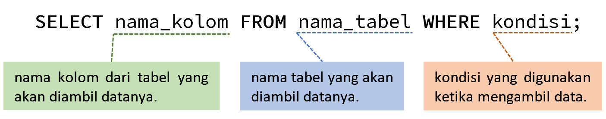
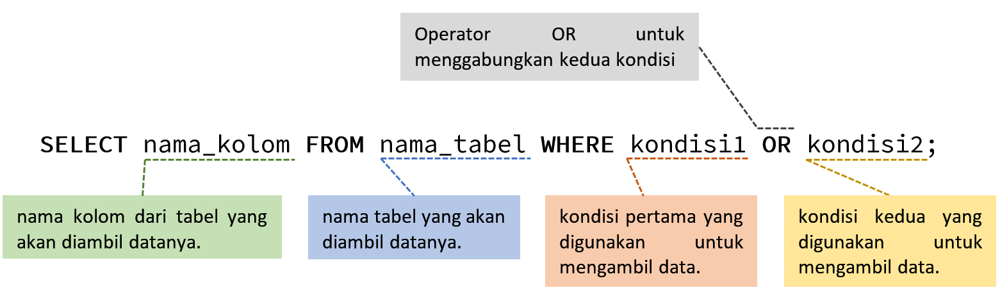
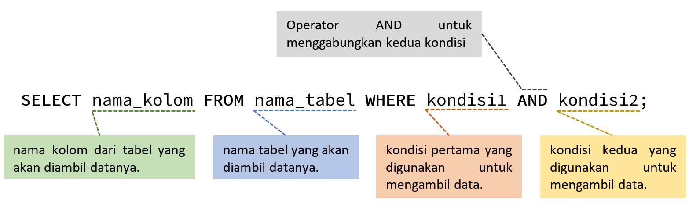
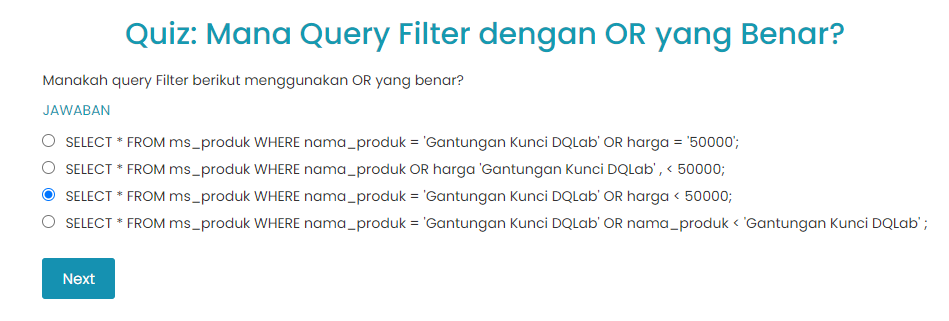
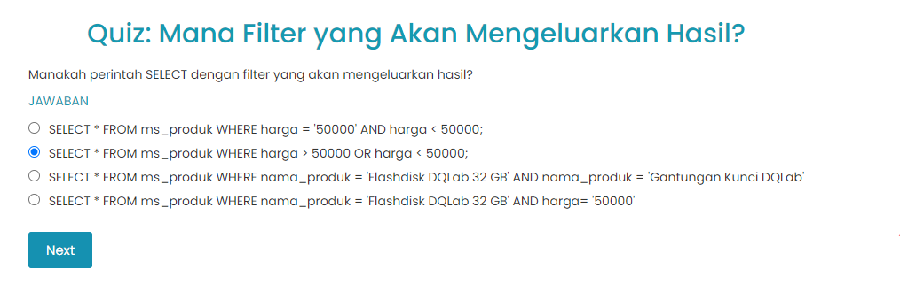

# Pendahuluan

Terkadang kita hanya ingin menampilkan data berdasarkan kondisi tertentu, jadi kita tidak butuh semua data dari tabel. Kalau seperti itu, berarti kita hanya ingin mengambil data produk dengan nama produk tertentu.

Untuk case dimana kita ingin mengambil data berdasarkan kondisi tertentu saja, kita bisa menggunakan filter. SQL memiliki fungsi filter dengan menggunakan klausul WHERE. Jika kondisi WHERE terpenuhi, maka hasil query hanya akan menampilkan data yang sudah terfilter.

Klausul WHERE untuk:
- Filter data dengan kondisi teks tertentu.
- Filter data dengan nilai angka tertentu.
- Filter data dengan dua kondisi menggunakan operator AND dan OR.

# Menggunakan WHERE
Klausul WHERE dari SELECT digunakan untuk memfilter data berdasarkan kondisi tertentu. Untuk syntax lengkapnya adalah sebagai berikut.

Tugas:
Cobalah ubah perintah SELECT pada code editor untuk mengeluarkan data dengan nama_produk bernilai 'Tas Travel Organizer DQLab'. 

|Code 	|               Title              	|
|:----:	|:--------------------------------:	|
| [📜](https://github.com/bayubagusbagaswara/dqlab-data-engineer/blob/master/2-Fundamental%20SQL%20using%20SELECT%20Statement/5-Menggunakan%20Filter/1-menggunakan-where.sql) | Menggunakan Where |

# Menggunakan Operand OR
Pada subbab sebelumnya, aku telah menggunakan filter teks sederhana untuk mengeluarkan data masing-masing dengan nama_produk 'Gantungan Kunci DQLab' dan 'Tas Travel Organizer DQLab'.

Pertanyaannya, bagaimana jika ingin mengeluarkan keduanya sekaligus? Aku bisa menggunakan Operand OR.

Untuk memunculkan hasil query yang memuat data produk dengan nama_produk 'Gantungan Kunci DQLab' dan 'Tas Travel Organizer DQLab', aku dapat menggunakan logika sederhana, yaitu: Aku perlu mengambil data dengan kondisi nama_produk itu bernilai 'Gantungan Kunci DQLab' ATAU 'Tas Travel Organizer DQLab'. Logika ini bisa dinotasikan dengan menggunakan logika OR.

Sehingga, dengan menggunakan logika OR, aku dapat menggabungkan dua atau lebih kondisi untuk memfilter data.

Tugas:
Tambahkan nama_produk 'Flashdisk DQLab 64 GB' ke dalam tabel.

|Code 	|               Title              	|
|:----:	|:--------------------------------:	|
| [📜](https://github.com/bayubagusbagaswara/dqlab-data-engineer/blob/master/2-Fundamental%20SQL%20using%20SELECT%20Statement/5-Menggunakan%20Filter/2-operand-or.sql) | Operand OR |

# Filter untuk Angka
Sebelumnya, aku telah melakukan filtering untuk teks, namun WHERE tidak terbatas untuk tipe data teks saja tapi malah umumnya untuk angka.

Tugas:
Tampilkan informasi dengan harga diatas 50000.

|Code 	|               Title              	|
|:----:	|:--------------------------------:	|
| [📜](https://github.com/bayubagusbagaswara/dqlab-data-engineer/blob/master/2-Fundamental%20SQL%20using%20SELECT%20Statement/5-Menggunakan%20Filter/3-filter-untuk-angka.sql) | Filter untuk Angka |

# Menggunakan Operand AND
Jika sebelumnya aku mempelajari Operand OR, aku juga bisa menggunakan operand AND agar dua atau lebih kondisi terpenuhi semuanya. Jika salah satu kondisi tidak terpenuhi, data tidak akan diambil. Secara umum syntaxnya diilustrasikan berikut ini

Tugas:
Cobalah ganti kondisi contoh di atas dimana harga menjadi lebih kecil dari 50000, dengan nama_produk yang sama.

|Code 	|               Title              	|
|:----:	|:--------------------------------:	|
| [📜](https://github.com/bayubagusbagaswara/dqlab-data-engineer/blob/master/2-Fundamental%20SQL%20using%20SELECT%20Statement/5-Menggunakan%20Filter/4-operand-and.sql) | Operand And |

# Kesimpulan
Wah, semakin seru saja nih belajar SQL! Sebelum aku lupa, aku mencatat apa yang aku pelajari tadi. Siapa yang punya kebiasaan seperti aku? Dengan mencatat apa yang aku pelajari, aku merasa ilmu yang aku pelajari tadi lebih mudah untuk aku pahami.

1. Filter di SQL diimplementasikan dengan menggunakan WHERE diikuti dengan satu atau lebih kondisi logis.
2. Kondisi logis ini memiliki format nama kolom diikuti dengan nilai yang akan difilter. Untuk teks sederhana bisa menggunakan tanda sama dengan, sedangkan untuk nilai angka bisa menggunakan operator perbandingan matematika.
3. Aku juga bisa menggunakan operand OR dan AND untuk menggabungkan beberapa kondisi menjadi satu kondisi baru yang harus terpenuhi untuk pengambilan data.