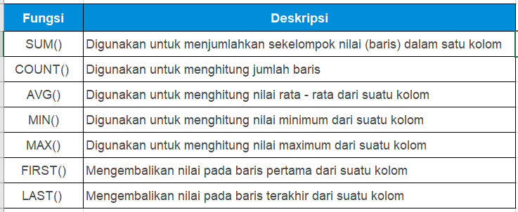

# Fungsi Aggregate
“Aksara, sepertinya aku lupa menunjukkan tabel fungsi aggregate padamu. Sebentar.”

Aku mengalihkan perhatianku dari layar laptop dan mendorong bangku mendekati Senja. “Ya?”

“Seperti yang sudah dijelaskan bahwa fungsi aggregate ini digunakan untuk melakukan perhitungan pada sekelompok nilai. Biar lebih jelas kita akan mempraktikkan penggunaan fungsi aggregate di SQL dengan menggunakan fungsi - fungsi aggregate yang umum digunakan. Tapi sebelumnya, kamu simak saja dulu tabel fungsinya ini.”




# Fungsi Aggregate - SUM()
Fungsi Aggregate SUM()

Syntax: 
```bash
SELECT SUM(ColumnName)  
FROM TableName; 
```

| Code  |               Title              	|
|:----:	|:--------------------------------:	|
| [📜](https://github.com/bayubagusbagaswara/dqlab-data-engineer/blob/master/3-Fundamental%20SQL%20Using%20FUNCTION%20and%20GROUP%20BY/3-Fungsi%20Aggregate%20dan%20Group%20By/1-SUM.sql) | Fungsi SUM |

# Fungsi Aggregate - COUNT()
Fungsi Aggregate COUNT()

Syntax: 
```bash
SELECT COUNT(ColumnName)  
FROM TableName;
```

| Code  |               Title              	|
|:----:	|:--------------------------------:	|
| [📜](https://github.com/bayubagusbagaswara/dqlab-data-engineer/blob/master/3-Fundamental%20SQL%20Using%20FUNCTION%20and%20GROUP%20BY/3-Fungsi%20Aggregate%20dan%20Group%20By/2-COUNT.sql) | Fungsi COUNT |

# Fungsi Aggregate - AVG( )
Fungsi Aggregate AVG()

Syntax: 
```bash
SELECT AVG(ColumnName)  
FROM TableName; 
```

| Code  |               Title              	|
|:----:	|:--------------------------------:	|
| [📜](https://github.com/bayubagusbagaswara/dqlab-data-engineer/blob/master/3-Fundamental%20SQL%20Using%20FUNCTION%20and%20GROUP%20BY/3-Fungsi%20Aggregate%20dan%20Group%20By/3-AVG.sql) | Fungsi AVG |

# Tugas Praktek
Tugas:
Setelah memahami fungsi-fungsi sebelumnya, kali ini Senja memintaku untuk menggunakan fungsi MIN() dan MAX() untuk menghitung nilai dari kolom Semester1 dan Semester2. Aku menggunakan fungsi tersebut dalam satu SELECT-Statement.

| Code  |               Title              	|
|:----:	|:--------------------------------:	|
| [📜](https://github.com/bayubagusbagaswara/dqlab-data-engineer/blob/master/3-Fundamental%20SQL%20Using%20FUNCTION%20and%20GROUP%20BY/3-Fungsi%20Aggregate%20dan%20Group%20By/4-tugas-praktek.sql) | Tugas Praktek |


# Pengenalan GROUP BY
“Nja, kamu perlu bilang kalau kita akan mengolah data penjualan tahun lalu bukan?”

“Iya, ada apa?”

“Kalau sudah ada datanya, kita pasti butuh mengelompokkannya dan menghitungnya berdasarkan penjualan setiap provinsi maupun dikelompokkan per bulan. Kalau kayak begitu kasusnya, pakai SQL bagaimana caranya ya?”

“Gambaranmu bagus sekali, Aksara. Saya bantu jelaskan ya. Untuk mengelompokkan data di SQL kita menggunakan GROUP BY Statement. GROUP BY statement akan mengelompokkan data yang bernilai sama ke dalam satu group, dan dengan menggunakan fungsi aggregate seperti (COUNT, MAX, MIN, SUM, AVG) kita bisa melakukan agregasi untuk untuk setiap group atau kelompok yang terbentuk. Biar lebih jelas, coba pelajari penulisan syntax-nya,” jelas Senja.

Aku pun menyimak syntax yang diberikan:


Hal penting yang perlu diperhatikan adalah: 

1. GROUP BY digunakan dengan SELECT, artinya kolom yang digunakan di GROUP BY statement, juga perlu ditempatkan di SELECT.
2. GROUP BY ditempatkan setelah WHERE, tetapi jika tidak menggunakan WHERE maka langsung ditempatkan setelah FROM. 
3. Jika menggunakan ORDER BY, maka GROUP BY ditempatkan sebelum ORDER BY. 

“Apakah kita bisa menggunakan group by untuk mengelompokkan data menggunakan 2 kriteria atau 2 kolom, Nja?” tanyaku penasaran.
“Tentu saja bisa. Group by bisa dilakukan dengan single column ataupun multiple column. Seperti ini contohnya:”

- Group by Single Column, data dikelompokkan menggunakan kriteria dari satu kolom saja, misalnya mengelompokkan data berdasarkan provinsi saja. 
- Group by Multiple Column, data dikelompokkan menggunakan kriteria dari dua kolom atau lebih, misalnya mengelompokkan data berdasarkan province dan brand.
 
# Group by Single Column
Fungsi Group by Single Column memastikan data dapat dikelompokkan menggunakan kriteria dari satu kolom saja, misalnya mengelompokkan data berdasarkan provinsi saja.

| Code  |               Title              	|
|:----:	|:--------------------------------:	|
| [📜](https://github.com/bayubagusbagaswara/dqlab-data-engineer/blob/master/3-Fundamental%20SQL%20Using%20FUNCTION%20and%20GROUP%20BY/3-Fungsi%20Aggregate%20dan%20Group%20By/5-Group-by-Single-Column.sql) | Group by Single Column |

# Group by Multiple Column
Dengan fungsi Group by Multiple Column, data dapat dikelompokkan menggunakan kriteria dari dua kolom atau lebih, misalnya mengelompokkan data berdasarkan province dan brand.

| Code  |               Title              	|
|:----:	|:--------------------------------:	|
| [📜](https://github.com/bayubagusbagaswara/dqlab-data-engineer/blob/master/3-Fundamental%20SQL%20Using%20FUNCTION%20and%20GROUP%20BY/3-Fungsi%20Aggregate%20dan%20Group%20By/6-Group-by-Multiple-Column.sql) | Group by Multiple Column |

# Fungsi Aggregate dengan Grouping
“Tambahan lagi, Aksara. Kamu masih ingatkan fungsi agregasi yang kita pelajari dan praktikkan sebelumnya? Pada fungsi itu kita belum menggunakan group by sehingga hasil SUM dan COUNT kita adalah hasil SUM dan COUNT dari seluruh baris yang ada di tabel data penjualan.”

“Ada data penjualannya kah, Nja? Biar lebih mudah membayangkan dan mempraktikkannya,” usulku.

Senja membuka data penjualan perusahaan tahun lalu untukku. Wow!

“Kalau begitu, kita praktik langsung saja. Sekarang coba kamu gunakan fungsi agregasi dan GROUP BY untuk menghitung total penjualan dari setiap provinsi di tahun 2019, dan kita bandingkan dengan hasil fungsi agregasi tanpa menggunakan group by,” pinta Senja.

| Code  |               Title              	|
|:----:	|:--------------------------------:	|
| [📜](https://github.com/bayubagusbagaswara/dqlab-data-engineer/blob/master/3-Fundamental%20SQL%20Using%20FUNCTION%20and%20GROUP%20BY/3-Fungsi%20Aggregate%20dan%20Group%20By/7-Fungsi-Aggregate-dengan-Grouping.sql) | Fungsi Aggregate dengan Grouping |

# Penggunaan CASE … WHEN….
“Wah, terima kasih Senja, aku sudah mulai paham menggunakan fungsi aggregate di SQL. Tapi aku mau tanya deh, kalau aku diminta untuk menambahkan kolom rekomendasi atau remark dari hasil agregasi data, misalnya nilai penjualan bulan Maret 2019 lebih dari 30M, maka diberikan rekomendasi/remark “Target Achieved”, kalau kurang diberi remark “Follow Up”. Bagaimana melakukannya di SQL ya? 

“Itu mudah saja, Aksara. Itu bisa kamu lakukan dengan CASE - statement di SQL. CASE - statement ini sama dengan IF - THEN - ELSE di pemrograman pada umumnya. Syntax dari CASE – statement seperti ini. Coba lihat.”


CASE - Statement ditempatkan sesudah SELECT, berikut syntax-nya secara lengkap :
```bash
SELECT ColumnName1, ColumnName2,  
CASE  
    WHEN condition1 THEN result1  
    WHEN condition2 THEN result2  
    WHEN conditionN THEN resultN  
    ELSE result  
END as alias  
FROM TableName; 
```

CASE-statement akan mengevaluasi kondisi yang sudah ditentukan, dimulai dari condition1, dan akan mengembalikan hasil (result1), jika condition1 terpenuhi (TRUE). Jika tidak, maka condition2 akan dievaluasi, dan akan mengembalikan result2 jika condition2 terpenuhi, dst. Apabila tidak ada kondisi yang terpenuhi, maka result pada bagian ELSE yang akan dikembalikan. 

Nah, silahkan praktikkan penggunaan CASE-Statement untuk membuat remark pada data aggregasi penjualan. 

# Tugas Praktek
Tugas:
Dengan menggunakan data sales_retail_2019,  buatlah syntax query yang menggunakan fungsi skalar MONTH() untuk mengubah order_date dari tanggal ke bulan, fungsi aggregate SUM() untuk menjumlahkan kolom item_price.

Tambahkan kolom remark menggunakan CASE… WHEN… statement. Jika sum(item_price) >= 30.000.000.000, maka remark-nya 'Target Achieved'; Jika sum(item_price) <= 25.000.000.000 maka remark-nya 'Less performed'; Selain itu, beri remark 'Follow Up'.

| Code  |               Title              	|
|:----:	|:--------------------------------:	|
| [📜](https://github.com/bayubagusbagaswara/dqlab-data-engineer/blob/master/3-Fundamental%20SQL%20Using%20FUNCTION%20and%20GROUP%20BY/3-Fungsi%20Aggregate%20dan%20Group%20By/8-tugas-praktek.sql) | Tugas Praktek |