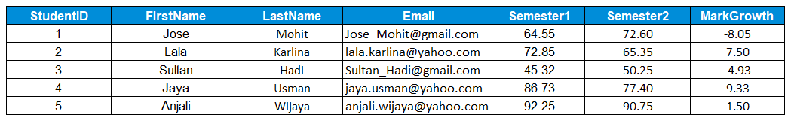

# Fungsi Scalar vs Fungsi Aggregate
“Bagian fungsi nih, Nja. Boleh kasih tahu perannya apa dalam pengolahan data?” Aku mulai bertanya.

“Oke, begini Aksara. Fungsi adalah metode yang digunakan untuk melakukan operasi data di database. Operasi ini bisa berupa kalkulasi numerik seperti sum, count, avg, etc; atau operasi non-numerik seperti string concatenations dan sub-strings. SQL Function dapat dibagi ke dalam 2 kategori, yaitufungsi scalar dan fungsi aggregate.”

Penjelasan Senja mengundang pertanyaan baru di benakku.

“Hm, apa aja sih bedanya fungsi skalar dan fungsi aggregate?”

“Fungsi skalar dalam SQL digunakan untuk mengembalikan nilai tunggal (single value) dari suatu nilai input yang diberikan, sedangkan fungsi agregat dalam SQL digunakan untuk melakukan perhitungan pada sekelompok nilai dan kemudian mengembalikan nilai tunggal. Nah, biar lebih mudah dipahami mari kita bahas dan praktekkan fungsi-fungsi dari kedua kategori ini.”


# Table yang digunakan

Table `students`

```bash
+-----------+-----------+----------+-------------------------+-----------+-----------+------------+
| StudentID | FirstName | LastName | Email                   | Semester1 | Semester2 | MarkGrowth |
+-----------+-----------+----------+-------------------------+-----------+-----------+------------+
|         1 | Jose      | Mohit    | Jose_Mohit@gmail.com    |     64.55 |      72.6 |      -8.05 |
|         2 | Lala      | Karlina  | lala_karlina@yahoo.com  |     72.85 |     65.35 |        7.5 |
|         3 | Sultan    | Hadi     | Sultan_Hadi@gmail.com   |     45.32 |     50.25 |      -4.93 |
|         4 | Jaya      | Usman    | jaya_usman@yahoo.com    |     86.73 |      77.4 |       9.33 |
|         5 | Anjali    | Wijaya   | anjali_wijaya@yahoo.com |     92.25 |     90.75 |        1.5 |
+-----------+-----------+----------+-------------------------+-----------+-----------+------------+
```

# Fungsi Skalar Matematika

“Memangnya fungsi-fungsi apa saja yang bisa dilakukan di SQL?”

“Untuk mengecek fungsi-fungsi apa saja yang bisa dilakukan di SQL, kita bisa membuka dokumentasi fungsi SQL di sini: https://www.postgresql.org/docs/9.5/functions-math.html, untuk postgresql database dan di sini: https://dev.mysql.com/doc/refman/8.0/en/mathematical-functions.html, untuk mysql database.


Untuk memudahkan pemahaman, aku diberikan Senja tabel dummy berisi nilai siswa semester 1 dan 2 di suatu sekolah. Berikut contoh penggunaan fungsi skalar dengan menggunakan tabel dummy: 

Tabel: students



# Fungsi Skalar Matematika - ABS()
Fungsi ABS( )

Syntax: 
```bash
SELECT ABS(ColumnName)  
FROM TableName; 
```

|Code 	|               Title              	|
|:----:	|:--------------------------------:	|
| [📜](https://github.com/bayubagusbagaswara/dqlab-data-engineer/blob/master/3-Fundamental%20SQL%20Using%20FUNCTION%20and%20GROUP%20BY/1-Fungsi%20di%20SQL/1-Fungsi-ABS.sql) | Fungsi ABS |

# Fungsi Skalar Matematika - CEILING()

Fungsi CEILING()

Syntax: 
```bash
SELECT CEILING(ColumnName)  
FROM TableName; 
```

|Code 	|               Title              	|
|:----:	|:--------------------------------:	|
| [📜](https://github.com/bayubagusbagaswara/dqlab-data-engineer/blob/master/3-Fundamental%20SQL%20Using%20FUNCTION%20and%20GROUP%20BY/1-Fungsi%20di%20SQL/2-Fungsi-CEILING.sql) | Fungsi CEILING |

# Fungsi Skalar Matematika - FLOOR()
Fungsi FLOOR()

Syntax: 
```bash
SELECT FLOOR(ColumnName)  
FROM TableName;
```

|Code 	|               Title              	|
|:----:	|:--------------------------------:	|
| [📜](https://github.com/bayubagusbagaswara/dqlab-data-engineer/blob/master/3-Fundamental%20SQL%20Using%20FUNCTION%20and%20GROUP%20BY/1-Fungsi%20di%20SQL/3-Fungsi-FLOOR.sql) | Fungsi FLOOR |

# Fungsi Skalar Matematika - ROUND()
Fungsi ROUND()

Syntax: 
```bash
SELECT ROUND(ColumnName)  
FROM TableName;
```

 |Code 	|               Title              	|
|:----:	|:--------------------------------:	|
| [📜](https://github.com/bayubagusbagaswara/dqlab-data-engineer/blob/master/3-Fundamental%20SQL%20Using%20FUNCTION%20and%20GROUP%20BY/1-Fungsi%20di%20SQL/4-Fungsi-ROUND.sql) | Fungsi ROUND |

# Fungsi Skalar Matematika - SQRT( )
Fungsi SQRT()

Syntax: 
```bash
SELECT SQRT(ColumnName)  
FROM TableName; 
```

 |Code 	|               Title              	|
|:----:	|:--------------------------------:	|
| [📜](https://github.com/bayubagusbagaswara/dqlab-data-engineer/blob/master/3-Fundamental%20SQL%20Using%20FUNCTION%20and%20GROUP%20BY/1-Fungsi%20di%20SQL/5-Fungsi-SQRT.sql) | Fungsi SQRT |

# Tugas Praktek
Tugas:
Gunakan fungsi MOD() untuk menghitung nilai sisa jika nilai Semester1 dibagi 2 dan fungsi EXP() untuk menghitung nilai eksponensial dari nilai MarkGrowth. Gunakan kedua fungsi tersebut dalam satu SELECT-Statement. 

 |Code 	|               Title              	|
|:----:	|:--------------------------------:	|
| [📜](https://github.com/bayubagusbagaswara/dqlab-data-engineer/blob/master/3-Fundamental%20SQL%20Using%20FUNCTION%20and%20GROUP%20BY/1-Fungsi%20di%20SQL/6-tugas-praktek.sql) | Tugas Praktek |
