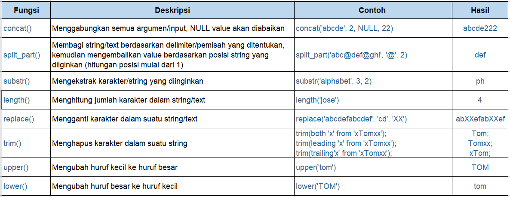

# Fungsi Text
“Aku sudah cukup paham soal fungsi skalar matematika, Nja. Thank you!”

“Sip, tapi jangan senang dulu, karena masih ada fungsi lain. Sekarang kita akan membahas tentang fungsi skalar untuk text/string value. Fungsi ini digunakan jika kita ingin melakukan operasi pada text atau karakter di SQL, misalnya, mengubah huruf kecil ke huruf besar, menghitung jumlah karakter dari text, dll. Fungsi skalar text di SQL juga cukup banyak.”

Aku menarik napas panjang, kukira fungsi skalar hanya tadi saja.

“Jadi, aku bisa cek di mana untuk fungsi skalar text?”

“Sama seperti fungsi skalar matematika, kita juga bisa mengecek fungsi - fungsi skalar text di dokumentasi postgresql: https://www.postgresql.org/docs/9.1/functions-string.html; dan dokumentasi mysql: https://dev.mysql.com/doc/refman/8.0/en/string-functions.html.  Aku kirim ya link ini ke kamu, Aksara.”

Aku segera mengecek kotak masuk emailku.

“Untuk  bahan praktik, kita akan mencoba beberapa fungsi saja yang sering digunakan saja, Aksara, yang ini,” tambah Senja sembari menunjuk tabel fungsinya untukku:



# Fungsi Text - CONCAT( )
Fungsi CONCAT()

Syntax: 

```bash
SELECT CONCAT(ColumnName1, ColumnName2, ColumnNameN)  
FROM TableName; 
```

| Code  |               Title              	|
|:----:	|:--------------------------------:	|
| [📜](https://github.com/bayubagusbagaswara/dqlab-data-engineer/blob/master/3-Fundamental-SQL-using-FUNCTION-and-GROUP-BY/2-Fungsi-Text-di-SQL/FungsiConcat.sql) | Fungsi CONCAT |

# Fungsi Text - SUBSTRING_INDEX( )
Fungsi Text SUBSTRING_INDEX()

Syntax: 
```bash
SELECT SUBSTRING_INDEX(column, delimiter, index to return)  
FROM TableName; 
```

Keterangan:
- column --> merupakan nama kolom yang akan dipecah text-nya,
- delimiter --> karakter atau gabungan beberapa karakter untuk pemecah text pada kolom bersangkutan,
- index_to_return --> indeks dari pecahan text yang akan diambil.

| Code  |               Title              	|
|:----:	|:--------------------------------:	|
| [📜](https://github.com/bayubagusbagaswara/dqlab-data-engineer/blob/master/3-Fundamental-SQL-using-FUNCTION-and-GROUP-BY/2-Fungsi-Text-di-SQL/FungsiSubstringIndex.sql) | Fungsi SUBSTRING_INDEX |

# Fungsi Text - SUBSTR()
Fungsi Text SUBSTR()

Syntax: 

```bash
SELECT SUBSTR(columnName, Start Index, Number of string to be extract)
FROM TableName;
``` 

Keterangan:
- columnName --> nama kolom yang akan dicari substring-nya
- Start Index --> indeks dari text yang dimiliki (dimulai dari 1)
- Number of string to be extract --> jumlah karakter atau beberapa karakter yang akan diambil.

| Code  |               Title              	|
|:----:	|:--------------------------------:	|
| [📜](https://github.com/bayubagusbagaswara/dqlab-data-engineer/blob/master/3-Fundamental-SQL-using-FUNCTION-and-GROUP-BY/2-Fungsi-Text-di-SQL/FungsiSubstr.sql) | Fungsi SUBSTR |

# Fungsi Text - LENGTH()
Fungsi Text LENGTH()

Syntax: 

```bash
SELECT LENGTH(ColumnName)
FROM TableName; 
```

| Code  |               Title              	|
|:----:	|:--------------------------------:	|
| [📜](https://github.com/bayubagusbagaswara/dqlab-data-engineer/blob/master/3-Fundamental-SQL-using-FUNCTION-and-GROUP-BY/2-Fungsi-Text-di-SQL/FungsiLength.sql) | Fungsi LENGTH |

# Fungsi Text - REPLACE()
Fungsi Text REPLACE()

Syntax: 

```bash
SELECT REPLACE(ColumnName, Character/String to be change, New String/Character)
FROM TableName;
``` 

Keterangan:
- ColumnName --> nama kolom yang akan diganti isi tiap record/barisnya berdasarkan string/karakter tertentu
- Character/String to be change --> string/karakter yang dimiliki untuk diganti
- New String/Character --> string/karakter baru pengganti string/karakter sebelumnya

| Code  |               Title              	|
|:----:	|:--------------------------------:	|
| [📜](https://github.com/bayubagusbagaswara/dqlab-data-engineer/blob/master/3-Fundamental-SQL-using-FUNCTION-and-GROUP-BY/2-Fungsi-Text-di-SQL/FungsiReplace.sql) | Fungsi REPLACE |

# Tugas Praktek
Tugas:
Gunakan fungsi UPPER() untuk mengubah kolom FirstName menjadi seluruhnya kapital dan gunakan LOWER() untuk mengubah kolom LastName menjadi seluruhnya non-kapital. Gunakan kedua fungsi tersebut dalam satu SELECT-Statement.


| Code  |               Title              	|
|:----:	|:--------------------------------:	|
| [📜](https://github.com/bayubagusbagaswara/dqlab-data-engineer/blob/master/3-Fundamental-SQL-using-FUNCTION-and-GROUP-BY/2-Fungsi-Text-di-SQL/TugasPraktek.sql) | Tugas Praktek |
