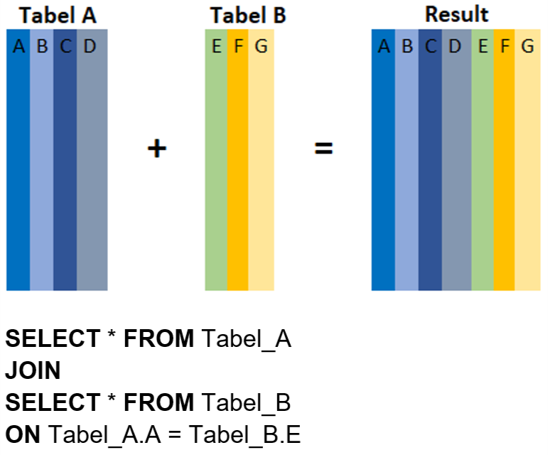

# Pendahuluan
Aku sedang mengerjakan kuis-kuis kecil ketika Senja datang membawa dua gelas minuman hangat. Dari aromanya bisa kutebak kalau itu kopi.

“Kopi saya. Ini teh susu buatmu.” Pagi di ruangan kantor yang masih sejuk-sejuk dingin memang paling pas minum yang anget! Dan, Senja masih ingat kalau aku enggak ngopi.

“Hari ini masih lanjut belajarnya, Aksara. Masih semangat kan?” tanya Senja sambil menyeruput kopinya lagi.

“Tentang apa materinya?”

“Saya melihat prosesmu bagus. Jadi kita sudah bisa lanjut ke bagian yang lebih kompleks, yaitu mengakses data dalam database dengan SQL (Structure Query Language).” Senja mengatakannya dengan begitu santai, padahal aku yang mendengarnya pun sudah mengerutkan alis.

“Sip, aku tak mungkin menolak bukan? Hehehe,” jawabku terkekeh.

“Pembelajaran kita hari ini akan dimulai dengan studi kasus praktik jadi learning by doing. Ini ada data berupa analisis hasil penjualan suatu store. Akan tetapi ketika kita coba cek di database, terdapat 2 tabel penjualan, yaitu :

- Tabel A berisi data transaksi untuk kode transaksi ‘tr-001’ sampai ‘tr-003’, dan
- Tabel B berisi data data transaksi untuk kode transaksi ‘tr-004’ sampai ‘tr-006’," buka Senja. 

“Lalu, bagaimana cara yang cepat dan efektif untuk membuat analisis dari kedua tabel tersebut menggunakan SQL? Apakah bisa menggunakan metode JOIN seperti yang kupelajari sebelumnya?”

“Mari kita selesaikan bersama.”

# Penggabungan hasil SELECT secara “Vertikal”
“Untuk kasus seperti ini kita perlu menggunakan metode UNION agar kedua tabel tadi menjadi satu tabel,” jelas Senja.

“UNION itu apa dan bagaimana mengoperasikannya?” tanyaku penuh rasa ingin tahu.

“UNION adalah operator SQL yang digunakan untuk menggabungkan hasil dari 2 atau lebih SELECT - statement secara “Vertikal”, dengan catatan,” Senja membuka buku catatannya dan menggesernya padaku untuk dicerna.

Setiap hasil dari SELECT statement yang akan digabungkan (UNION) memiliki jumlah kolom yang sama
Kolom tersebut juga harus memiliki tipe data yang sama, dan
Kolom tersebut memiliki urutan posisi yang sama.
Berikut format syntax-nya:


“Biar lebih mudah dipahami, mari kita praktekkan dengan tabel yang ingin dianalisis ini. Kamu bisa perhatikan ya langkah per langkahnya, Aksara.”

Aku menekuri layar laptop menunggu Senja beraksi memperlihatkan contoh.

# Tabel yang Akan Digabungkan
“Oke, pertama - tama mari kita SELECT seluruh kolom dari tabel_A.” Aku memperhatikan intruksi pertama Senja.


“Selanjutnya kita SELECT seluruh kolom dari tabel_B,” tambah Senja.

Dan, hasilnya seperti ini :


Sesuai dengan syarat untuk penggabungan dengan UNION yang telah dijelaskan tadi bahwa:

- jumlah kolom tabel_A dan tabel_B adalah sama
- kolom-kolom pada tabel_A dan tabel_B memiliki tipe data yang sama, dan
- kolom-kolom pada tabel_A dan tabel_B memiliki urutan posisi yang sama.

Melalui pengecekan pada tabel_A dan tabel_B pastikan bahwa ketiga syarat penggabungan dengan UNION yang dinyatakan di atas terpenuhi. Langkah ini kita lakukan sebelum melanjutkan pada praktek berikutnya menggunakan UNION. 

```bash
select * from tabel_A;
select * from tabel_B;
```

# Menggunakan UNION

Kedua tabel_A dan tabel_B sudah memiliki jumlah kolom yang sama, dan juga urutan posisi kolom juga sama, jadi bisa langsung menggabungkan kedua kolom tersebut dengan menambahkan UNION. 

| Code  |               Title              	|
|:----:	|:--------------------------------:	|
| [📜](https://github.com/bayubagusbagaswara/dqlab-data-engineer/blob/master/4-Fundamental%20SQL%20Using%20INNER%20JOIN%20and%20UNION/3-UNION/1-menggunakan-union.sql) | Menggunakan UNION |

# Menggunakan UNION dengan Klausa WHERE
Aku bertanya pada Senja, “Terus, kalo ada kondisi WHERE, syntaxnya bagaimana? Misalnya aku hanya ingin menggabungkan tabel yang isinya data penjualan untuk kode produk prod-04 saja?”

”Mudah saja, tinggal tambahkan WHERE di kedua SELECT-statement, seperti berikut ini,”


Tugas Praktek:
Lakukanlah hal yang sama dengan yang dicontohkan, akan dipilih kode_pelanggan = 'dqlabcust03' sebagai kondisinya. 

| Code  |               Title              	|
|:----:	|:--------------------------------:	|
| [📜](https://github.com/bayubagusbagaswara/dqlab-data-engineer/blob/master/4-Fundamental%20SQL%20Using%20INNER%20JOIN%20and%20UNION/3-UNION/2-UNION-dengan-Klausa-WHERE.sql) | Union dengan where |

# Menyelaraskan (Conforming) Kolom
Aku diam sebentar untuk menyimak. Tapi, masih ada pertanyaan yang mengganjal di benakku.

“Hmm, aku masih bingung, Nja. Kebetulan data penjualan ini berada di kedua tabel A & B jumlah kolom dan posisinya sama serta nama kolomnya sama. Bagaimana kalau posisi kolom dari kedua tabelnya tidak sama? Apa tidak bisa di-UNION-kan?”

“Tentu saja bisa, kamu bisa menyelaraskan kolom dari kedua tabel di SELECT-statement. Mari kita contohkan dengan data dari tabel berikut ini.”

tabel Customers


dan tabel Supplier


Jumlah kolom dari kedua tabel tersebut sama - sama 7 kolom, tetapi kolom posisi kolom ContactName dari kedua tabel tidak sama. Di tabel Customer, posisi kolom ContactName berada di Kolom ke - 3 sedangkan di tabel supplier berada di kolom ke-2.

Jika langsung menggabungkan keduanya, tanpa menyelaraskan kolom hasilnya akan sebagai berikut:


Tentunya, ini hasil UNION yang tidak diinginkan, oleh karena itu, urutkan posisi kolom tersebut di SELECT-Statement dan juga pilih kolom yang ingin digabungkan, sehingga tidak perlu semua kolom dari kedua tabel di-UNION-kan, seperti berikut ini :

```bash
SELECT CustomerName, ContactName, City, PostalCode 
FROM Customers 
UNION 
SELECT SupplierName, ContactName, City, PostalCode 
FROM Suppliers;
```

Jika terdapat perbedaan nama kolom antara SELECT-statement pertama dan SELECT-statement kedua, maka secara default akan digunakan nama kolom dari SELECT-statement yang pertama.

# Menggunakan UNION dan Menyelaraskan Kolom-Kolomnya.
Senja menyerahkan tugas praktik sederhana untuk menguji materi ini. Sekilas kubaca pertanyaan dan perintahnya tidak sulit. Baiklah, mari langsung terapkan ilmunya!

| Code  |               Title              	|
|:----:	|:--------------------------------:	|
| [📜](https://github.com/bayubagusbagaswara/dqlab-data-engineer/blob/master/4-Fundamental%20SQL%20Using%20INNER%20JOIN%20and%20UNION/3-UNION/3-Menggunakan-UNION-dan-Menyelaraskan-Kolom-Kolomnya.sql) | Union menyelaraskan Kolom |

# Perbedaan antara UNION dan JOIN
Setelah mengerjakan tugas, aku jadi teringat materiku sebelumnya mengenai JOIN. Sebenarnya kalau dipikir-pikir fungsi keduanya tampak mirip. Jadi, kapan waktu yang tepat untuk memaki salah satu darinya? Aku memutuskan menanyakan hal ini pada Senja.

“ Nja, aku sudah paham bagaimana menggunakan UNION tetapi aku masih belum mengerti bedanya dengan metode JOIN, bukankah keduanya sama – sama untuk menggabungkan data dari 2 tabel? Lalu, kapan aku perlu pakai JOIN dan kapan aku perlu pakai UNION?”

“Memang benar UNION dan JOIN digunakan untuk menggabungkan data dari dua atau lebih tabel. Tapi yang membedakan adalah bagaimana tabel - tabel itu digabungkan. Kita menggunakan JOIN ketika akan menggabungkan tabel secara horizontal, sehingga hasil join akan memuat kolom - kolom dari kedua atau lebih tabel yang digabungkan. Berikut gambaran penggabungan tabel dengan metode JOIN,” Senja menampilkan contoh tabel di layar laptop.



Pada metode JOIN, penggabungan dilakukan berdasarkan key/kolom tertentu yang terdapat di tabel-tabel yang akan digabungkan dan key/kolom ini memiliki nilai yang saling terkait. Seperti yang terlihat pada gambar, Kolom A dan Kolom E merupakan key/kolom yang saling terkait sehingga kedua tabel dapat digabungkan dengan mencocokan nilai dari kedua kolom ini. Proses JOIN tidak dapat dilakukan jika tidak terdapat key/kolom yang saling terkait di kedua atau lebih tabel yang akan digabungkan.

Untuk UNION seperti yang sudah dijelaskan, digunakan ketika ingin menggabungkan tabel secara secara vertikal yaitu menggabungkan baris/row dari dua atau lebih tabel. Tidak seperti JOIN, untuk penggabungan dengan UNION, tidak diperlukan key/kolom yang saling terkait tetapi UNION mensyaratkan bahwa jumlah kolom dari tabel - tabel yang akan digabungkankan adalah sama dan berada diposisi yang sama pula. Berikut ilustrasi penggabungan dengan UNION:


Pada proses penggabungan UNION, tidak terdapat penambahan kolom tetapi jumlah baris/rows yang akan bertambah. 


# Kesimpulan
Pada chapter UNION ini telah dipelajari bagaimana menggabungkan dua tabel secara vertikal (bertambah barisnya). Tentunya ada syarat yang harus dipenuhi oleh kedua tabel yang digabungkan dengan UNION, yaitu:

- Setiap hasil dari SELECT statement yang akan digabungkan (UNION) memiliki jumlah kolom yang sama
- Kolom tersebut juga harus memiliki tipe data yang sama, dan
- Kolom tersebut memiliki urutan posisi yang sama.

Selain itu, mempelajari bagaimana penyelerasan kolom sehingga record/baris yang ditampilkan pada tabel hasil penggabungan memiliki arti.

Perbedaan mendasar dari JOIN dan UNION adalah JOIN menggabungkan 2 tabel atau lebih berdasarkan baris yang saling berelasi/terkait sedangkan UNION menggabungkan 2 tabel secara vertikal. 