# Tabel pertama: ms_item_warna
“Oke, contoh tabel pertama yang akan kita gunakan sebagai bahan latihan adalah tabel ms_item_warna seperti terlihat berikut ini,” bimbing Senja sambil memperlihatkan layar laptopnya padaku:

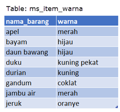

“Tabel ini terdiri dari dua kolom yang berisi informasi nama buah atau sayuran dengan warnanya, dan memiliki delapan baris data,” ujar Senja.

“Lalu, bagaimana langkah selanjutnya?” tanyaku menunggu.

“Selanjutnya, jika permasalahan kita adalah ingin mengetahui informasi tidak hanya mengenai warna tetapi juga jenis/kategori dari setiap nama barang apakah tergolong sayuran atau buah, maka kita tidak dapat memperoleh informasi tersebut jika hanya berdasarkan tablel ms_item_warna. Oleh karena itu, kita perlu menghubungkan tabel tersebut dengan tabel lain yang berisi informasi tersebut, yaitu tabel ms_item_kategori.”

# Tabel kedua: ms_item_kategori
“Perhatikan kembali ya, Aksara. Kalau ini contoh tabel kedua, yakni tabel ms_item_kategori seperti terlihat berikut ini.”

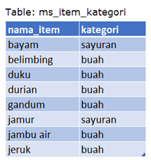

Tabel ini terdiri dari dua kolom yang berisi informasi nama tumbuhan dengan kategorinya, dan memiliki delapan baris data.

“Nah, sekarang kita telah memiliki tabel kedua yaitu tabel ms_item_kategori yang memiliki delapan baris data dan berisi informasi mengenai nama tumbuhan dengan kategorinya. Sama seperti permasalahan di tabel sebelumnya, jika kita hanya memiliki tabel ms_item_kategori maka kita tidak dapat memperoleh informasi mengenai nama dan warna tumbuhan. Oleh karena itu, kita bisa menggabungkan kedua tabel tersebut menjadi satu tabel baru yang berisi informasi lengkap mengenai nama, warna dan kategori setiap barang/item, “ tambah Senja.

Aku mengangguk paham.

“Kalau sudah cukup mengerti contoh dua tabel tadi, kamu bisa kerjakan tugas praktik dan kuisnya. Saya akan memperhatikan.”

Aku pun kembali mengambil alih laptop.

# Tugas Praktek
Cobalah ketik query pada code editor untuk melihat keseluruhan isi dari kolom tabel ms_item_kategori dan ms_item_warna.

| Code  |               Title              	|
|:----:	|:--------------------------------:	|
| [📜](https://github.com/bayubagusbagaswara/dqlab-data-engineer/blob/master/4-Fundamental-SQL-using-INNER-JOIN-and-UNION/1-Penggabungan-Tabel-dari-Relasi-Kolom/TugasPraktek.sql) | Tugas Praktek |

# Quiz

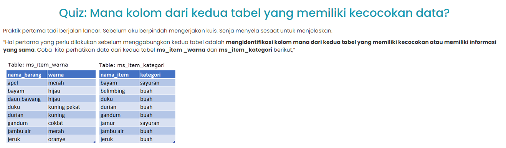
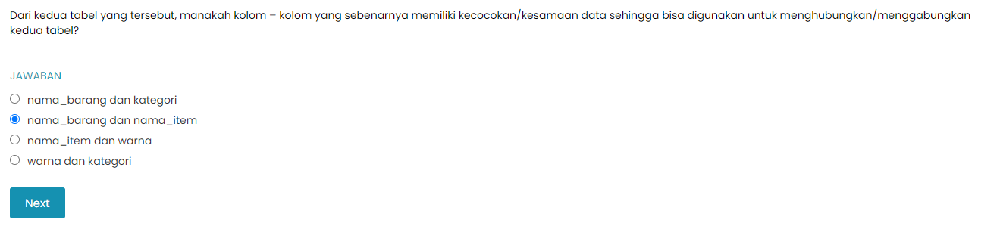

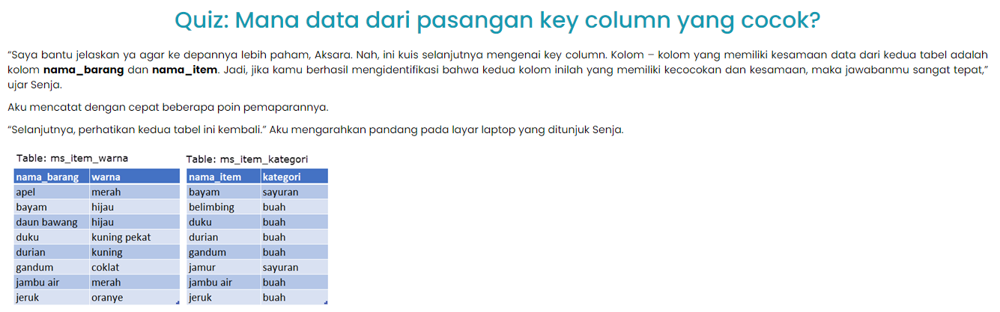

# Key Columns
Penjelasan selanjutnya adalah mengenai key columns dan bagaimana penggunaannya dalam menggabungkan kedua tabel.

Perhatikan kembali tabel ms_item_warna dan ms_item_kategori yang telah ditemui pada pembahasan sebelumnya.

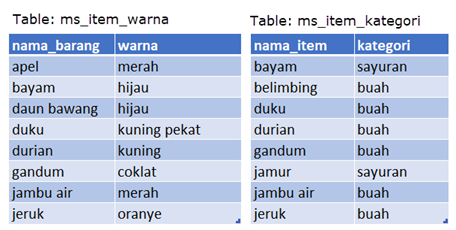

Dari rangkaian pembahasan sebelumnya, dapat disimpulkan bahwa kedua tabel tersebut memiliki hubungan/relasi yaitu pada kolom nama_barang (tabel ms_item_warna) dan kolom nama_item (tabel ms_item_kategori) karena banyak kecocokan dari isi data.

Kedua kolom ini untuk selanjutnya disebut sebagai kolom kunci atau key columns.

# Menggabungkan Tabel dengan Key Columns
Saatnya  mempraktekkan penggabungan tabel ms_item_kategori dan ms_item_warna menggunakan key columns.

| Code  |               Title              	|
|:----:	|:--------------------------------:	|
| [📜](https://github.com/bayubagusbagaswara/dqlab-data-engineer/blob/master/4-Fundamental-SQL-using-INNER-JOIN-and-UNION/1-Penggabungan-Tabel-dari-Relasi-Kolom/MenggabungkanTabelDenganKeyColumns.sql) | Menggabungkan Table dengan Key Columns |

Dapat dilihat hasil dari penggabungan dua tabel tersebut yaitu berupa tabel baru dengan empat kolom dan enam baris data. Perlu diketahui bahwa penggabungan ini bersifat sementara artinya tabel asli di database tidak mengalami perubahan, dan tabel baru hasil penggabungan ini juga tidak serta merta tersimpan di database.  

# Penjelasan Query Penggabungan Tabel
Penggabungan dua tabel menjadi satu tabel baru menggunakan query SELECT pada subbab sebelumnya dilakukan dengan cara berikut:

menuliskan dua nama tabel yang akan digunakan dengan dipisahkan operator koma (,).
menuliskan pasangan key columns dengan penghubung operator sama dengan (=) di bagian filter atau kondisi.

Berikut adalah gambaran detil syntax penggunaan cara di atas:

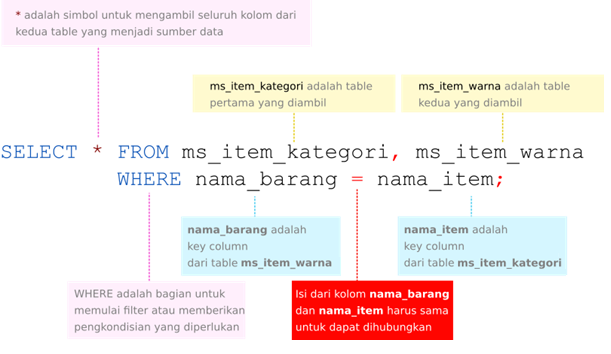

Cara join seperti ini disebut dengan cara join menggunakan operator koma.

# Penjelasan Hasil Penggabungan Tabel
Sejauh ini aku tidak menemukan masalah yang signifikan, tapi ketika berusaha menggabungkan tabel aku masih kesulitan. Untungnya Senja masih di sampingku.

“Nja, aku mau nanya. Jika aku amati, penggabungan tabel menghasilkan enam baris data. Sedangkan di kedua tabel asal masing-masing memiliki delapan baris data. Lalu, kenapa bisa berkurang dua baris data?” tanyaku penasaran.

“Untuk menjawab pertanyaan tersebut, cobalah perhatikan gambar berikut,” jawab Senja lugas langsung memberi penjelasan lengkap bersama visualnya

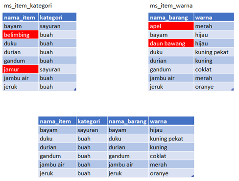

Dua tabel di bagian atas yaitu tabel ms_item_kategori dan tabel ms_item_warna merupakan tabel sumber data, dan bagian bawah adalah tabel hasil penggabungan dari kedua tabel tersebut.

Dari tabel hasil penggabungan terlihat bahwa baris data yang muncul hanyalah baris data yang isi datanya terdapat di kedua key columns, dan data yang isinya cocok untuk kedua tabel jumlahnya hanya enam dari total delapan baris data yang ada. Sedangkan baris data yang berisi belimbing, jamur, apel dan daun bawang, tidak terdapat di kedua tabel, sehingga baris data ini akan di-exclude dan tidak akan muncul di tabel hasil penggabungan.

# Penjelasan Proses Penggabungan Tabel
Mari diperhatikan kembali gambar di bawah ini untuk penjelasan proses penggabungan.

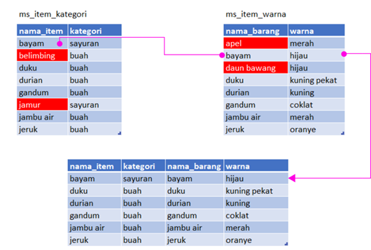

Panah berwarna magenta menunjukkan proses pencocokan dan penggabungan data. Sebagai contoh: Baris data pertama dengan isi “bayam” pada key column nama_item (tabel ms_item_kategori), akan mencari isi yang sama di key column nama_barang (tabel ms_item_warna), dan ditemukan pada baris kedua kemudian dihubungkan menjadi satu baris di tabel baru hasil penggabungan.

Pencocokan dengan pencarian ini berdasarkan bagian kondisi (conditional clause) pada query yang ditandai dengan warna kuning berikut.

Setelah seluruh data ditemukan dengan kondisi ini, dan jika tidak menentukan spesifik kolom maka seluruh kolom data dari kedua tabel akan dimunculkan dengan isi/baris data yang sama dan terdapat di kedua key column digabungkan menjadi satu baris pada tabel baru. 

Isi data yang ditandai dengan warna merah adalah data yang tidak memiliki pasangan sehingga tidak bisa digabungkan, dan dengan demikian tidak memiliki data gabungan pada hasil akhir.

Cara pencocokan dan penggabungan disebut dengan INNER JOIN - dimana isi dari key column kedua tabel harus cocok satu sama lain baru dapat digabungkan.

Penjelasan Senja selalu lengkap seperti biasa. Aku mengintip buku catatan dari sudut mataku, tak terasa sudah sekitar tiga halaman habis oleh coretan tanganku. Malam ini harus kurapikan nih!

“Satu lagi, Aksara. Saya perhatikan kamu suka sekali mencatat, jangan kelewat soal ini: jika kamu biasa bekerja dengan Excel, proses ini hampir menyerupai penggunaan fungsi vlookup. Jadi harusnya sudah terbiasa.”

Aku terkekeh, “Hehehe, iya. Biar rapi. Biasanya aku taruh di buku diari juga.”

“Metode belajarmu unik juga, Aksara. Kuisnya jangan lupa dikerjakan.”

Aku mengangguk sambil mengangkat jari membentuk kata ‘peace’. Setelah kutelusuri lagi lebih dalam, tak hanya ada kuis saja tapi juga banyak sekali materi-materi baru lainnya! Mumpung Senja masih di sini, aku harus belajar ‘ngebut’ agar bisa bertanya kalau ada yang bingung.

# Quiz

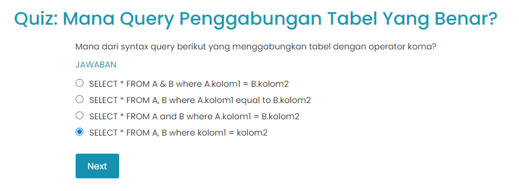

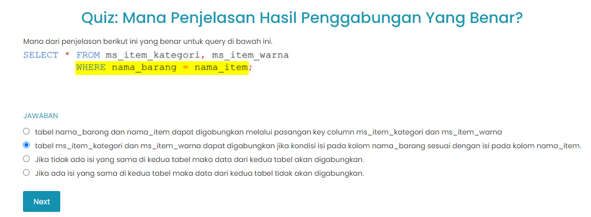

# Bagaimana jika urutan Tabel diubah?
Jika akan mengubah urutan tabel di bagian FROM pada query inner join, maka hanya urutan kolom saja yang berubah tetapi isi data dan jumlah data tidak berubah.

| Code  |               Title              	|
|:----:	|:--------------------------------:	|
| [📜](https://github.com/bayubagusbagaswara/dqlab-data-engineer/blob/master/4-Fundamental-SQL-using-INNER-JOIN-and-UNION/1-Penggabungan-Tabel-dari-Relasi-Kolom/MengubahUrutanTabel.sql) | Mengubah Urutan Table |

Terlihat jumlah data yang dihasilkan tetap 6 baris data, namun dengan urutan kolom yang berbeda.

Dimana dua kolom pertama adalah dari tabel ms_item_warna, dan dua kolom berikutnya dari tabel ms_item_kategori. Hal ini sesuai dengan urutan nama tabel yang diketikkan setelah FROM.

# Menggunakan Prefix Nama Tabel
Seperti yang dijelaskan sebelumnya, jika akan menggunakan wildcard (*), dan tidak menentukan spesifik nama kolom yang akan dimunculkan di bagian SELECT, maka secara default urutan kolom dimulai dengan kolom dari tabel yang dinyatakan pertama di bagian FROM. Akan tetapi, bisa juga memanfaatkan wildcard dengan menambahkan prefix nama tabel, dimana dengan merinci prefix nama tabel ini, dimungkinkan untuk menentukan urutan kolom dari tabel mana yang muncul duluan.

Sebagai contoh, jika akan menggabungkan kedua tabel, dengan menyatakan tabel ms_item_warna terlebih dahulu di bagian FROM, tetapi yang ingin dimunculkan kolomnya di awal hasil adalah dari yang ms_item_kategori, maka querynya akan menjadi sebagai berikut.

| Code  |               Title              	|
|:----:	|:--------------------------------:	|
| [📜](https://github.com/bayubagusbagaswara/dqlab-data-engineer/blob/master/4-Fundamental-SQL-using-INNER-JOIN-and-UNION/1-Penggabungan-Tabel-dari-Relasi-Kolom/MenggunakanPrefixNamaTabel.sql) | Menggunakan Prefix Nama Tabel |

Terlihat urutan kolom yang muncul adalah dari tabel ms_item_kategori terlebih dahulu.

# Penggabungan Tanpa Kondisi
Sesuai dugaanku. Aku kembali menemukan hal yang membingungkan. Dan, tampaknya hari ini Senja memang sudah mendedikasikan waktunya untuk mengajariku karena (beruntungnya!) Senja masih tepat di sebelahku.

“Nja, hehehe. Sorry mau ganggu lagi. Bagaimana kalau aku ingin menggabungkan tabel tanpa ada kondisi? Apakah tetap bisa memakai metode ini?”

Senja memicingkan matanya pada layar laptop yang kutunjuk sebelum menjawab. “Pertanyaan bagus. Penjelasan dan praktek yang kita lakukan pada materi sebelumnya adalah penggabungan dua tabel dengan menggunakan kondisi, yaitu terdapat data yang sama pada key kolom dari kedua tabel. Akan tetapi, memang benar, dalam beberapa case di real problem, sering kali terdapat permasalahan tertentu dimana kita ingin menggabungkan tabel tanpa ada kondisi. Proses penggabungan ini juga dapat dilakukan dengan metode koma dan tanpa menggunakan kondisi relasi antar kolom.”

Aku mencoba mencerna penjelasan Senja. Sebelum aku sempat memahami semuanya. Senja sudah mengajakku untuk melihat contoh.

“Terlihat pada query kita hanya menyertakan nama dua tabel yang akan diambil datanya, tapi tidak ada informasi kondisi bagaimana kedua tabel tersebut berelasi satu dengan yang lainnya melalui key column. Lalu apa hasilnya?” tanya Senja retoris.

“Kamu hanya butuh untuk mengetik  query ini pada code editor dan jalankan, jika berhasil dengan baik maka akan muncul hasil dengan enam puluh empat baris data seperti berikut.”

| Code  |               Title              	|
|:----:	|:--------------------------------:	|
| [📜](https://github.com/bayubagusbagaswara/dqlab-data-engineer/blob/master/4-Fundamental-SQL-using-INNER-JOIN-and-UNION/1-Penggabungan-Tabel-dari-Relasi-Kolom/PenggabunganTanpaKondisi.sql) | Penggabungan Tanpa Kondisi |

Aku menggumam mengerti. Terlihat banyak sekali hasil yang keluar, ini dikarenakan setiap baris data pada kedua tabel akan dihubungkan satu sama lain - tanpa ada hubungan.

Jumlah enam puluh empat baris data ini adalah hasil perkalian dari jumlah data dari kedua tabel, dimana masing-masing memiliki delapan baris data. Cara menggabungkan kedua tabelseperti ini disebut dengan mekanisme cross join.

Aku sudah sampai di penghujung materi dan sejauh ini cukup paham! Hanya butuh satu kuis lagi untuk menuntaskannya. Belajar memang jadi lebih mudah kalau ada Senja, eh maksudku mentor, hehehe.

# Quiz

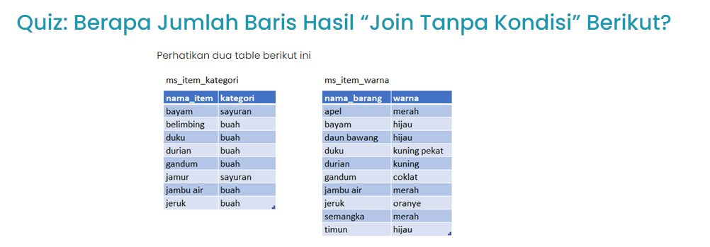
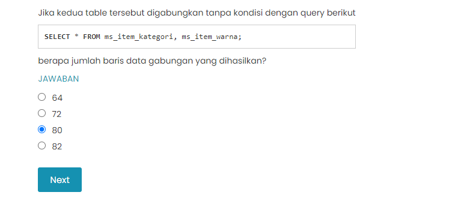

# Kesimpulan
Bahasa SQL diciptakan untuk sistem database relasional atau RDBMS. Dan aspek relasional inilah yang menjadi fitur paling penting dan unggul, dimana beberapa tabel dapat digabungkan menjadi satu sumber data baru.

Cara menggabungkan antar tabel disebut sebagai mekanisme join. Pada bab ini telah dicontohkan bagaimana dua tipe join, yaitu inner join dan cross join diterapkan dengan dua contoh tabel sederhana.

Inner join terjadi jika kedua tabel digabungkan melalui kolom kunci atau key column. Syarat penggabungan adalah dimana Isi data dari key column tabel yang satu harus dapat dicocokkan dengan isi data dari key column tabel yang lain.

Sedangkan cross join terjadi dari penggabungan tabel tanpa kondisi, dan menghasilkan seluruh penggabungan data seperti proses perkalian.

Untuk bab ini, inner join maupun cross join dilakukan dengan cara menggunakan operator koma dan pengkondisian where. Pada bab selanjutnya, akan terlihat penggunaan inner join dengan menggunakan keyword INNER JOIN … ON. 