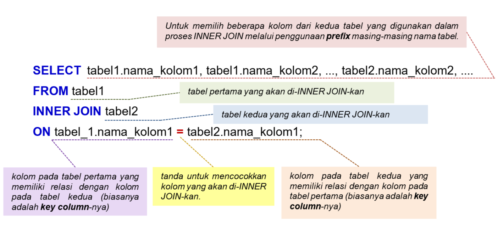

# Pendahuluan
Pagi ini ada yang membuatku menyunggingkan senyum: menemukan laptop dan beberapa berkas kerja Senja sudah rapi di sebelah mejaku. Ini artinya Senja akan mendampingiku lagi hari ini!

“Eits, jangan girang dulu! Karena bakal ada materi baru yang enggak kalah ribet dibanding kasus kamu kemarin lho,” bisik Senja dari belakang pundakku. Aku sontak membalikkan badan karena terkejut oleh kemunculan Senja yang tiba-tiba.

“Senja! Bikin kaget saja.”

“Sorry, hahaha. Soalnya kamu senyum-senyum sendiri begitu. Oh ya, kemarin kamu sudah mempelajari mengenai konsep dan penggunaan inner join menggunakan operator koma dengan klausa FROM…WHERE… pada perintah SELECT untuk menggabungkan dua tabel menjadi satu sumber data baru. Hari ini kita naik level ya, sudah siap?”

“Pastinya,” tantangku. Senja hanya tersneyum melihat kepercayaan diriku, padahal lubuk hati terdalamku tegang juga rasanya!

“Selanjutnya saya akan menjelaskan bagaimana menggabungkan dua tabel dengan metode INNER JOIN lain, yaitu dengan keyword INNER JOIN, yang memberikan hasil yang sama, tetapi dengan konstruksi atau syntax yang sedikit berbeda. Konstruksi baru ini akan memberi manfaat lebih ketika pada suatu query melibatkan beberapa join sehingga penggunaan operator koma menjadi sangat terbatas. Sampai sini sudah cukup pusing?”

Lagi-lagi Senja menggodaku. Aku menggeleng mantap, walau sebenarnya ada beberapa hal yang masih asing di telingaku. Tapi, kuyakin pasti akan paham akhirnya. Optimis itu harus!

“Untuk penjelasan mengenai materi JOIN dengan penggunaan keyword INNER JOIN, kita akan kembali menggunakan dua contoh tabel sederhana, yaitu ms_item_warna dan ms_item_category, sehingga kita dapat dengan mudah memahami penggunaan keyword INNER JOIN untuk menggabungkan dua tabel tersebut. Here we go, Aksara.”

# Syntax INNER JOIN
Aku menerima modul baru dari Senja. Saat kubuka, bab baru yang menyapaku adalah “Syntax INNER JOIN”.

“Sudah tahu kan bahwa tujuan JOIN adalah menggabungkan dua atau lebih tabel yang berbeda di dalam database. Nah, JOIN ini hanya bisa dilakukan apabila tabel - tabel tersebut memiliki key kolom yang sama. Di SQL, terdapat beberapa tipe JOIN yaitu : INNER JOIN, LEFT JOIN, RIGHT JOIN, FULL JOIN, dan SELF JOIN. Setiap tipe join memiliki tujuan dan hasil query yang berbeda. Pada metode INNER JOIN, baris dari kedua atau lebih tabel akan dibandingkan untuk mengecek baris - baris mana saja yang cocok satu sama lain berdasarkan kondisi JOIN yang ditentukan,” jelas Senja fasih. 

“Memang JOIN itu sendiri ada berapa tipe sih, Nja?”“Untuk materi ini, kita akan ke tipe pertama, yaitu INNER JOIN. Namun demikian, pembahasan akan makin mendalam dengan memberikan konsep pengantar terlebih dahulu agar memudahkan dalam memahami tipe-tipe JOIN lainnya.”

“Oh oke, Nja.”

Syntax INNER JOIN:


Penggunaan prefix pada tabel_1.nama_kolom dan tabel_2.nama_kolom ditujukan agar terdapat kejelasan (clarity) kolom pada tabel mana yang dijadikan acuan dalam proses INNER JOIN. Tentunya, penggunaan prefix ini ini sangat bermanfaat jika ingin menggabungkan beberapa tabel. Untuk penjelasan lebih detail, coba ingat kembali penggunaan prefix dan alias, yang telah dipelajari pada modul "Fundamental SQL with SELECT statement chapter Prefix dan Alias".

Jika masing-masing tabel tersebut dianalogikan sebagai dua himpunan maka proses INNER JOIN ekivalen dengan INTERSECTION (IRISAN) antara dua himpunan.


Proses INNER JOIN memiliki konsep penggabungan untuk records pada kedua tabel yang bernilai sama.

# Tugas Praktek: Menggunakan INNER JOIN (1/3)
Sejauh ini aku belum memiliki pertanyaan berarti dan semoga saja tidak ada. Dalam hati kuberdoa kelancaran pembelajaran ini juga sampai ke kuis dan tugasnya, hehehe.

“Kita lanjut penjelasannya ya, Aksara,” ujar Senja menarikku kembali ke materi.

“Nah, sebelumnya kan kita sudah menerapkan penggunaan … WHERE …; dari perintah SELECT … dan operator koma, untuk penggabungan tabel ms_item_warna dan ms_item_kategori. Selanjutnya, ini kita akan menggunakan klausa INNER JOIN … ON …; untuk menggabungkan kedua ms_item_warna dan ms_item_kategori berdasarkan sintaks INNER JOIN yang telah dijelaskan sebelumnya.”

| Code  |               Title              	|
|:----:	|:--------------------------------:	|
| [📜](https://github.com/bayubagusbagaswara/dqlab-data-engineer/blob/master/4-Fundamental-SQL-using-INNER-JOIN-and-UNION/2-INNER-JOIN/TugasPraktek.sql) | Tugas Praktek 1 |

Hasil yang diperoleh dengan penggunaan SELECT … FROM … INNER JOIN … ON …; adalah sama dengan penerapan SELECT … FROM … WHERE …;.

# tabel tr_penjualan dan tabel ms_produk
Tak kusangka penggunaan INNER JOIN ini banyak sekali langkah per langkahnya. Untungnya aku sudah diberi modul oleh Senja, kalau tidak, buku catatanku bisa habis diisi oleh materi ini saja.

“Setelah kita menggunakan tabel ms_item_warna dan ms_item_kategori, sekarang mari kita gunakan tabel tr_penjualan dan tabel ms_produk yang ada di-database, sehingga kita bisa lebih paham mengenai penerapan konsep JOIN di real case,” pinta Senja.

“Oke, Nja.”

”Mari kita lihat isi dari tabel tr_penjualan. Silakan ketikkan query berikut pada code editor.”

| Code  |               Title              	|
|:----:	|:--------------------------------:	|
| [📜](https://github.com/bayubagusbagaswara/dqlab-data-engineer/blob/master/4-Fundamental-SQL-using-INNER-JOIN-and-UNION/2-INNER-JOIN/SelectTabelPenjualanDanTabelProduk.sql) | Table penjualan dan ms produk |

# Quiz


# Tugas Praktek: Menggunakan INNER JOIN (2/3)
“Oke, Aksara. Silakan dipraktikkan pada code editor untuk menggabungkan tabel tr_penjualan dan ms_produk dan menampilkan seluruh kolom dari kedua tabel.”

| Code  |               Title              	|
|:----:	|:--------------------------------:	|
| [📜](https://github.com/bayubagusbagaswara/dqlab-data-engineer/blob/master/4-Fundamental-SQL-using-INNER-JOIN-and-UNION/2-INNER-JOIN/TugasPraktek2.sql) | Tugas Praktek 2 |

# Memahami Proses dan Hasil Query dengan INNER JOIN
“Lanjut ya, Aksara. Kita ngejar supaya materi ini bisa kamu kuasai hari ini juga,” ujar Senja.

Aku pun kembali serius menekuri layar laptop dan isi modul.

“Perhatikan tabel hasil query pada tugas praktek sebelumnya, apakah perbedaan antara tabel sebelum penggabungan dengan INNER JOIN dan setelah penggabungan?”


“Sekarang seluruh kolom dari kedua tabel berada di satu tabel dan berisi seluruh kolom - kolom dari kedua tabel. Jadi, Aku juga dapat dengan mudah mengidentifikasi nama produk dari setiap kode produk yang dibeli oleh customer.”

“Iya, benar sekali, Aksara. Sekarang perhatikan lebih lanjut dan bandingkan antara kolom kode_produk pada hasil query dengan INNER JOIN di atas, dengan kolom kode_produk pada tabel ms_produk. Menurutmu apa yang berbeda?”

“Hm, aku tidak menemukan prod-06 di tabel hasil query, padahal di tabel ms_produk terdapat data prod-06 yaitu pulpen multifunction + laser DQLAB.”

“Tepat sekali, selanjutnya bandingkan dengan tabel tr_penjualan, apakah kamu menemukan data prod-06 di tabel tr_penjualan?” tanya Senja kembali menguji kepemahamanku.Dan, untungnya aku tak pernah mengantuk saat mendengar penjelasan Senja sepanjang materi. Kalau iya, habislah sudah!

“Tidak ada transaksi dengan kode_produksi prod-06 di tabel tr_penjualan.   Sepertinya aku mulai paham. INNER JOIN akan mencocokkan key kolom tabel tr_penjualan dengan key kolom ms_produk, jika value dari key kolom sama - sama ada di kedua tabel , maka baris itu akan dikembalikan sebagai hasil query dan membentuk satu tabel yang berisi seluruh kolom dari kedua tabel, sedangkan jika value key kolom hanya terdapat di satu kolom, maka baris ini tidak akan ditampilkan. prod-06 ada di tabel di ms_produk tetapi tidak ada di data penjualan sehingga saat penggabungan tabel dengan INNER JOIN, data prod-06 dari tabel ms_produk tidak akan muncul di hasil query.”

Bibir Senja melengkung. Aku bisa mendapati senyum puas Senja atas jawabanku. Senyum apresiasi dari Senja selalu mampu menghangatkan hatiku. Senangnya! Walau sederhana tapi bermakna.

“Tepat Sekali, Aksara. Sepertinya kamu sudah paham dengan penggunaan INNER JOIN. Silahkan lanjutkan  materinya di modul. Oh iya, pada bagian SELECT, kamu boleh memilih kolom mana saja yang ingin kamu tampilkan setelah kedua tabel di-JOIN.”

# Syntax INNER JOIN – Memilih Beberapa Kolom Untuk Ditampilkan

“Satu lagi, Aksara. Sementara itu, jika kita ingin menampilkan beberapa kolom saja dari tabel hasil penggabungan, maka syntax SQL dari INNER JOIN dinyatakan sebagai berikut ini.”



Bagian query

```bash
SELECT tabel1.nama_kolom1, tabel1.nama_kolom2, ..., tabel2.nama_kolom2, .... 
FROM tabel1
```
menghendaki pemilihan kolom mana saja dari kedua tabel yang akan digabungkan. Disini diperlukan penggunaan prefix nama tabelnya.

Selanjutnya, bagian query

```bash
INNER JOIN tabel2
digunakan untuk menggabungkan tabel1 dengan tabel2.
```

Akhirnya, bagian query

```bash
ON tabel_1.nama_kolom1 = tabel2.nama_kolom1;
```

adalah acuan penggabungan tabel1 dan tabel2 berdasarkan kolom yang memiliki tingkat kecocokan yang tinggi. Kedua kolom dengan tingkat kecocokan yang tinggi pada masing-masing tabel disebut juga dengan key column. 

Catatan:

Perlu diperhatikan jika menampilkan kolom dengan nama yang sama di kedua tabel, maka pada bagian Select, tidak bisa hanya mengetikkan nama kolom saja, tetapi juga harus didahului oleh prefix nama tabel dimana kolom itu berasal untuk menghindari error karena ambiguitas," Senja mengingatkanku sekali lagi.


# Tugas Praktek: Menggunakan INNER JOIN (3/3)
“Oke, semua dariku sudah. Sekarang silakan dipraktikkan pada code editor untuk menggabungkan tabel tr_penjualan dan ms_produk dengan kolom yang ditampilkan dari tabel tr_penjualan adalah kode_transaksi, kode_pelanggan, kode_produk, qty. Untuk tabel ms_produk tampilkan kolom nama_produk dan harga." 

Aku mengangguk mantap. Senja sudah membekaliku sampai di sini. Ini saatnya aku mandiri.

Kemudian aku membentuk kolom total yang merupakan hasil perkalian setiap baris pada kolom harga di tabel ms_produk dengan kolom qty di tabel tr_penjualan.

"Tabel hasil penggabungan haruslah membentuk kolom-kolom dengan urutannya adalah kode_transaksi, kode_pelanggan, kode_produk, nama_produk, harga, qty, dan total," lanjut Senja lagi mengingatkan.

| Code  |               Title              	|
|:----:	|:--------------------------------:	|
| [📜](https://github.com/bayubagusbagaswara/dqlab-data-engineer/blob/master/4-Fundamental-SQL-using-INNER-JOIN-and-UNION/2-INNER-JOIN/TugasPraktek3.sql) | Tugas Praktek 3 |

# Kesimpulan
Pada chapter INNER JOIN ini kita telah mempelajari bagaimana menggabungkan dua tabel berdasarkan key column-nya.

- Pada tahap awal kita menggunakan INNER JOIN untuk menggabungkan keseluruhan kolom yang dimiliki oleh kedua tabel tersebut. 
- Selanjutnya, kita menerapkan INNER JOIN dengan menggunakan prefix nama tabel untuk memilih kolom-kolom mana saja yang akan ditampilkan pada tabel hasil penggabungan.

Untuk chapter selanjutnya kita akan menggabungkan tabel dengan menggunakan UNION.