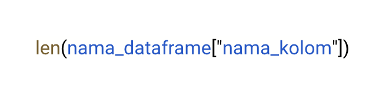
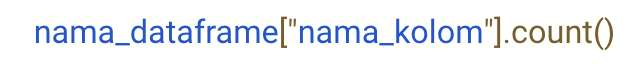
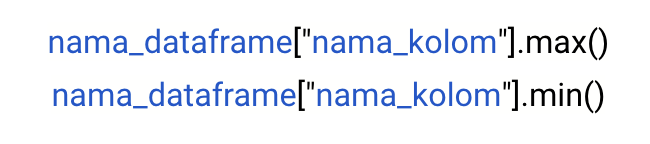
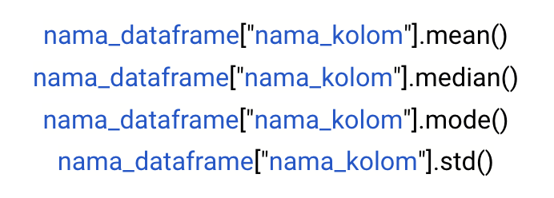
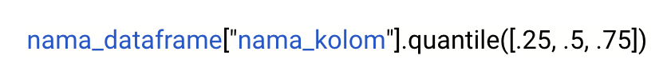
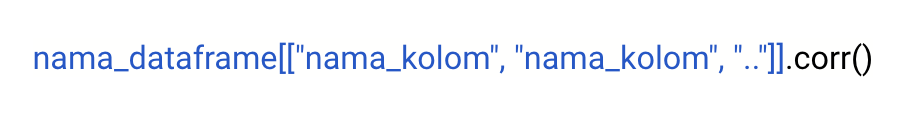
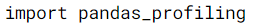
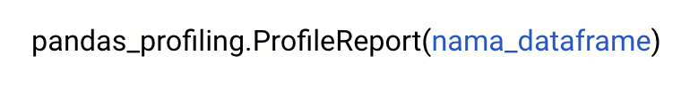
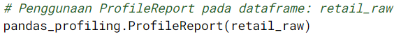

# Pengantar
Aku dipanggil ke ruangan Kroma, sang kepala divisi! Gugup? Pastinya. Penasaran? Apalagi. Setelah diam beberapa saat, Kroma menunjukkan lembar kerjaku di layar laptopnya.

“Setelah mengecek hasil analisis kamu, saya rasa ini perlu sedikit revisi. Coba lakukan analisis terhadap datanya secara lebih mendalam menggunakan EDA, termasuk data profiling. Bisa?” pinta Kroma di ruangannya.

Aku memang sudah terbiasa mendengar kata ‘revisi’ dari Senja dan Andra, tapi tetap saja kali ini lebih menegangkan karena langsung dari Kroma, si kepala divisi! Aku hendak mengangguk tapi kuingat kalau aku belum sempat mempelajari mengenai data profiling bersama Senja. Seperti mampu membaca keraguanku, Kroma mencondongkan tubuhnya ke arahku dan berujar, “Sekaligus saya kirimkan referensi lengkap dan contoh bagaimana data profiling dilakukan.”

Aku pun keluar dari ruangan membawa ‘kado’ berupa revisi.

Senangnya kalau punya kepala divisi yang memberikan revisi sekaligus solusi. Setelah kembali ke meja, aku langsung membuka tautan referensi yang diberikan Kroma. Aku memutuskan untuk mempelajarinya dulu sebelum melakukan revisi pekerjaan.

# Apa itu Data Profiling?
Pada bagian sebelumnya, aku sudah mempelajari mengenai exploratory data analysis, dimana Exploratory Data Analysis (EDA) adalah menggunakan pendekatan statistik yang bertujuan untuk menemukan dan meringkas sebuah dataset, mengetahui struktur dan hubungan antar variabel dalam dataset. EDA merupakan proses pre-analysis baik untuk descriptive analysis maupun predictive analysis.

Dalam bab ini, aku akan fokus pada satu aspek EDA, yaitu: Data Profiling!

Data profiling adalah kegiatan merangkum dataset menggunakan statistik deskriptif. Tujuan dari pembuatan data profiling adalah untuk memiliki pemahaman yang kuat tentang data sehingga dapat mulai menyusun framework analisis  dan memvisualisasikan data.


Wah, seru sekali referensi materi dari Kroma yang kudapatkan ini. Aku akan melanjutkan ke materi berikutnya supaya lebih memahami dan bisa memenuhi tugas dari Kroma. 

# Importing Data
Sebagai langkah pertama yang harus dilakukan adalah inisialisasi Library dan mengimport dataset tersebut ke dalam Python menggunakan library Pandas dan diassign sebagai retail_raw.

Library yang perlu diimport adalah: (1) pandas, (2) numpy, (3) io, dan (4) pandas_profiling. Untuk dua libray yang pertama importlah sebagai aliasnya.

Datasetnya tersedia di: 'https://storage.googleapis.com/dqlab-dataset/retail_raw_reduced_data_quality.csv'.

| Code  |               Title              	|
|:----:	|:--------------------------------:	|
| [📜](https://github.com/bayubagusbagaswara/dqlab-data-engineer/blob/master/5-Data-Quality-with-Python-for-Beginner/1-Data-Profiling/ImportingData.py) | Importing Data |

# Inspeksi tipe data
Dengan library Pandas, dapat menjalankan fungsi `.dtypes` untuk melihat data untuk setiap kolom termasuk tipe datanya.

| Code  |               Title              	|
|:----:	|:--------------------------------:	|
| [📜](https://github.com/bayubagusbagaswara/dqlab-data-engineer/blob/master/5-Data-Quality-with-Python-for-Beginner/1-Data-Profiling/InspeksiTipeData.py) | Inspeksi Tipe Data |

# Descriptive Statistics - Part 1
Di bagian ini, aku akan mempelajari berbagai statistik deskriptif yang dapat digunakan untuk lebih memahami struktur data.

`Length`

Fungsi len menghitung jumlah pengamatan dalam suatu series/column. Fungsi len akan menghitung semua pengamatan, terlepas dari apakah ada null-value atau tidak (include missing value).



Tugas Praktek:
Setelah membaca modul referensi Kroma, aku coba memulai analisis dengan menginspeksi length dari kolom product_id dari dataframe retail_raw!

| Code  |               Title              	|
|:----:	|:--------------------------------:	|
| [📜](https://github.com/bayubagusbagaswara/dqlab-data-engineer/blob/master/5-Data-Quality-with-Python-for-Beginner/1-Data-Profiling/DescriptiveStatisticsPart1.py) | Length |

# Descriptive Statistics - Part 2
Aku melanjutkan mempelajari ke fungsi berikutnya, yaitu Count.

`Count`

Fungsi count menghitung jumlah pengamatan non-NA/non-null dalam suatu series/column. Di lain pihak, fungsi len akan hanya menghitung jumlah elemen dari kolom baik kolom bersangkutan memiliki atau tidak memiliki missing value (include missing value).



Tugas Praktek:
Setelah yang tadi cukup lancar, aku berniat mengetahui jumlah non-null value dari kolom product_id dari dataframe retail_raw agar hasil analisisnya lebih lengkap.

| Code  |               Title              	|
|:----:	|:--------------------------------:	|
| [📜](https://github.com/bayubagusbagaswara/dqlab-data-engineer/blob/master/5-Data-Quality-with-Python-for-Beginner/1-Data-Profiling/DescriptiveStatisticsPart2.py) | Count |

# Descriptive Statistics - Part 3
Lanjut ke bagian berikutnya. 

`Missing Value`

Dengan Length dan Count, sekarang dapat menghitung jumlah missing-value. Jumlah nilai yang hilang adalah perbedaan antara Length dan Count.

Tugas Praktek:
Yes! Aku berhasil mendapatkan length dan count dari product_id, sekarang  aku perlu mengetahui jumlah missing-value dari kolom tersebut. Ini artiya aku perlu membuat syntaks untuk menghitung persentase missing-value dari product_id. Kerjakanlah di code editor pada baris 7 s/d 11.

| Code  |               Title              	|
|:----:	|:--------------------------------:	|
| [📜](https://github.com/bayubagusbagaswara/dqlab-data-engineer/blob/master/5-Data-Quality-with-Python-for-Beginner/1-Data-Profiling/DescriptiveStatisticsPart3.py) | Missing Value |

# Descriptive Statistics - Part 4

`Maximum dan Minimum`

Fungsi max dan min digunakan untuk mengetahui elemen terbesar dan terkecil dari suatu kolom di dataframe.



`Mean, Median, Modus dan Standard Deviasi`

Fungsi mean, median, modus dan standard deviasi digunakan untuk mengetahui pemusatan data dan persebarannya.




Tugas praktek:
Buatlah statistics deskriptif untuk data item_price dari dataframe retail_raw! Berupa max, min, mean, median, dan std!

| Code  |               Title              	|
|:----:	|:--------------------------------:	|
| [📜](https://github.com/bayubagusbagaswara/dqlab-data-engineer/blob/master/5-Data-Quality-with-Python-for-Beginner/1-Data-Profiling/DescriptiveStatisticsPart4.py) | Maximum, Minimum, Mean, Median, Modus |

# Descriptive Statistics - Part 5

`Quantile Statistics`

Quantiles adalah titik potong yang membagi distribusi dalam ukuran yang sama. Jika akan membagi distribusi menjadi empat grup yang sama, kuantil yang dibuat dinamai quartile. Jika dibagi kedalam 10 sepuluh grup yang sama dinamakan percentile. Dalam kasus di bawah ini, ingin membagi distribusi menjadi empat grup atau quartile.



Tugas Praktek:
Baiklah, sekarang saatnya lanjut untuk membuat distribusi quartile dari item_price dari dataframe retail_raw.

| Code  |               Title              	|
|:----:	|:--------------------------------:	|
| [📜](https://github.com/bayubagusbagaswara/dqlab-data-engineer/blob/master/5-Data-Quality-with-Python-for-Beginner/1-Data-Profiling/DescriptiveStatisticsPart5.py) | Quantile Statistics |

# Descriptive Statistics - Part 6

`Correlation`

Korelasi adalah cara yang tepat untuk menemukan hubungan antara variabel numerik. Koefisien korelasi berkisar antara -1 hingga 1. Korelasi 1 adalah korelasi positif total, korelasi -1 adalah korelasi negatif total dan korelasi 0 adalah korelasi non-linear.



Tugas Praktek:
“Hmmm, korelasi antara quantity dan item_price apa ya?” batinku. Aku perlu tahu untuk melengkapi syntaks. Aku coba cari di modul yang Kroma berikan tadi deh. Aku mengetikkan kode yang kupelajari sebelumnya di code editor.

| Code  |               Title              	|
|:----:	|:--------------------------------:	|
| [📜](https://github.com/bayubagusbagaswara/dqlab-data-engineer/blob/master/5-Data-Quality-with-Python-for-Beginner/1-Data-Profiling/DescriptiveStatisticsPart6.py) | Correlation |


# Penggunaan Profiling Libraries
Seperti yang terlihat di atas, mengumpulkan statistik deskriptif dapat menjadi proses yang panjang. Pandas Profiling library memiliki function yang dapat membuat profiling data secara otomatis.

Untuk dapat menggunakannya, cukup dengan memanggil library:



Syntax:



Contoh penggunaan untuk dataset retail_raw:



Mengingat output yang ditampilkan kaya akan penggunaan javascript, maka silakan klik tautan berikut ini untuk dibuka di tab baru browser kamu:

```bash
Retail_Profiling.html
```

untuk melihat profiling report dari data frame retail_raw yang telah DQLab buatkan.

Akan dapat memahami proses profiling data yang menerapkan EDA (exploratory data analysis) dari report yang di-generate menggunakan library pandas_profiling melalui method ProfileReport.