# Pendahuluan
Aku berhenti sejenak dari bacaan modul dan latihan kuis. Timbul satu pertanyaan yang menggelitikku. Dan, pas sekali aku melihat Andra sedang mampir ke meja di seberangku. Waktu yang tepat untuk memanggilnya dan bertanya.

“Ndra, memangnya file apa saja sih yang bisa dibaca oleh Pandas? Aku penasaran.”

“Saya kirim saja yah lengkapnya ada di link. Coba kamu cek di email,” jawab Andra singkat, padat, jelas.

Sesaat setelah aku bertanya, aku melihat Andra mengutak-atik ponselnya. Semenit kemudian, aku sudah menemukan link di kotak masuk email-ku yang berisi file-file yang bisa diakses Pandas. Aku pun membukanya dan menyimaknya satu per satu:

Pandas menyediakan berbagai method untuk membaca file tersebut hanya dengan dipanggil method itu, code yang lebih simple dan loading yang lebih, tentu saja output nya dapat berupa Series atau Dataframe.

Terdapat sangat banyak file yang dapat dibaca/dapat disimpan oleh Pandas, tapi ada beberapa file yang paling umum dan sering digunakan oleh praktisi data seperti berikut ini:

1. CSV (Comma Separated Values), antar data dalam satu baris dipisahkan oleh comma, ",".
2. TSV (Tab Separated Values), antar data dalam satu baris dipisahkan oleh "Tab".
3. Excel
4. Google BigQuery
5. SQL Query
6. JSON (Java Script Object Notation)

# Read Dataset - CSV dan TSV
CSV dan TSV pada hakikatnya adalah tipe data text dengan perbedaan terletak pada pemisah antar data dalam satu baris. Pada file CSV, antar data dalam satu baris dipisahkan oleh comma, ",". Namun, pada file TSV antar data dalam satu baris dipisahkan oleh "Tab".

Fungsi `.read_csv()` digunakan untuk membaca file yang value-nya dipisahkan oleh comma (default), terkadang pemisah value-nya bisa di set ‘\t’ untuk file tsv (tab separated values).

Notes :
Dataset csv : https://storage.googleapis.com/dqlab-dataset/sample_csv.csv

Dataset tsv : https://storage.googleapis.com/dqlab-dataset/sample_tsv.tsv

1. `Membaca file CSV`

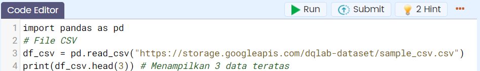

Jika dijalankan akan menghasilkan output di console:

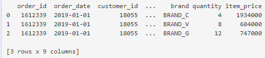

2. `Membaca file TSV`

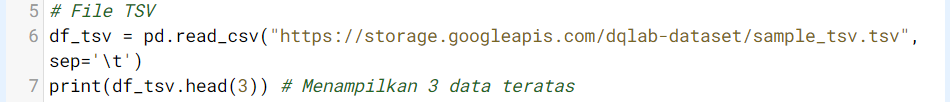

Jika dijalankan akan menghasilkan output di console:


Tugas Praktek!

| Code  |               Title              	|
|:----:	|:--------------------------------:	|
| [📜](https://github.com/bayubagusbagaswara/dqlab-data-engineer/blob/master/6-Data%20Manipulation%20with%20Pandas%20-%20Part%201/2-Dataset%20IO/1-Read-Dataset-CSV-dan-TSV.py) | Membaca file CSV dan TSV |

# Read Dataset - Excel
File Excel dengan ekstensi *.xls atau *.xlsx cukup banyak digunakan dalam menyimpan data. Pandas juga memiliki fitur untuk membaca file excel.

Notes :
Dataset : https://storage.googleapis.com/dqlab-dataset/sample_excel.xlsx

Fungsi .read_excel() digunakan untuk membaca file excel menjadi dataframe pandas.

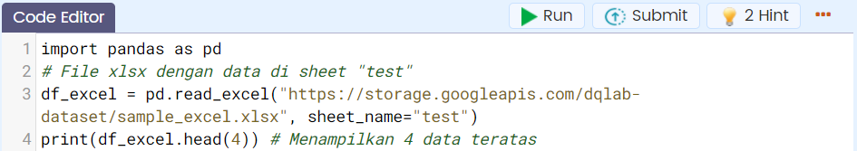

Jika dijalankan code di atas akan menghasilkan output di console seperti berikut:

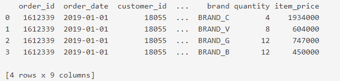

Tugas Praktek!

| Code  |               Title              	|
|:----:	|:--------------------------------:	|
| [📜](https://github.com/bayubagusbagaswara/dqlab-data-engineer/blob/master/6-Data%20Manipulation%20with%20Pandas%20-%20Part%201/2-Dataset%20IO/2-Read-Dataset-Excel.py) | Membaca file Excel |

# Read Dataset - JSON
Method .read_json() digunakan untuk membaca URL API yang formatnya JSON dan mengubahnya menjadi dataframe pandas. Method ini dapat digunakan seperti yang dicontohkan berikut ini:

Dataset JSON: https://storage.googleapis.com/dqlab-dataset/covid2019-api-herokuapp-v2.json


Kemudian akan mendapatkan hasilnya di console seperti berikut:

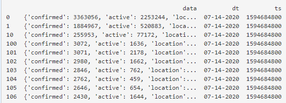

Tugas Praktek!

| Code  |               Title              	|
|:----:	|:--------------------------------:	|
| [📜](https://github.com/bayubagusbagaswara/dqlab-data-engineer/blob/master/6-Data%20Manipulation%20with%20Pandas%20-%20Part%201/2-Dataset%20IO/3-Read-Dataset-JSON.py) | Membaca file JSON |

# Read Dataset - SQL
Fungsi .read_sql() atau .read_sql_query() digunakan untuk membaca query dari database dan translate menjadi pandas dataframe, contoh case ini database sqlite.

Contoh penggunaannya:

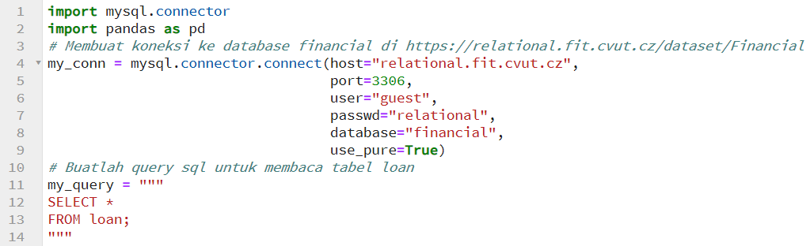

Jika menggunakan .read_sql_query


Output:

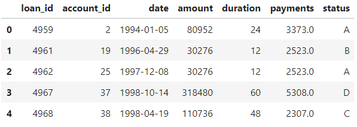

Jika menggunakan .read_sql

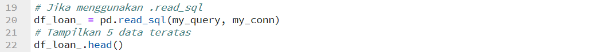

Output:


Terlihat keduanya menghasilkan output yang sama.

# Read Dataset - Google BigQuery
Untuk data yang besar (big data), umumnya digunakan Google BigQuery. Layanan ini dapat digunakan jika telah memiliki Google BigQuery account.

Fungsi .read_gbq() digunakan untuk membaca Google BigQuery table menjadi dataframe pandas.


project_id="XXXXXXXX" adalah ID dari Google BigQuery account.

Output-nya:


# Write Dataset
Dalam bekerja sebagai data scientist/analis setelah dilakukan data cleaning dataset yang sudah rapi tentunya disimpan terlebih dahulu ke dalam media penyimpanan.  

Pandas menyediakan fitur demikian secara ringkas melalui penerapan method pada dataframe/series yang ditabelkan berikut ini:

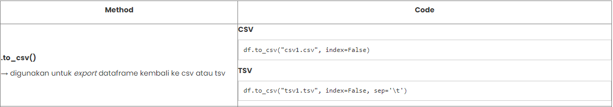

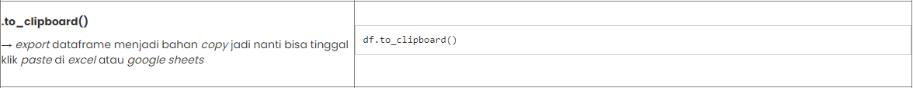

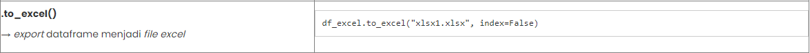

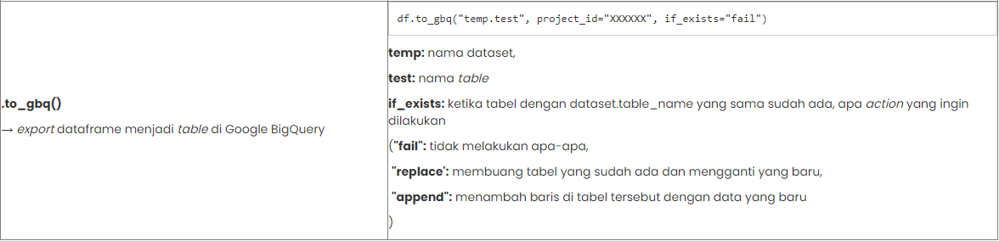

# Head & Tail
Seperti yang telah dipelajari sebelumnya bahwa ada method .head yang diterapkan pada suatu variabel bertipe pandas dataframe/series.

Method `.head` ditujukan untuk membatasi tampilan jumlah baris teratas dari dataset. Sementara itu, method .tail ditujukan untuk membatasi jumlah baris terbawah dari dataset.

Secara umum kedua method ini memiliki bentuk

```bash
[nama_dataframe].head(n) 
```
dan 

```bash
[nama_dataframe].tail(n)
```

dengan n merupakan jumlah baris yang akan ditampilkan, jika tidak disebutkan n = 5 (sebagai nilai default dari n). 

Tugas Praktek:

Notes :

Dataset : https://storage.googleapis.com/dqlab-dataset/sample_csv.csv

Berdasarkan file sample_csv.csv cetaklah 3 data teratas dan 3 data terbawah. 

| Code  |               Title              	|
|:----:	|:--------------------------------:	|
| [📜](https://github.com/bayubagusbagaswara/dqlab-data-engineer/blob/master/6-Data%20Manipulation%20with%20Pandas%20-%20Part%201/2-Dataset%20IO/4-Head-and-Tail.py) | Head and Tail |

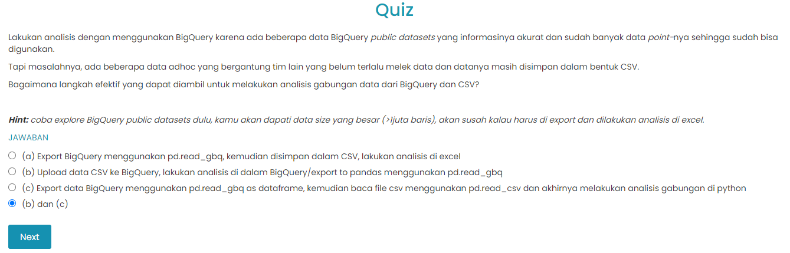