# Pendahuluan
Aku masih fokus mengutak-atik dokumen yang bisa dibaca oleh Pandas ketika Andra menyahut dari belakangku. “Sudah dipelajari modulnya, Aksara? Apakah sudah cukup paham dasarnya penggunaan basic data of Pandas? Terutama cara bikin dataframe dan data source yang diolah dari Pandas?”

Seperti biasa, Andra ingin memastikan proses belajarku berjalan lancar. Tapi, mumpung ia berada di sini dan aku punya pertanyaan, lebih baik kusampaikan.

“Iya, Ndra. Tapi aku masih agak bingung soal manipulasi data, seperti membuat index, slicing, dan transform tipe data di series maupun dataframe,” ungkapku jujur. Apakah Andra akan membantuku? Aku menunggu responsnya sampai kemudian Andra menarik bangku ke sebelahku.

“Oke, coba sini saya bantu jelaskan.”

Mataku berbinar. Aku tak akan melewatkan kesempatan ini. Aku pun menggeser bangku agar lebih dekat dengan Andra yang siap menampilkan beberapa contoh manipulasi data, terutama membuat index, seperti yang dijelaskan selanjutnya.

# Indexing - Part 1
Index merupakan key identifier dari tiap row/column untuk Series atau Dataframe (sifatnya tidak mutable untuk masing-masing value tapi bisa diganti untuk semua value sekaligus).

Jika tidak disediakan, pandas akan membuat kolom index default secara otomatis sebagai bilangan bulat (integer) dari 0 sampai range jumlah baris data tersebut.

Kolom index dapat terdiri dari:

1. satu kolom (single index), atau
2. multiple kolom (disebut dengan hierarchical indexing).

Index dengan multiple kolom ini terjadi karena unique identifier tidak dapat dicapai hanya dengan set index di 1 kolom saja sehingga membutuhkan beberapa kolom yang menjadikan tiap row menjadi unique.

# Indexing - Part 2
Secara default setelah suatu dataframe dibaca dari file dengan format tertentu, index-nya merupakan single index.

Pada sub bab ini akan mencetak index dan kolom yang dimiliki oleh file "https://storage.googleapis.com/dqlab-dataset/sample_csv.csv". Untuk menentukan index dan kolom yang dimiliki oleh dataset yang telah dinyatakan sebagai sebuah dataframe pandas dapat dilakukan dengan menggunakan atribut .index dan .columns.

Tugas Praktek:

Tampilkanlah index dan kolom data teratas dari file TSV "https://storage.googleapis.com/dqlab-dataset/sample_tsv.tsv" yang telah dibaca!

| Code  |               Title              	|
|:----:	|:--------------------------------:	|
| [📜](https://github.com/bayubagusbagaswara/dqlab-data-engineer/blob/master/6-Data%20Manipulation%20with%20Pandas%20-%20Part%201/3-Indexing%2C%20Slicing%2C%20dan%20Transforming/2-Indexing-Part-2.py) | Indexing |

# Indexing - Part 3
Di sub bab sebelumnya telah dibahas terkait single index, tentunya pada sub bab ini akan bahas multi index atau disebut juga dengan hierarchical indexing.

Untuk membuat multi index (hierarchical indexing) dengan pandas diperlukan kolom-kolom mana saja yang perlu disusun agar index dari dataframe menjadi sebuah hirarki yang kemudian dapat dikenali.

Selanjutnya akan membuat multi index dengan menggunakan kolom 'order_id', 'customer_id', 'product_id', dan 'order_date' dengan menggunakan method .set_index(). Mari perhatikan contoh kode yang diberikan berikut ini:


berikut hasil tampilan dataframe df_x-nya:

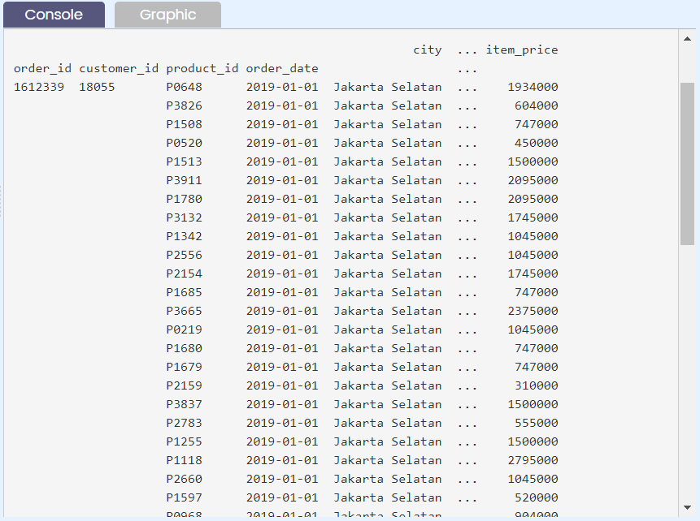


Untuk melihat multi index yang telah diset dapat dilakukan dengan:


yang memberikan output:

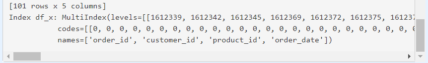

Perlu diketahui bahwa kumpulan index dari multi index adalah list dari banyak tuples, tuples-nya merupakan kombinasi yang ada dari gabungan index-index tersebut. Dari multi index tersebut juga terdapat atribut levels yang menunjukkan urutan index, dalam case ini 'order_id' > 'customer_id' > 'product_id' > 'order_date'.


yang menghasilkan output berupa:


Tugas praktek:

Tampilkanlah multi index dari file TSV "sample_tsv.tsv" yang telah dibaca berupa nama dan level index-nya.

Notes :

Dataset : https://storage.googleapis.com/dqlab-dataset/sample_tsv.tsv

Kolom yang menjadi index-nya yaitu 'order_date', 'city', dan 'customer_id'!


| Code  |               Title              	|
|:----:	|:--------------------------------:	|
| [📜](https://github.com/bayubagusbagaswara/dqlab-data-engineer/blob/master/6-Data%20Manipulation%20with%20Pandas%20-%20Part%201/3-Indexing%2C%20Slicing%2C%20dan%20Transforming/3-Indexing-Part-3.py) | Indexing |


# Indexing - Part 4
Terdapat beberapa cara untuk membuat index, salah satunya adalah seperti yang telah dilakukan pada sub bab sebelumnya dengan menggunakan method .set_index().

Di sub bab ini akan menggunakan assignment untuk menset index dari suatu dataframe. Untuk itu file "sample_excel.xlsx" yang digunakan. Perhatikan code berikut!

Note:

- Cara yang ditunjukkan oleh baris ketujuh (ke-7) pada code editor di atas hanya berlaku jika index yang di-assign tersebut memiliki panjang yang sama dengan jumlah baris dari dataframe.
- Jika ingin kembalikan dataframe ke index default-nya yaitu dari 0 s/d jumlah baris data - 1, maka dapat menggunakan method .reset_index(drop=True), argument drop=True bertujuan untuk menghapus index lama. 
 
Tugas praktek:

Baca kembali file TSV "sample_tsv.tsv" hanya untuk 10 baris pertama. Set index-nya dengan menggunakan nama "Pesanan ke-i" i adalah bilangan bulat dari 1 sampai dengan jumlah baris (10 baris data).

Notes :

Dataset : https://storage.googleapis.com/dqlab-dataset/sample_tsv.tsv

Jika berhasil dijalankan kodenya maka akan tampil hasil berikut:


| Code  |               Title              	|
|:----:	|:--------------------------------:	|
| [📜](https://github.com/bayubagusbagaswara/dqlab-data-engineer/blob/master/6-Data%20Manipulation%20with%20Pandas%20-%20Part%201/3-Indexing%2C%20Slicing%2C%20dan%20Transforming/4-Indexing-Part-4.py) | Indexing |

# Indexing - Part 5
Jika file yang akan dibaca melalui penggunaan library pandas dapat di-preview terlebih dahulu struktur datanya maka melalui fungsi yang ditujukan untuk membaca file dapat diset mana kolom yang akan dijadikan index.

Fitur ini telah dimiliki oleh setiap fungsi yang digunakan dalam membaca data dengan pandas, yaitu penggunaan argumen index_col pada fungsi yang dimaksud. Untuk jelasnya dapat diperhatikan pada kode berikut ini.


Dari dataset sample_csv.csv, sample_tsv.tsv, atau sample_excel.xlsx sudah tahu bahwa kolom dataset adalah 'order_id'; 'order_date'; 'customer_id'; 'city'; 'province'; 'product_id'; 'brand'; 'quantity'; and 'item_price'. Sehingga kode di atas digunakan langsung kolom 'order_date' pada saat membaca file-nya.

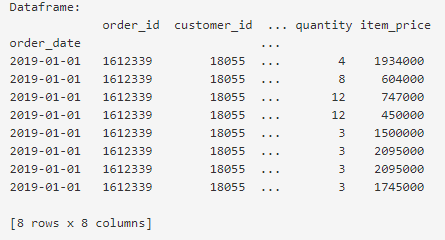

Terlihat bahwa kolom order_date sudah jadi index, dan tentunya jumlah kolom dataframe berkurang satu, yaitu menjadi delapan kolom.

Tugas praktek:

Baca kembali file TSV "sample_tsv.tsv" dan set lah kolom "order_date" dan "order_id" sebagai index_col-nya dan cetaklah dataframe untuk delapan baris pertama. 

Notes : 

Dataset : https://storage.googleapis.com/dqlab-dataset/sample_tsv.tsv

Jika berhasil dijalankan kodenya maka akan tampil hasil berikut:


| Code  |               Title              	|
|:----:	|:--------------------------------:	|
| [📜](https://github.com/bayubagusbagaswara/dqlab-data-engineer/blob/master/6-Data%20Manipulation%20with%20Pandas%20-%20Part%201/3-Indexing%2C%20Slicing%2C%20dan%20Transforming/5-Indexing-Part-5.py) | Indexing |

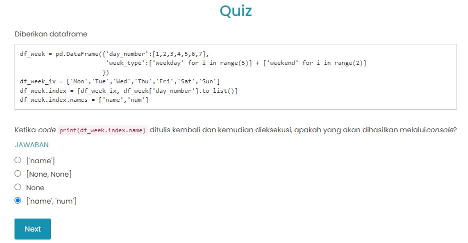

# Slicing - Part 1
Seperti artinya slicing adalah cara untuk melakukan filter ke dataframe/series berdasarkan kriteria tertentu dari nilai kolomnya ataupun kriteria index-nya.

Terdapat 2 cara paling terkenal untuk slicing dataframe, yaitu dengan menggunakan method .loc dan .iloc pada variabel bertipe pandas DataFrame/Series. Method .iloc ditujukan untuk proses slicing berdasarkan index berupa nilai integer tertentu. Akan tetapi akan lebih sering menggunakan dengan method .loc karena lebih fleksibel. 

Mari ikuti ilustrasi berikut ini.

Dataset belum dilakukan indexing, jadi slicing berdasarkan nilai kolomnya. Untuk itu "sample_csv.csv" dibaca kembali dan dipraktikkan metode .loc[] dengan mengambil tanggal 1 Januari 2019 dari kolom order_date dan product_id nya adalah P2154 dan P2556.

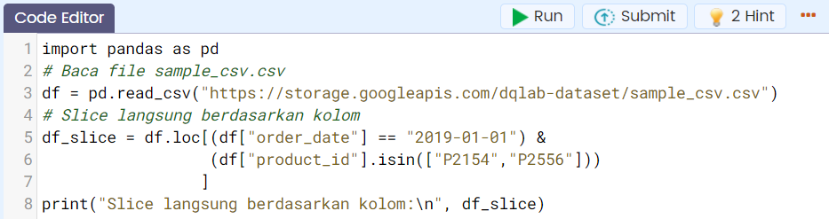

Output jika dijalankan:

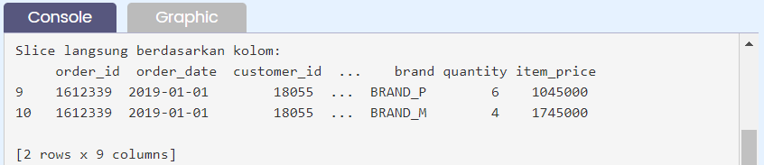

Tugas praktek:

Baca kembali file TSV "sample_csv.csv" dan slice/filter-lah dataset jika customer_id adalah 18055 dan product_id-nya yaitu P0029, P0040, P0041, P0116, dan P0117. 

Notes :

Dataset: https://storage.googleapis.com/dqlab-dataset/sample_csv.csv

Jika berhasil dijalankan kodenya maka akan tampil hasil berikut:

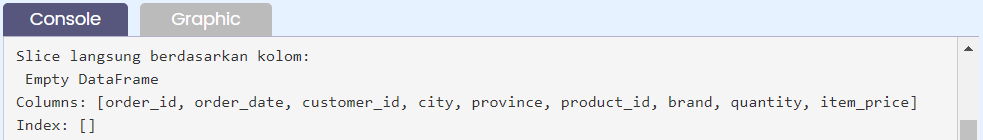

| Code  |               Title              	|
|:----:	|:--------------------------------:	|
| [📜](https://github.com/bayubagusbagaswara/dqlab-data-engineer/blob/master/6-Data%20Manipulation%20with%20Pandas%20-%20Part%201/3-Indexing%2C%20Slicing%2C%20dan%20Transforming/6-Slicing-Part-1.py) | Slicing |

# Slicing - Part 2
Dalam sub bab sebelumnya telah mempelajari bagaimana melakukan slicing/filtering dataset dengan menggunakan method .loc pada kolom dataset.

Sekarang, menerapkan berdasarkan index. Tentu syaratnya adalah dataset sudah dilakukan indexing terlebih dahulu melalui penerapan method .set_index 

`Cara 1`: Gunakan method .loc seperti yang dicontohkan berikut:

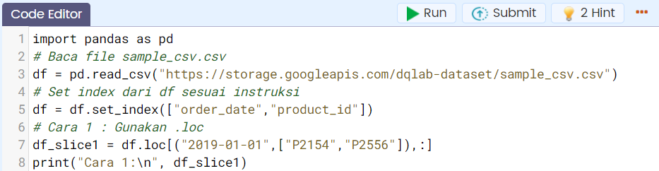

Output cara 1:

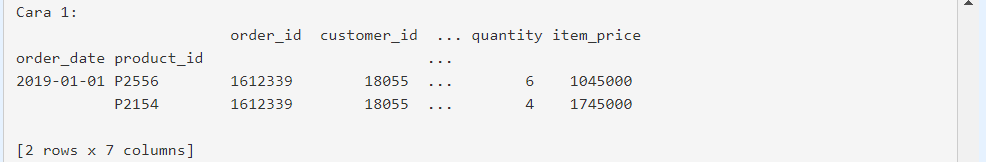

`Cara 2`: Gunakan pd.IndexSlice sebagai varaibel untuk melakukan slicing index

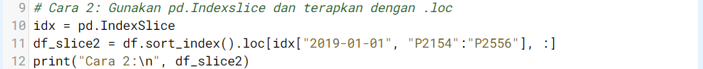

Output cara 2:

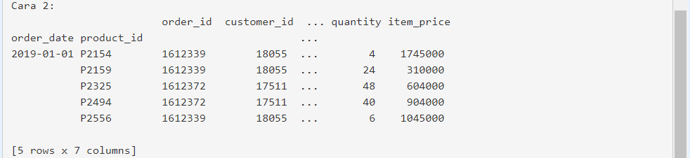

Tugas praktek: 

Baca kembali file TSV "sample_csv.csv" dan set terlebih dahulu indexnya yaitu order_date, order_id, dan product_id. Kemudian slice/filter-lah dataset jika order_date adalah 2019-01-01, order_id adalah 1612339 dan product_id-nya yaitu P2154 dan P2159. Gunakanlah cara pertama.

Notes :

Dataset :  https://storage.googleapis.com/dqlab-dataset/sample_csv.csv

Jika berhasil dijalankan kodenya maka akan tampil hasil berikut:

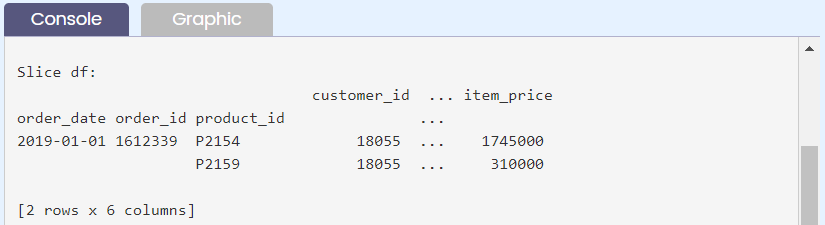

| Code  |               Title              	|
|:----:	|:--------------------------------:	|
| [📜](https://github.com/bayubagusbagaswara/dqlab-data-engineer/blob/master/6-Data%20Manipulation%20with%20Pandas%20-%20Part%201/3-Indexing%2C%20Slicing%2C%20dan%20Transforming/7-Slicing-Part-2.py) | Slicing |


# Transforming - Part 1
Transform adalah ketika mengubah dataset yang ada menjadi entitas baru, dapat dilakukan dengan:

    - konversi dari satu data type ke data type yang lain,
    - transpose dataframe,
    - atau yang lainnya.

Hal yang biasa dilakukan pertama kali setelah data dibaca adalah mengecek tipe data di setiap kolomnya apakah sesuai dengan representasinya. Untuk itu dapat menggunakan atribut .dtypes pada dataframe yang telah kita baca tadi,

```bash
[nama_dataframe].dtypes 
```

Untuk konversi tipe data, secara default system akan mendeteksi data yang tidak bisa di render as date type or numeric type sebagai object yang basically string. Tidak bisa di render oleh system ini karena berbagai hal, mungkin karena formatnya asing dan tidak dikenali oleh python secara umum (misal: date type data → '2019Jan01').

Data contoh tersebut tidak bisa di render karena bulannya Jan tidak bisa di translate menjadi in form of number (00-12) dan tidak ada ‘-’ di antara tahun, bulan dan harinya. Jika seluruh data pada kolom di order_date sudah tertulis dalam bentuk 'YYYY-MM-DD' maka ketika dibaca, kolom order_date sudah langsung dinyatakan bertipe data datetime.

Untuk merubah kolom date_order yang sebelumnya bertipe object menjadi kolom bertipe datetime, cara pertama yang dapat dilakukan adalah menggunakan:

```bash
pd.to_datetime(argumen) 
```

dengan argumen adalah isi kolom dari dataframe yang akan dirubah tipe datanya, misal dalam format umum.

```bash
nama_dataframe["nama_kolom"]
```

Sehingga lengkapnya dapat ditulis sebagai:

```bash
nama_dataframe["nama_kolom"] = pd.to_datetime(nama_dataframe["nama_kolom"]) 
```

Tugas praktek:

Ubahlah tipe data di kolom order_date yang semula bertipe objek menjadi bertipe datetime.

Di code editor telah disediakan kode yang tidak lengkap, silakan diisi sesuai dengan instruksi yang diberikan. 

Jika dengan benar dituliskan dan berhasil dijalankan maka output berikut yang akan diperoleh pada console.

Notes :

Dataset : https://storage.googleapis.com/dqlab-dataset/sample_csv.csv

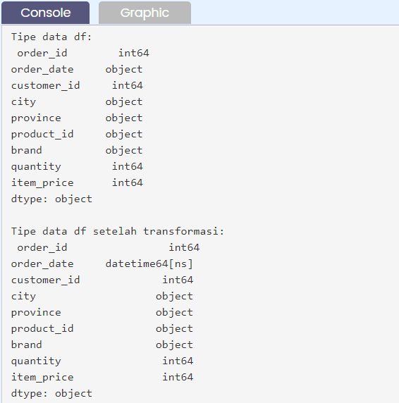

| Code  |               Title              	|
|:----:	|:--------------------------------:	|
| [📜](https://github.com/bayubagusbagaswara/dqlab-data-engineer/blob/master/6-Data%20Manipulation%20with%20Pandas%20-%20Part%201/3-Indexing%2C%20Slicing%2C%20dan%20Transforming/8-Transforming-Part-1.py) | Transforming |

# Transforming - Part 2
Pada sub bab ini akan mengubah tipe data pada kolom dataframe yang telah dibaca menjadi tipe data float (kolom quantity) dan tipe kategori (kolom city).

Secara umum, untuk mengubah ke numerik dapat menggunakan pd.to_numeric(), yaitu:

```bash
nama_dataframe["nama_kolom"] = pd.to_numeric(nama_dataframe["nama_kolom"], downcast="tipe_data_baru")
```

Sedangkan untuk menjadi suatu kolom yang dapat dinyatakan sebagai kategori dapat menggunakan method .astype() pada dataframe, yaitu

```bash
nama_dataframe["nama_kolom"] = nama_dataframe["nama_kolom"].astype("category")
```

Tugas Praktek:

Ubahlah tipe data di kolom

- quantity yang semula bertipe int64 menjadi bertipe float32, dan
- city yang semula bertipe object menjadi bertipe category

Di code editor telah disediakan kode yang tidak lengkap, silakan diisi sesuai dengan instruksi yang diberikan. 

Jika dengan benar dituliskan dan berhasil dijalankan maka output berikut yang akan kamu peroleh di console.

Notes : 

Dataset : https://storage.googleapis.com/dqlab-dataset/sample_csv.csv

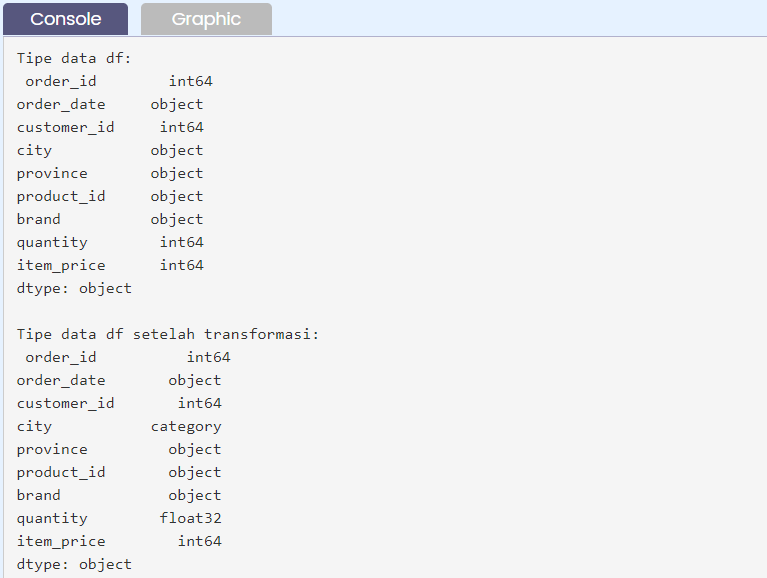

| Code  |               Title              	|
|:----:	|:--------------------------------:	|
| [📜](https://github.com/bayubagusbagaswara/dqlab-data-engineer/blob/master/6-Data%20Manipulation%20with%20Pandas%20-%20Part%201/3-Indexing%2C%20Slicing%2C%20dan%20Transforming/9-Transforming-Part-2.py) | Transforming |

# Transforming - Part 3
Sekarang akan mempelajari teknik/cara berikutnya dalam proses transformasi suatu dataframe. Di sub bab ini akan memakai method .apply() dan .map() pada suatu dataframe.

`Method .apply()` digunakan untuk menerapkan suatu fungsi python (yang dibuat dengan def atau anonymous dengan lambda) pada dataframe/series atau hanya kolom tertentu dari dataframe. 

Berikut ini adalah contohnya yaitu akan merubah setiap baris pada kolom brand menjadi lowercase.  

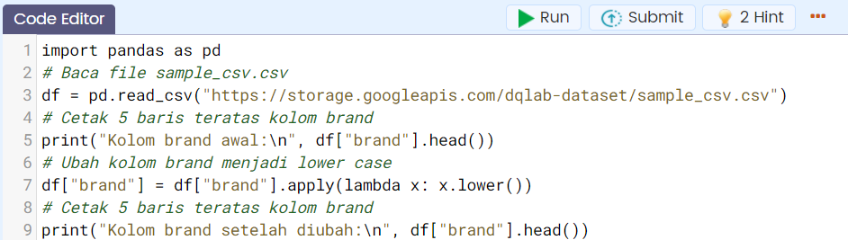

Jika dijalankan maka akan menghasilkan:

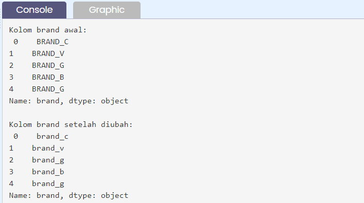

`Method .map()` hanya dapat diterapkan pada series atau dataframe yang diakses satu kolom saja. Method ini digunakan untuk mensubstitusikan suatu nilai ke dalam tiap baris datanya.

Mari lihat contoh yang diberikan berikut ini yang mana akan ambil huruf terakhir dari brand.

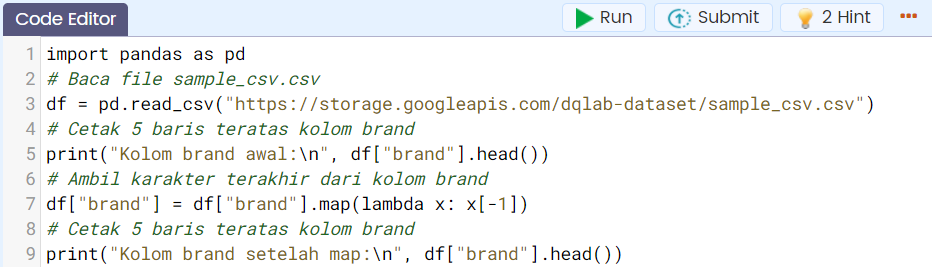

Jika dijalankan maka akan menghasilkan:

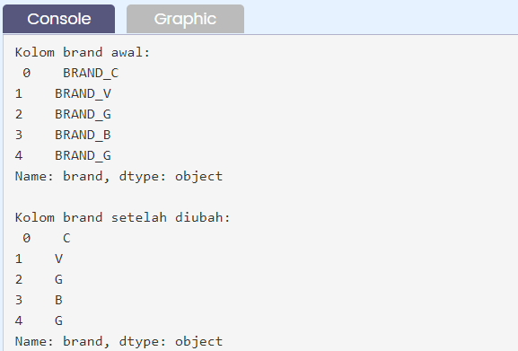

Tugas praktek:

Kerjakanlah seperti yang diinstruksikan melalui code editor dan di code editor juga telah disediakan kode yang tidak lengkap, silakan diisi dengan yang seharusnya. Apa yang telah dicontohkan dapat dijadikan referensi.

Notes :

Dataset : https://storage.googleapis.com/dqlab-dataset/sample_csv.csv

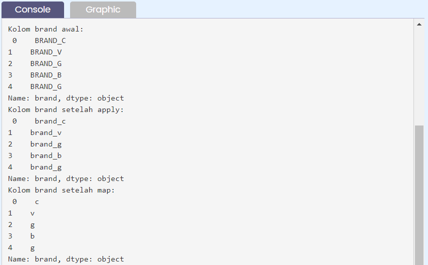

| Code  |               Title              	|
|:----:	|:--------------------------------:	|
| [📜](https://github.com/bayubagusbagaswara/dqlab-data-engineer/blob/master/6-Data%20Manipulation%20with%20Pandas%20-%20Part%201/3-Indexing%2C%20Slicing%2C%20dan%20Transforming/10-Transforming-Part-3.py) | Transforming |

# Transforming - Part 4
Di sub bab sebelumnya sudah mengetahui bahwa map hanya dapat digunakan untuk pandas series. Pada sub bab ini akan menggunakan method .applymap pada dataframe.

Untuk itu perhatikan contoh berikut:

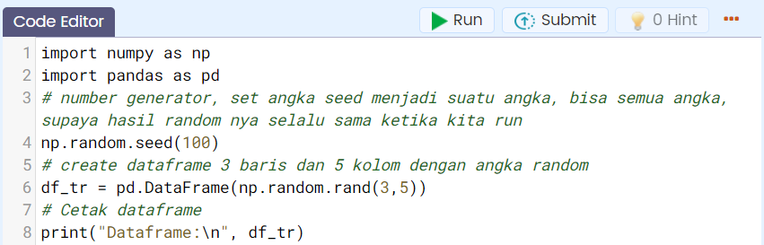

Cara 1 dengan tanpa define function awalnya, langsung pake fungsi anonymous lambda x

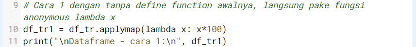

Cara 2 dengan define function

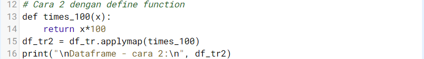

Output setelah dijalankan

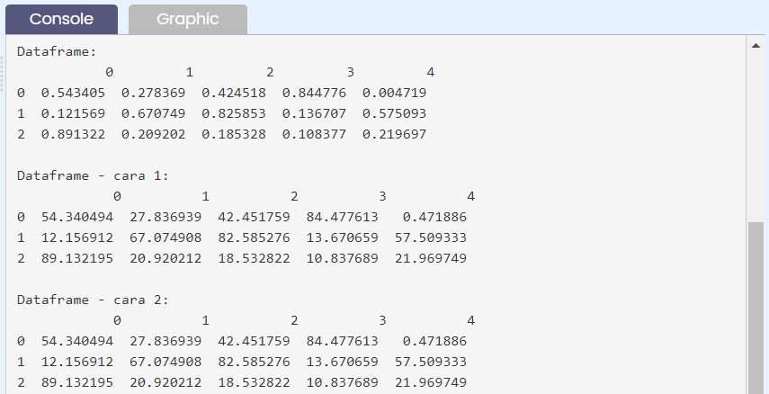

Tugas Praktek:

Dengan cara yang sama seperti diatas buatlah matriks random ukuran 3 x 4 dengan seed random-nya 1234. Kemudian gunakan kedua cara seperti di atas untuk merubah seluruh isi dengan fungsi kuadrat x**2 + 3*x + 2.

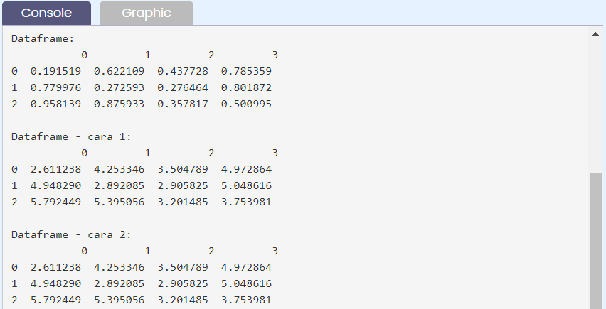

| Code  |               Title              	|
|:----:	|:--------------------------------:	|
| [📜](https://github.com/bayubagusbagaswara/dqlab-data-engineer/blob/master/6-Data%20Manipulation%20with%20Pandas%20-%20Part%201/3-Indexing%2C%20Slicing%2C%20dan%20Transforming/11-Transforming-Part-4.py) | Transforming |