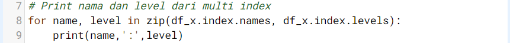

# Pendahuluan
Aku masih fokus mengutak-atik dokumen yang bisa dibaca oleh Pandas ketika Andra menyahut dari belakangku. “Sudah dipelajari modulnya, Aksara? Apakah sudah cukup paham dasarnya penggunaan basic data of Pandas? Terutama cara bikin dataframe dan data source yang diolah dari Pandas?”

Seperti biasa, Andra ingin memastikan proses belajarku berjalan lancar. Tapi, mumpung ia berada di sini dan aku punya pertanyaan, lebih baik kusampaikan.

“Iya, Ndra. Tapi aku masih agak bingung soal manipulasi data, seperti membuat index, slicing, dan transform tipe data di series maupun dataframe,” ungkapku jujur. Apakah Andra akan membantuku? Aku menunggu responsnya sampai kemudian Andra menarik bangku ke sebelahku.

“Oke, coba sini saya bantu jelaskan.”

Mataku berbinar. Aku tak akan melewatkan kesempatan ini. Aku pun menggeser bangku agar lebih dekat dengan Andra yang siap menampilkan beberapa contoh manipulasi data, terutama membuat index, seperti yang dijelaskan selanjutnya.

# Indexing - Part 1
Index merupakan key identifier dari tiap row/column untuk Series atau Dataframe (sifatnya tidak mutable untuk masing-masing value tapi bisa diganti untuk semua value sekaligus).

Jika tidak disediakan, pandas akan membuat kolom index default secara otomatis sebagai bilangan bulat (integer) dari 0 sampai range jumlah baris data tersebut.

Kolom index dapat terdiri dari:

1. satu kolom (single index), atau
2. multiple kolom (disebut dengan hierarchical indexing).

Index dengan multiple kolom ini terjadi karena unique identifier tidak dapat dicapai hanya dengan set index di 1 kolom saja sehingga membutuhkan beberapa kolom yang menjadikan tiap row menjadi unique.

# Indexing - Part 2
Secara default setelah suatu dataframe dibaca dari file dengan format tertentu, index-nya merupakan single index.

Pada sub bab ini akan mencetak index dan kolom yang dimiliki oleh file "https://storage.googleapis.com/dqlab-dataset/sample_csv.csv". Untuk menentukan index dan kolom yang dimiliki oleh dataset yang telah dinyatakan sebagai sebuah dataframe pandas dapat dilakukan dengan menggunakan atribut .index dan .columns.

Tugas Praktek:

Tampilkanlah index dan kolom data teratas dari file TSV "https://storage.googleapis.com/dqlab-dataset/sample_tsv.tsv" yang telah dibaca!

| Code  |               Title              	|
|:----:	|:--------------------------------:	|
| [📜](https://github.com/bayubagusbagaswara/dqlab-data-engineer/blob/master/6-Data%20Manipulation%20with%20Pandas%20-%20Part%201/3-Indexing%2C%20Slicing%2C%20dan%20Transforming/2-Indexing-Part-2.py) | Indexing |

# Indexing - Part 3
Di sub bab sebelumnya telah dibahas terkait single index, tentunya pada sub bab ini akan bahas multi index atau disebut juga dengan hierarchical indexing.

Untuk membuat multi index (hierarchical indexing) dengan pandas diperlukan kolom-kolom mana saja yang perlu disusun agar index dari dataframe menjadi sebuah hirarki yang kemudian dapat dikenali.

Selanjutnya akan membuat multi index dengan menggunakan kolom 'order_id', 'customer_id', 'product_id', dan 'order_date' dengan menggunakan method .set_index(). Mari perhatikan contoh kode yang diberikan berikut ini:

berikut hasil tampilan dataframe df_x-nya:

Untuk melihat multi index yang telah diset dapat dilakukan dengan:

yang memberikan output:

Perlu diketahui bahwa kumpulan index dari multi index adalah list dari banyak tuples, tuples-nya merupakan kombinasi yang ada dari gabungan index-index tersebut. Dari multi index tersebut juga terdapat atribut levels yang menunjukkan urutan index, dalam case ini 'order_id' > 'customer_id' > 'product_id' > 'order_date'.

yang menghasilkan output berupa:

Tugas praktek:

Tampilkanlah multi index dari file TSV "sample_tsv.tsv" yang telah dibaca berupa nama dan level index-nya.

Notes :

Dataset : https://storage.googleapis.com/dqlab-dataset/sample_tsv.tsv

Kolom yang menjadi index-nya yaitu 'order_date', 'city', dan 'customer_id'!

| Code  |               Title              	|
|:----:	|:--------------------------------:	|
| [📜](https://github.com/bayubagusbagaswara/dqlab-data-engineer/blob/master/6-Data%20Manipulation%20with%20Pandas%20-%20Part%201/3-Indexing%2C%20Slicing%2C%20dan%20Transforming/3-Indexing-Part-3.py) | Indexing |

# Indexing - Part 4
Terdapat beberapa cara untuk membuat index, salah satunya adalah seperti yang telah dilakukan pada sub bab sebelumnya dengan menggunakan method .set_index().

Di sub bab ini akan menggunakan assignment untuk menset index dari suatu dataframe. Untuk itu file "sample_excel.xlsx" yang digunakan. Perhatikan code berikut!

Note:

- Cara yang ditunjukkan oleh baris ketujuh (ke-7) pada code editor di atas hanya berlaku jika index yang di-assign tersebut memiliki panjang yang sama dengan jumlah baris dari dataframe.
- Jika ingin kembalikan dataframe ke index default-nya yaitu dari 0 s/d jumlah baris data - 1, maka dapat menggunakan method .reset_index(drop=True), argument drop=True bertujuan untuk menghapus index lama. 
 
Tugas praktek:

Baca kembali file TSV "sample_tsv.tsv" hanya untuk 10 baris pertama. Set index-nya dengan menggunakan nama "Pesanan ke-i" i adalah bilangan bulat dari 1 sampai dengan jumlah baris (10 baris data).

Notes :

Dataset : https://storage.googleapis.com/dqlab-dataset/sample_tsv.tsv

Jika berhasil dijalankan kodenya maka akan tampil hasil berikut:

| Code  |               Title              	|
|:----:	|:--------------------------------:	|
| [📜](https://github.com/bayubagusbagaswara/dqlab-data-engineer/blob/master/6-Data%20Manipulation%20with%20Pandas%20-%20Part%201/3-Indexing%2C%20Slicing%2C%20dan%20Transforming/4-Indexing-Part-4.py) | Indexing |

# Indexing - Part 5
Jika file yang akan dibaca melalui penggunaan library pandas dapat di-preview terlebih dahulu struktur datanya maka melalui fungsi yang ditujukan untuk membaca file dapat diset mana kolom yang akan dijadikan index.

Fitur ini telah dimiliki oleh setiap fungsi yang digunakan dalam membaca data dengan pandas, yaitu penggunaan argumen index_col pada fungsi yang dimaksud. Untuk jelasnya dapat diperhatikan pada kode berikut ini.

Dari dataset sample_csv.csv, sample_tsv.tsv, atau sample_excel.xlsx sudah tahu bahwa kolom dataset adalah 'order_id'; 'order_date'; 'customer_id'; 'city'; 'province'; 'product_id'; 'brand'; 'quantity'; and 'item_price'. Sehingga kode di atas digunakan langsung kolom 'order_date' pada saat membaca file-nya.

Terlihat bahwa kolom order_date sudah jadi index, dan tentunya jumlah kolom dataframe berkurang satu, yaitu menjadi delapan kolom.

Tugas praktek:

Baca kembali file TSV "sample_tsv.tsv" dan set lah kolom "order_date" dan "order_id" sebagai index_col-nya dan cetaklah dataframe untuk delapan baris pertama. 

Notes : 

Dataset : https://storage.googleapis.com/dqlab-dataset/sample_tsv.tsv

Jika berhasil dijalankan kodenya maka akan tampil hasil berikut:

| Code  |               Title              	|
|:----:	|:--------------------------------:	|
| [📜](https://github.com/bayubagusbagaswara/dqlab-data-engineer/blob/master/6-Data%20Manipulation%20with%20Pandas%20-%20Part%201/3-Indexing%2C%20Slicing%2C%20dan%20Transforming/5-Indexing-Part-5.py) | Indexing |
