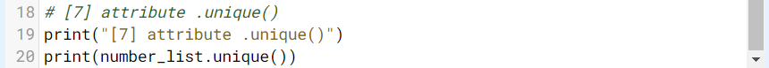

# Pendahuluan
“Apa kegunaan mempelajari Pandas? Aku tahunya Pandas nama hewan,” kelakarku pada Andra. Benar kan! Lagi-lagi aku menemukan istilah umum tapi punya makna berbeda di dunia data.

“Itu Panda, Aksara. Kalau Pandas berguna untuk melakukan analisis dan pengolahan data dari menengah sampai besar. Coba dibaca saja dulu modulnya biar lebih jelas. Nanti akan ada praktik yang memperjelas,” tukas Andra.

Seperti yang bisa kutebak, aku harus memahami modul dan pembelajaran baru ini sendiri. Karena kulihat Andra sudah melengang pergi setelah memberi intruksi sederhana seperti itu. Tak apa, perlahan aku terbiasa juga belajar mandiri. Walau memang lebih nyaman kalau dibimbing, hehehe.

# Memanggil Library Pandas
Pandas adalah library python open source yang biasanya digunakan untuk kebutuhan data analisis. Pandas membuat Python supaya dapat bekerja dengan data yang berbentuk tabular seperti spreadsheet dengan cara pemuatan data yang cepat, manipulasi data, menggabungkan data, serta ada berbagai fungsi yang lain.

| Code  |               Title              	|
|:----:	|:--------------------------------:	|
| [📜](https://github.com/bayubagusbagaswara/dqlab-data-engineer/blob/master/6-Data-Manipulation-with-Pandas-Part-1/1-Introduction-to-Pandas/MemanggilLibraryPandas.py) | Memanggil Library Pandas |

# DataFrame & Series
Di Pandas terdapat 2 kelas data baru yang digunakan sebagai struktur dari spreadsheet:

1. `Series`: satu kolom bagian dari tabel dataframe yang merupakan 1 dimensional numpy array sebagai basis datanya, terdiri dari 1 tipe data (integer, string, float, dll).
2. `DataFrame`: gabungan dari Series, berbentuk rectangular data yang merupakan tabel spreadsheet itu sendiri (karena dibentuk dari banyak Series, tiap Series biasanya punya 1 tipe data, yang artinya 1 dataframe bisa memiliki banyak tipe data).

| Code  |               Title              	|
|:----:	|:--------------------------------:	|
| [📜](https://github.com/bayubagusbagaswara/dqlab-data-engineer/blob/master/6-Data-Manipulation-with-Pandas-Part-1/1-Introduction-to-Pandas/DataframeDanSeries.py) | Dataframe dan Series |

# Atribut DataFrame & Series - Part 1

Dataframe dan Series memiliki sangat banyak atribut yang digunakan untuk transformasi data, tetapi ada beberapa attribute yang sering dipakai. Di sini series `number_list` dan dataframe `matrix_list` pada subbab sebelumnya digunakan kembali.

1. `Method .info()`

Method .info() digunakan untuk mengecek kolom apa yang membentuk dataframe itu, data types, berapa yang non null, dll. Method ini tidak dapat digunakan pada series, hanya pada dataframe saja.

Output di console untuk penggunaan method .info() ini adalah:

2. `Attribute .shape`

Attribute .shape digunakan untuk mengetahui berapa baris dan kolom, hasilnya dalam format tuple (baris, kolom).

Output di console untuk penggunaan attribute .shape ini adalah:

3. `Attribute .dtypes`

Attribute .dtypes digunakan untuk mengetahui tipe data di tiap kolom. Tipe data object: kombinasi untuk berbagai tipe data (number & text, etc).

Output di console untuk penggunaan attribute .dtypes ini adalah:

4. `Method .astype(nama_tipe_data)`

Method .astype(nama_tipe_data) untuk convert tipe data berdasarkan tipe data seperti: float, int, str, numpy.float, numpy.int ataupun numpy.datetime.

Output di console untuk penggunaan method .astype() ini adalah:

Tugas Praktek

| Code  |               Title              	|
|:----:	|:--------------------------------:	|
| [📜](https://github.com/bayubagusbagaswara/dqlab-data-engineer/blob/master/6-Data-Manipulation-with-Pandas-Part-1/1-Introduction-to-Pandas/AtributDataFrameDanSeriesPart1.py) | Atribut Dataframe dan Series |

# Atribut DataFrame & Series - Part 2
Dataframe dan Series memiliki sangat banyak atribut yang digunakan untuk transformasi data, tetapi ada beberapa attribute yang sering dipakai. Di sini series number_list dan data frame matrix_list digunakan kembali.

5. `Attribute .copy()`

Attribute .copy() digunakan melakukan duplikat, untuk disimpan di variable yang berbeda mungkin supaya tidak loading data lagi.

Output di console untuk penggunaan attribute .copy() ini adalah:

6. `Attribute .to_list()`

Attribute .to_list() digunakan untuk mengubah series menjadi list dan tidak dapat digunakan untuk dataframe.

Output di console untuk penggunaan attribute .to_list() ini adalah:

7. `Attribute .unique()`

Attribute .unique() digunakan menghasilkan nilai unik dari suatu kolom, hasilnya dalam bentuk numpy array. Attribute ini hanya digunakan pada series saja.

Output di console untuk penggunaan attribute .unique() ini adalah:

Tugas Praktek

| Code  |               Title              	|
|:----:	|:--------------------------------:	|
| [📜](https://github.com/bayubagusbagaswara/dqlab-data-engineer/blob/master/6-Data-Manipulation-with-Pandas-Part-1/1-Introduction-to-Pandas/AtributDataFrameDanSeriesPart2.py) | Atribut Dataframe dan Series |

# Atribut DataFrame & Series - Part 3
Dataframe dan Series memiliki sangat banyak atribut yang digunakan untuk transformasi data, tetapi ada beberapa attribute yang sering dipakai. Di sini series `number_list` dan data frame `matrix_list` pada subbab sebelumnya digunakan kembali.

8. `Attribute .index`

Attribute `.index` digunakan untuk mencari index/key dari Series atau Dataframe.

Output di console untuk penggunaan attribute .index ini adalah:

9. `Attribute .columns`

Attribute `.columns` digunakan untuk mengetahui apa saja kolom yang tersedia di dataframe tersebut (hanya digunakan untuk dataframe saja). 

Output di console untuk penggunaan attribute .columns ini adalah:

10. `Attribute .loc`

Attribute `.loc` digunakan slice dataframe atau series berdasarkan nama kolom dan/atau nama index.

Output di console untuk penggunaan attribute .loc[] ini adalah:

11. `Attribute .iloc`

Attribute .iloc digunakan untuk slice dataframe atau series berdasarkan index kolom dan/atau index.

Output di console untuk penggunaan attribute .iloc[] ini adalah:

Tugas praktek:

| Code  |               Title              	|
|:----:	|:--------------------------------:	|
| [📜](https://github.com/bayubagusbagaswara/dqlab-data-engineer/blob/master/6-Data-Manipulation-with-Pandas-Part-1/1-Introduction-to-Pandas/AtributDataFrameDanSeriesPart3.py) | Atribut Dataframe dan Series |

# Quiz

# Creating Series & Dataframe from List
Untuk membuat Series atau Dataframe bisa dari berbagai macam tipe data container/mapping di python, seperti list dan dictionary, maupun dari numpy array.

Pada sub bagian ini, kamu akan membuat Series dan Dataframe yang bersumber dari list. Sekadar meninjau bahwa list merupakan sebuah kumpulan data berbagai macam tipe data yang mutable (dapat diganti).

Tugas Praktek!

| Code  |               Title              	|
|:----:	|:--------------------------------:	|
| [📜](https://github.com/bayubagusbagaswara/dqlab-data-engineer/blob/master/6-Data-Manipulation-with-Pandas-Part-1/1-Introduction-to-Pandas/CreatingSeriesDanDataFrameFromList.py) | Creating Series & DataFrame from List |

# Creating Series & Dataframe from Dictionary
Untuk membuat Series atau Dataframe bisa dari berbagai macam tipe data container/mapping di python, seperti list dan dictionary, maupun dari numpy array.

Pada sub bagian ini, akan membuat Series dan Dataframe yang bersumber dari dictionary. Sekadar meninjau bahwa, dictionary merupakan kumpulan data yang strukturnya terdiri dari key dan value.

Tugas Praktek!

| Code  |               Title              	|
|:----:	|:--------------------------------:	|
| [📜](https://github.com/bayubagusbagaswara/dqlab-data-engineer/blob/master/6-Data-Manipulation-with-Pandas-Part-1/1-Introduction-to-Pandas/CreatingSeriesDanDataFrameFromDictionary.py) | Creating Series & DataFrame from Dictionary |

# Creating Series & Dataframe from Numpy Array
Untuk membuat Series atau Dataframe bisa dari berbagai macam tipe data container/mapping di python, seperti list dan dictionary, maupun dari numpy array.

Pada sub bagian ini, akan membuat Series dan Dataframe yang bersumber dari numpy array. Sekadar meninjau bahwa, numpy array kumpulan data yang terdiri atas berbagai macam tipe data, mutable, tapi dibungkus dalam array oleh library Numpy.

Tugas Praktek!

| Code  |               Title              	|
|:----:	|:--------------------------------:	|
| [📜](https://github.com/bayubagusbagaswara/dqlab-data-engineer/blob/master/6-Data-Manipulation-with-Pandas-Part-1/1-Introduction-to-Pandas/CreatingSeriesDanDataFrameFromNumpyArray.py) | Creating Series & DataFrame from Numpy Array |

# Quiz 

