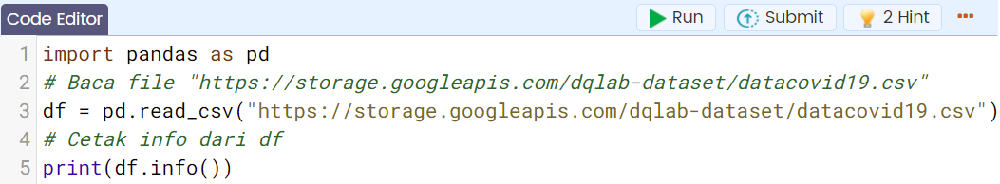
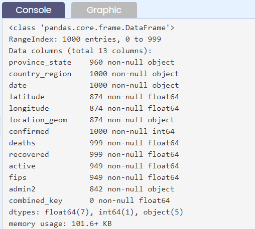
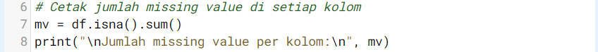
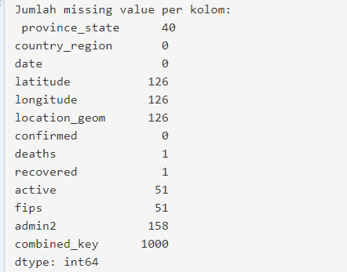

# Pendahuluan
“Aksara, saya barusan kirim email lagi ya berisi link seputar handling missing values untuk Pandas. Kamu bisa belajar lebih lengkap di sana bersama isi modul.”

“Siap!”

Tanpa menunggu lagi, aku mengecek link yang diberikan Andra:

https://pandas.pydata.org/pandas-docs/stable/user_guide/missing_data.html

# Inspeksi Missing Value

Value yang hilang/tidak lengkap dari dataframe akan membuat analisis atau model prediksi yang dibuat menjadi tidak akurat dan mengakibatkan keputusan salah yang diambil. Terdapat beberapa cara untuk mengatasi data yang hilang/tidak lengkap tersebut.

Data COVID-19 yang akan digunakan ini diambil dari google big query, tetapi sudah disediakan datasetnya dalam format csv dengan nama https://storage.googleapis.com/dqlab-dataset/datacovid19.csv. Ini adalah studi kasus untuk meng-handle missing value. Bagaimanakah langkah-langkahnya?

Di pandas data yang hilang umumnya direpresentasikan dengan `NaN`.

Langkah pertama, harus tahu kolom mana yang terdapat data hilang dan berapa banyak dengan cara:

`Cara 1`: menerapkan method `.info()` pada dataframe yang dapat diikuti dari kode berikut ini:

Notes :

Dataset : https://storage.googleapis.com/dqlab-dataset/datacovid19.csv

Output baris kode kelima:

Cara 2: mengetahui berapa banyak nilai hilang dari tiap kolom di dataset tersebut dengan menerapkan chaining method pada dataframe yaitu `.isna().sum()`. Method .isna() digunakan untuk mengecek berapa data yang bernilai NaN dan .sum() menjumlahkannya secara default untuk masing-masing kolom dataframe.

Perhatikanlah kode berikut!

Output untuk baris kode ketujuh dan kedelapan:

Seperti kedua output di atas, artinya ada beberapa kolom yang ada null sebagian dan ada yang nilainya null semua untuk kolomnya.

Tugas Praktek:

Ketikkanlah kembali statement seperti yang ditunjukkan dalam kedua cara untuk mendeteksi missing value pada dataframe 

| Code  |               Title              	|
|:----:	|:--------------------------------:	|
| [📜](https://github.com/bayubagusbagaswara/dqlab-data-engineer/blob/master/6-Data-Manipulation-with-Pandas-Part-1/4-Handling-Missing-Values/InspeksiMissingValue.py) | Inspeksi Missing Value |

