# Pendahuluan
“Aksara, saya barusan kirim email lagi ya berisi link seputar handling missing values untuk Pandas. Kamu bisa belajar lebih lengkap di sana bersama isi modul.”

“Siap!”

Tanpa menunggu lagi, aku mengecek link yang diberikan Andra:

https://pandas.pydata.org/pandas-docs/stable/user_guide/missing_data.html

# Inspeksi Missing Value

Value yang hilang/tidak lengkap dari dataframe akan membuat analisis atau model prediksi yang dibuat menjadi tidak akurat dan mengakibatkan keputusan salah yang diambil. Terdapat beberapa cara untuk mengatasi data yang hilang/tidak lengkap tersebut.

Data COVID-19 yang akan digunakan ini diambil dari google big query, tetapi sudah disediakan datasetnya dalam format csv dengan nama https://storage.googleapis.com/dqlab-dataset/datacovid19.csv. Ini adalah studi kasus untuk meng-handle missing value. Bagaimanakah langkah-langkahnya?

Di pandas data yang hilang umumnya direpresentasikan dengan `NaN`.


Langkah pertama, harus tahu kolom mana yang terdapat data hilang dan berapa banyak dengan cara:

`Cara 1`: menerapkan method `.info()` pada dataframe yang dapat diikuti dari kode berikut ini:

Notes :

Dataset : https://storage.googleapis.com/dqlab-dataset/datacovid19.csv


Output baris kode kelima:


Cara 2: mengetahui berapa banyak nilai hilang dari tiap kolom di dataset tersebut dengan menerapkan chaining method pada dataframe yaitu `.isna().sum()`. Method .isna() digunakan untuk mengecek berapa data yang bernilai NaN dan .sum() menjumlahkannya secara default untuk masing-masing kolom dataframe.

Perhatikanlah kode berikut!


Output untuk baris kode ketujuh dan kedelapan:


Seperti kedua output di atas, artinya ada beberapa kolom yang ada null sebagian dan ada yang nilainya null semua untuk kolomnya.

Tugas Praktek:

Ketikkanlah kembali statement seperti yang ditunjukkan dalam kedua cara untuk mendeteksi missing value pada dataframe 

| Code  |               Title              	|
|:----:	|:--------------------------------:	|
| [📜](https://github.com/bayubagusbagaswara/dqlab-data-engineer/blob/master/6-Data-Manipulation-with-Pandas-Part-1/4-Handling-Missing-Values/InspeksiMissingValue.py) | Inspeksi Missing Value |

# Treatment untuk Missing Value - Part 1
Terdapat beberapa cara untuk mengatasi missing value, antara lain:

    - dibiarkan saja,
    - hapus value itu, atau
    - isi value tersebut dengan value yang lain (biasanya interpolasi, mean, median, etc)
 
Sebelum melakukan action ke missing value pada data covid diatas, sebaiknya tampilkan beberapa row teratas dari dataset itu

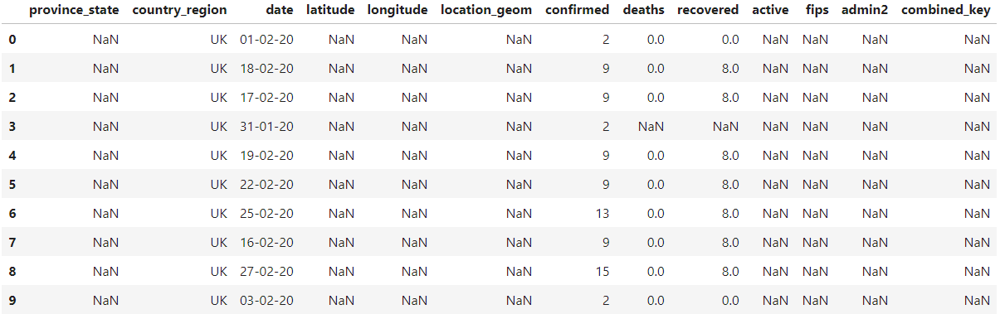

dan dilihat kembali jumlah missing value tiap kolomnya.


agar dapat ditelaah terlebih dahulu.

Hanya kolom combine_key yang keseluruhan barisnya adalah missing value (1000 buah), sementara kolom country_region, date, dan confirmed tidak memiliki missing value. Untuk kolom lainnya terdapat beragam jumlah missing value. Apa yang dapat dilakukan?

Untuk memahami mana kolom yang akan di treatment dengan tiga perlakukan di atas lihat nature dari data terlebih dahulu. Contohnya pada kolom death dan recovered jika ada yang missing value maka kemungkinan terbesarnya adalah tidak ada meninggal atau sembuh pada hari tersebut. 

Untuk kolom yang seluruhnya missing yaitu combined_key dapat dibuang saja satu kolom itu karena tidak ada data yang dapat diketahui dari kolom tersebut.

Sementara, kolom yang lainnya bagaimana? Misal ambil kolom province_stat, missing value-nya dapat terjadi bahwa tidak dilaporkan itu berasal dari daerah mana di negara itu. Dapat mengisi misal dengan string 'unknown' karena tahu kolom tersebut bertipe data string.

# Treatment untuk Missing Value - Part 2
Sekarang dapat menerapkan dua aksi yaitu

    - Membiarkannya saja
    - Menghapus kolom
 
Treatment `pertama` (membiarkannya saja) seperti pada kolom confirmed, death, dan recovered. Akan tetapi jika tidak ada yang terkonfirmasi, meninggal dan sembuh sebenarnya dapat menukar value ini dengan angka nol. Meskipun ini lebih make sense dalam representasi datanya, tetapi untuk sub bab ini ketiga kolom tersebut diasumsikan dibiarkan memiliki nilai missing value.

Treatment `kedua` yaitu dengan menghapus kolom, yang mana ini digunakan jika seluruh kolom dari dataset yang dipunyai semua barisnya adalah missing value. Untuk itu dapat menerapkan method .dropna() pada dataframe, bagaimana caranya?

```bash
nama_dataframe.dropna(axis=1, how="all")
```

Pada method .dropna() ada dua keyword argumen yang harus diisikan yaitu axis dan how. Keyword axis digunakan untuk menentukan arah dataframe yang akan dibuang angka 1 untuk menyatakan kolom (column-based) atau dapat ditulis dalam string "column". Jika digunakan angka 0 berarti itu dalam searah index (row-based) atau dapat ditulis dalam string "index".

Sementara, keyword how digunakan untuk bagaimana cara membuangnya. Opsi yang dapat diterimanya (dalam string) adalah

    - "all" artinya jika seluruh data di satu/beberapa kolom atau di satu/beberapa baris adalah missing value.
    - "any" artinya jika memiliki 1 saja data yang hilang maka buanglah baris/kolom tersebut.

Tugas Praktek:

1. Cetaklah ukuran awal dari dataframe dengan atribut .shape pada dataframe yang telah dibaca.
2. Buanglah kolom jika memiliki seluruh data adalah missing value, kemudian cetaklah ukurannya.
3. Dari dataframe hasil langkah kedua buanglah baris-baris yang setidaknya memiliki satu saja missing value, dan cetak kembali ukurannya.

Notes:

Dataset: https://storage.googleapis.com/dqlab-dataset/datacovid19.csv

Jika berhasil akan ditampilkan output-nya sebagai berikut

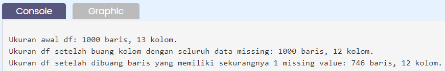

| Code  |               Title              	|
|:----:	|:--------------------------------:	|
| [📜](https://github.com/bayubagusbagaswara/dqlab-data-engineer/blob/master/6-Data-Manipulation-with-Pandas-Part-1/4-Handling-Missing-Values/TreatmentMissingValuePart2.py) | Treatment Missing Value |

# Treatment untuk Missing Value - Part 3
Sekarang, akan melakukan treatment ketiga untuk melakukan handle missing value pada dataframe. Treatment ini dilakukan dengan cara mengisi missing value dengan nilai lain, yang dapat berupa :

    - nilai statistik seperti mean atau median
    - interpolasi data
    - text tertentu
 
Akan mulai pada kolom yang missing yang tipe datanya adalah berupa object. Kolom tersebut adalah province_state, karena tidak tahu secara persis province_state mana yang dimaksud, bisa menempatkan string "unknown" sebagai substitusi missing value. Meskipun keduanya berarti sama-sama tidak tahu tetapi berbeda dalam representasi datanya.

Untuk melakukan hal demikian dapat menggunakan method .fillna() pada kolom dataframe yang dimaksud. Perhatikan kode berikut!

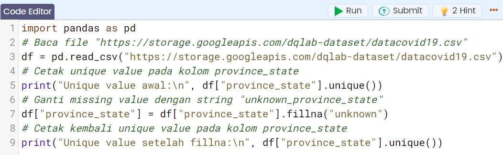

Jika dijalankan akan menghasilkan output berikut di console:

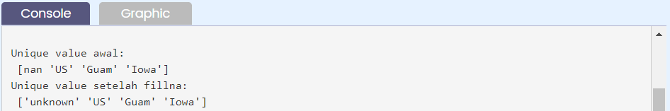

Terlihat bahwa unique value di kolom "province_state" yang semula ada nan telah berubah menjadi "unknown". 


Tugas Praktek:

Lakukanlah dengan cara yang sama dengan yang telah dicontohkan di atas, tetapi isilah missing value dengan string "unknown_province_state".

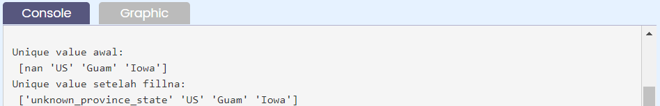

| Code  |               Title              	|
|:----:	|:--------------------------------:	|
| [📜](https://github.com/bayubagusbagaswara/dqlab-data-engineer/blob/master/6-Data-Manipulation-with-Pandas-Part-1/4-Handling-Missing-Values/TreatmentMissingValuePart3.py) | Treatment Missing Value |

# Treatment untuk Missing Value - Part 4
Masih melanjutkan bagaimana melakukan handle missing value tentunya dengan jalan mengganti missing value dengan nilai lainnya. Pada bab sebelumnya telah mengganti kolom bertipe objek dengan sesuatu string/teks.

Dalam sub bab ini akan mengganti missing value dengan nilai statistik kolom bersangkutan, baik median atau mean (nilai rata-rata). Misalnya akan menggunakan kolom active. Dengan mengabaikan terlebih dahulu sebaran berdasarkan negara (univariate), jika mengisi dengan nilai rata-rata maka harus melihat terlebih dahulu data apakah memiliki outliers atau tidak. Jika ada outliers dari data maka menggunakan nilai tengah (median) data adalah cara yang lebih safe.

Untuk itu diputuskan dengan mengecek nilai median dan nilai mean kolom active juga nilai min dan max-nya. Jika data pada kolom active terdistribusi normal maka nilai mean dan median akan hampir sama.


Terlihat data memiliki distribusi yang skewness, karena nilai mean dan median yang cukup jauh serta range data yang cukup lebar. Di sini pada kolom active data memiliki outliers. Jadi akan mengisi missing value dengan median.

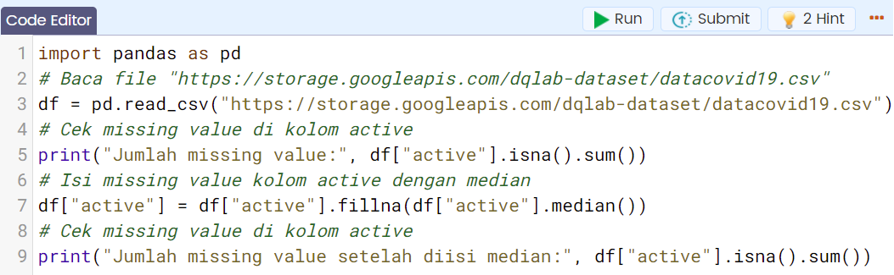

Outputnya:

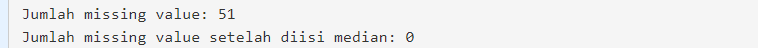

Tugas Praktek:

Carilah perbedaan nilai mean dan median kolom active untuk kondisi sebelum dan setelah missing value-nya diisi masing-masingnya dengan median dan mean.

Notes:

Dataset: https://storage.googleapis.com/dqlab-dataset/datacovid19.csv

Jika berjalan lancar maka akan diperoleh hasil seperti berikut ini di console:

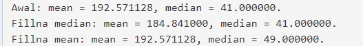

| Code  |               Title              	|
|:----:	|:--------------------------------:	|
| [📜](https://github.com/bayubagusbagaswara/dqlab-data-engineer/blob/master/6-Data-Manipulation-with-Pandas-Part-1/4-Handling-Missing-Values/TreatmentMissingValuePart4.py) | Treatment Missing Value |

# Treatment untuk Missing Value - Part 5
Di bagian ini akan menggunakan teknik interpolasi dalam mengisi nilai missing value pada suatu dataset.

Data yang menggunakan interpolasi untuk mengisi data yang hilang adalah time series data, yang secara default akan diisi dengan interpolasi linear.

Perhatikan kode berikut:

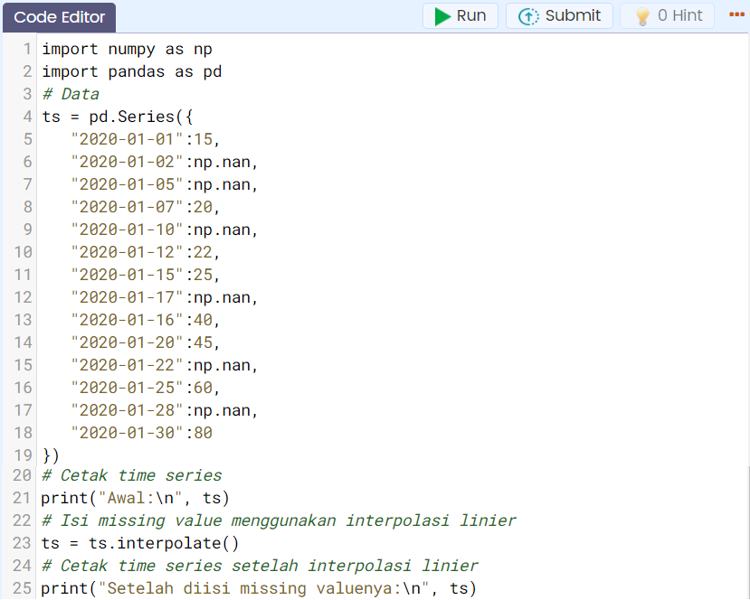

Jika dijalankan akan menghasilkan:


Tugas praktek:

Kerjakan kembali seperti contoh kode di atas dengan hasil output seperti yang ditujukkan berikut ini

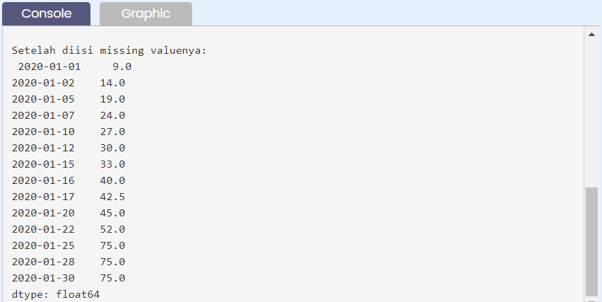

| Code  |               Title              	|
|:----:	|:--------------------------------:	|
| [📜](https://github.com/bayubagusbagaswara/dqlab-data-engineer/blob/master/6-Data-Manipulation-with-Pandas-Part-1/4-Handling-Missing-Values/TreatmentMissingValuePart5.py) | Treatment Missing Value |

# Quiz

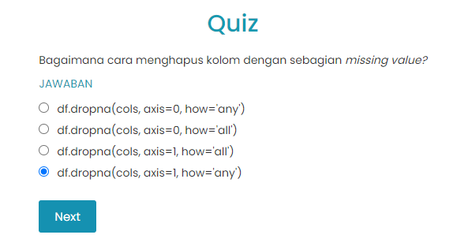