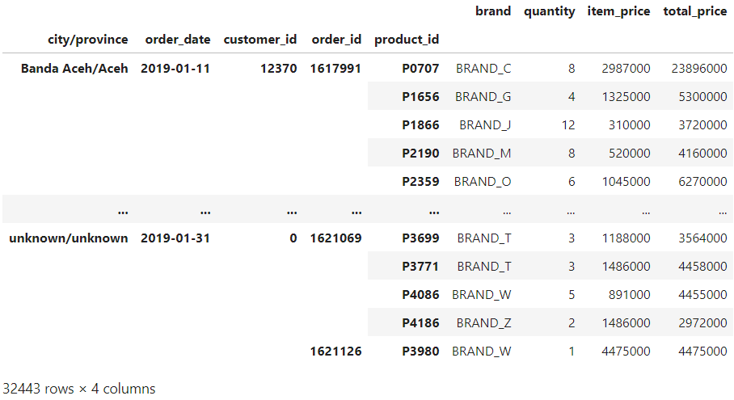

# Pendahuluan
“Ndra, aku sudah cukup paham dengan teorinya,” sahutku seakan memberi kode jika aku sudah siap mengerjakan proyek yang tadi dijanjikan.

“Saya suka kepercayaan dirimu, Aksara. Kalau begitu, sudah siap kalau diberi proyek?” pancing Andra.

Aku mengangguk mantap.

“Oke, untuk proyek pertama, kamu akan melakukan ETL sebelum analisis data. Karena data yang dibutuhkan masih belum bersih, sehingga tidak bisa dilakukan analisis lebih lanjut.”

Aku menyimak pemaparan dari Andra sembari memikirkan solusi untuk ETL. Tentunya bisa aku eksekusi dengan Pandas. “Baik, Ndra. Data yang dibutuhkan apa saja nantinya?”

“Data untuk cabang perusahaan ritel kita, Aksara. Berarti kumpulan data bulan Januari 2019 untuk setiap kota dan provinsi, tanggal order-nya, customer, order-nya apa aja terkait brand, product, quantity dan item price-nya juga. Dan, yang terakhir adalah GMV/Gross Merchandise Volume (total price)-nya.”

“Banyak banget!” gumamku dalam hati.

“Saya tahu kamu pasti sudah memikirkan detlennya karena data yang dibutuhkan banyak. Jangan khawatir, saya beri tenggat waktu sampai akhir minggu ini, bukan besok. Cukup?”

Aku mengangkat ibu jari, “Langsung aku cicil dari sekarang deh, Ndra.”

“Baik, selamat bekerja Aksara!”

# Project dari Andra
Berikut adalah isi email yang ditugaskan oleh Andra:

Diberikan dataset ‘retail_raw_test.csv’

1. Baca dataset
2. Tipe data diubah menjadi tipe yang seharusnya
    - customer_id dari string ke int64,
    - quantity dari string ke int64,
    - item_price dari string ke int64
3. transform product_value supaya bentuknya seragam dengan format PXXXX, assign ke kolom baru "product_id", dan drop kolom "product_value", jika terdapat nan gantilah dengan "unknown".
4. transform order_date menjadi value dengan format YYYY-mm-dd
5. cek data hilang dari tiap kolom dan kemudian isi missing value
    - di brand dengan "no_brand", dan
    - cek dulu bagaimana missing value di city & province - isi missing value di city dan province dengan "unknown"
6. create column city/province dari gabungan city & province
7. membuat index berdasarkan city_provice, order_date, customer_id, order_id, product_id (cek index)
8. membuat kolom "total_price" sebagai hasil perkalian quantity dengan item_price
9. slice data hanya untuk Jan 2019

Notes :

Dataset :  https://storage.googleapis.com/dqlab-dataset/retail_raw_test.csv

Preview akhir data:

Jawaban :

| Code  |               Title              	|
|:----:	|:--------------------------------:	|
| [📜](https://github.com/bayubagusbagaswara/dqlab-data-engineer/blob/master/6-Data-Manipulation-with-Pandas-Part-1/5-Mini-Project/Project.py) | Project |