# Pendahuluan

“Aksara, sedang apa?”

Aku pun mengalihkan perhatianku dari layar laptop ke Andra. Pagi-pagi sekali ia sudah menghampiriku. Diam-diam aku menebak materi baru apa lagi yang harus kupelajari ataukah ada proyek dadakan lagi yang perlu diselesaikan?

“Lagi latihan pakai Pandas, Ndra.”

“Oh, masih modul Pandas part 1 kemarin?”

Aku mengangguk.

“Pas banget, pagi ini saya mau ngirim ke kamu lanjutan modulnya. Lagipula modul kemarin kamu sudah lulus kok. Sekarang fokus ke Pandas part 2 saja. Kali ini materinya lebih dalam mengenai interaksi dengan tabular data menggunakan Pandas. Nanti kamu baca dan pelajari saja dulu.”

“Oh, oke.” 

Setelah obrolan tadi, aku langsung menerima pesan dengan lampiran materi lanjutan dari Andra. Penasaran dengan apa yang bisa Pandas lakukan lagi, aku pun segera membuka dan mencernanya:

Reference: https://pandas.pydata.org/pandas-docs/stable/user_guide/merging.html

# Bagaimana Cara Menggabungkan Pandas Series/Dataframe?
Sebagai seorang praktisi data, pasti sering kali bertemu dengan banyak file sekaligus dan data yang dibutuhkan tersebar di berbagai file tersebut dan membutuhkan metode untuk menggabungkan semua informasi yang dibutuhkan dari setiap file itu.

Dengan menggunakan excel atau tools pengolah spreadsheet lain hal itu bisa terjadi mungkin dengan menggunakan copy paste file satu ke file lainnya atau yang agak canggih menggunakan method importRange di google sheets. Tetapi tentu hal itu tidak bisa diandalkan ketika berurusan dengan big data yang datanya bisa miliaran rows dengan informasi yang tidak terbatas, Python dan Pandas adalah satu-satunya cara untuk mengatasinya.

Terdapat beberapa metode untuk menggabungkan Series/Dataframe di Pandas, yaitu:

- append
- concat
- merge
- join

Akan dibahas satu persatu dalam subbab berikutnya.

# Append
Method `.append()` dapat digunakan pada dataframe/series yang ditujukan untuk menambah row-nya saja. Jika di SQL memiliki 2 tabel atau lebih maka dapat menggabungkannya secara vertikal dengan Union. Jadi `SQL Union` ekuivalen dengan method `.append()` di Pandas.

Perhatikan contoh berikut, mulai dengan method .append pada series.

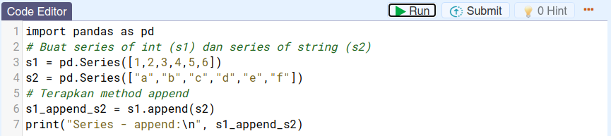

Output-nya adalah:

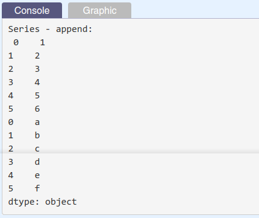

Untuk dataframe:

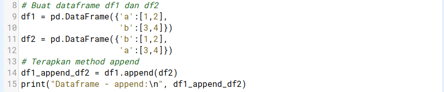

Output-nya adalah:

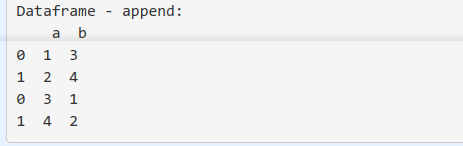

Tugas Praktek:

Untuk praktiknya terapkanlah method append dengan series s1 dan dataframe df1 ditempatkan setelah series s2 dan dataframe df2 masing-masingnya.

Outputnya:

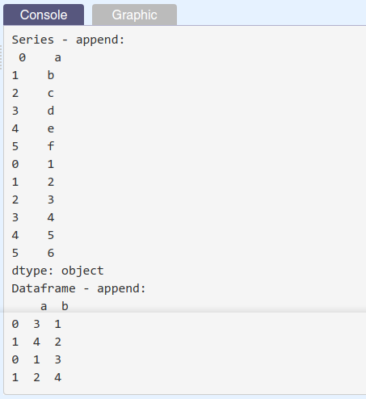

| Code  |               Title              	|
|:----:	|:--------------------------------:	|
| [📜](https://github.com/bayubagusbagaswara/dqlab-data-engineer/blob/master/7-Data-Manipulation-with-Pandas-Part-2/1-Penggabungan-Series-atau-DataFrame/Append.py) | Append |


# Concat
Method `.concat()` dapat digunakan pada dataframe yang ditujukan untuk penggabungan baik dalam row-wise (dalam arah) atau column-wise.

Perhatikan contoh berikut, mulai dengan method .concat pada row-wise.

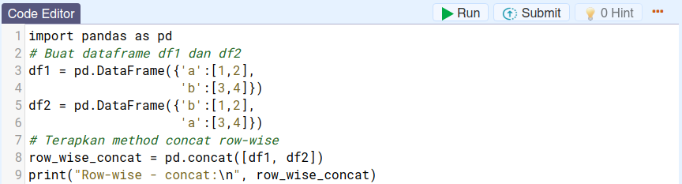

Output-nya:

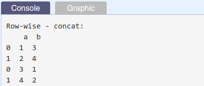

Untuk penerapan concat pada column-wise:

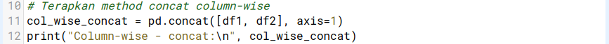

Output-nya:

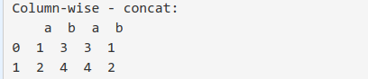

Dapat juga menambahkan identifier dari dataframe untuk data yang ditambahkan.

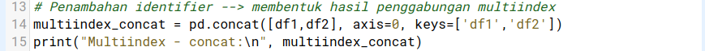

Output-nya:

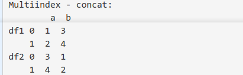

Tugas Praktik:

Balikkanlah posisi kedua dataframe yang akan digabungkan dengan concat. 

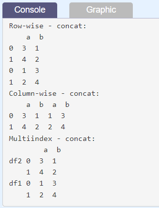

| Code  |               Title              	|
|:----:	|:--------------------------------:	|
| [📜](https://github.com/bayubagusbagaswara/dqlab-data-engineer/blob/master/7-Data-Manipulation-with-Pandas-Part-2/1-Penggabungan-Series-atau-DataFrame/Concat.py) | Concat |

# Merge - Part 1
Method .merge() untuk menggabungkan Series/Dataframe yang bentuknya mirip dengan syntax join di SQL, specify left and right tables, join key, dan how to join (left, right, inner, full outer).

Mari kita perhatikan contoh berikut:

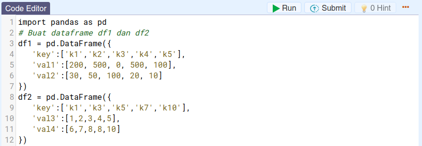

pd.merge yang ekivalen dengan `SQL left join`.

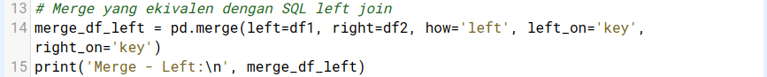

Output-nya:

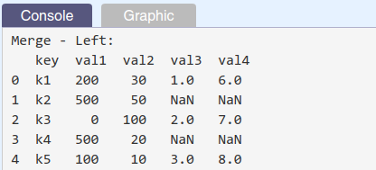

pd.merge yang ekivalen dengan `SQL right join`.

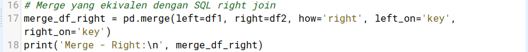

Output-nya:

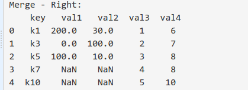

pd.merge yang ekivalen dengan `SQL inner join`.

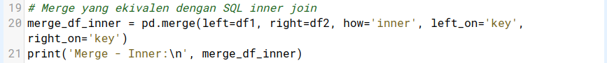

Output-nya:

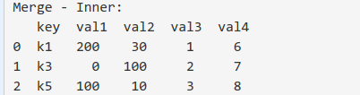

pd.merge yang ekivalen dengan `SQL outer join`.

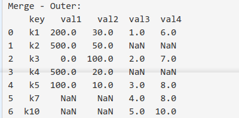

Output-nya:


Tugas Praktik:

Pada contoh di atas keyword argument left=df1 dan right=df2, untuk praktik gunakanlah keyword argument untuk left dan right masing-masingnya adalah df2 dan df1.

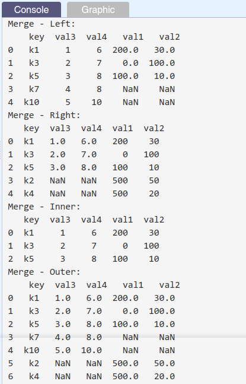

| Code  |               Title              	|
|:----:	|:--------------------------------:	|
| [📜](https://github.com/bayubagusbagaswara/dqlab-data-engineer/blob/master/7-Data-Manipulation-with-Pandas-Part-2/1-Penggabungan-Series-atau-DataFrame/Merge.py) | Merge |

# Merge - Part 2
Penggunaan method .merge yang telah dipelajari pada part 1 adalah untuk dataframe dengan index tunggal.

Bagaimana jika salah satu dataframe atau keseluruhan dataframe yang akan digabungkan tersebut memiliki multi index?

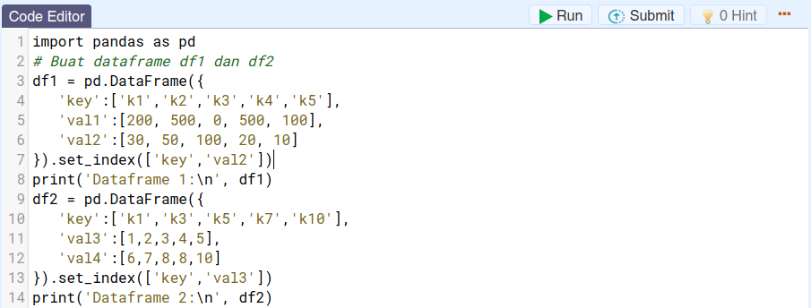

dengan df1 dan d2 di console:

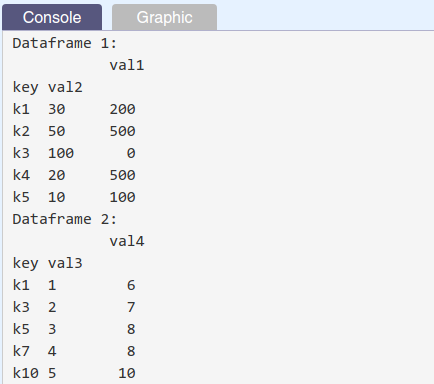

Jika digabungkan secara langsung seperti yang telah dilakukan pada bagian sebelumnya.

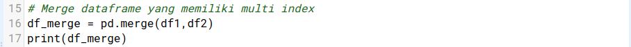

akan menghasilkan:

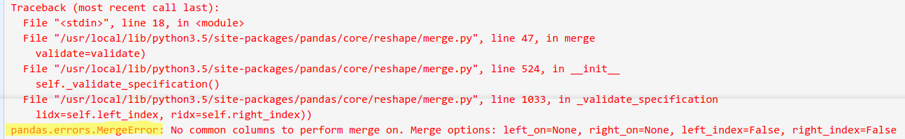

terjadi kegagalan dalam merging kedua dataframe yang memiliki multi index.

Cara mengatasinya adalah dengan me-reset index pada kedua dataframe, kemudian merge akan mendeteksi common single/multi column di kedua dataframe dan melakukan merge.

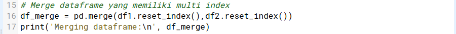

dengan output-nya:

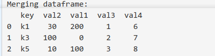

Tugas Praktik:

| Code  |               Title              	|
|:----:	|:--------------------------------:	|
| [📜](https://github.com/bayubagusbagaswara/dqlab-data-engineer/blob/master/7-Data-Manipulation-with-Pandas-Part-2/1-Penggabungan-Series-atau-DataFrame/MergePart2.py) | Merge Part 2 |


# Join
Method .join() digunakan pada dataframe untuk menggabungkan kedua data dengan set index pada kedua tabel tersebut sebagai join key, tanpa index, hal ini tidak akan berhasil.

Coba lihat kasusnya.

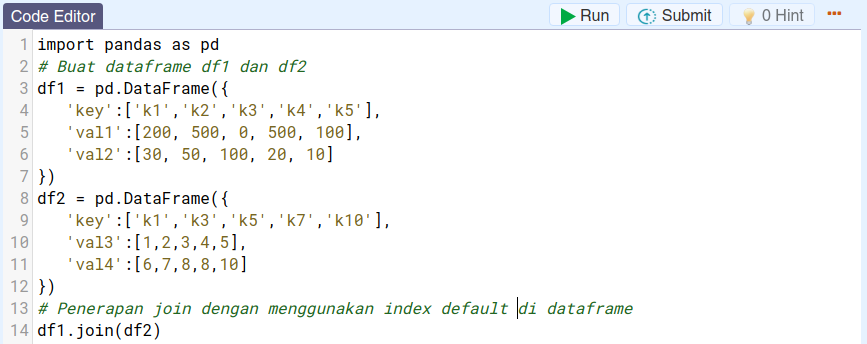

dengan output:

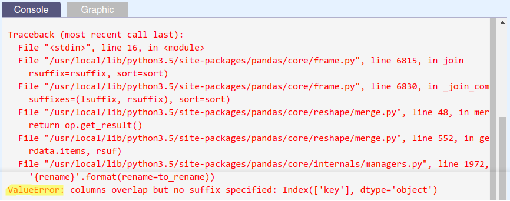

Terdapat error berupa:

```bash
ValueError: columns overlap but no suffix specified: Index(['key'], dtype='object')
```

Untuk itu, jika dilakukan seperti ini:

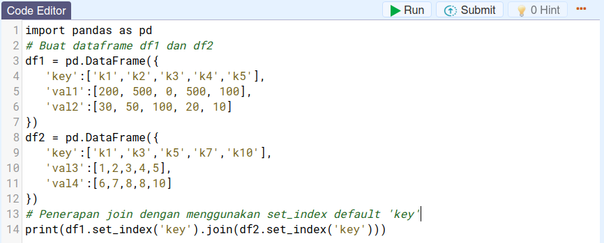

akan menghasilkan:

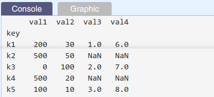

secara default, fungsi join ini akan mengeksekusi left join.

Untuk tipe join yang lain (contoh=inner), harus men-specify keyword how='inner' seperti yang dicontohkan berikut ini:

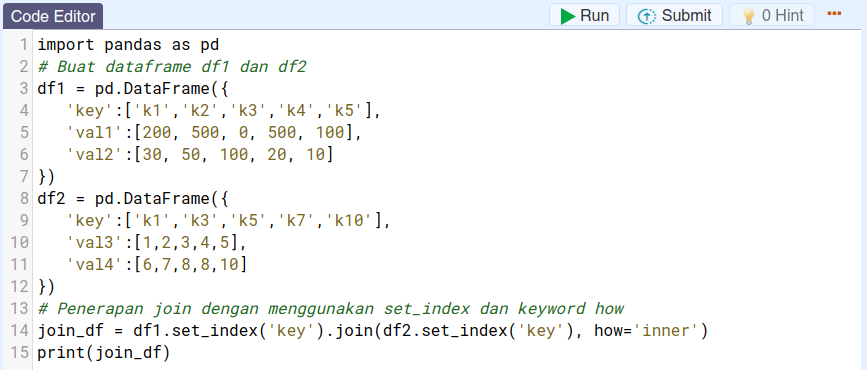

dengan output:

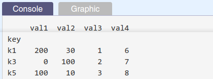

Tugas Praktek:

Lakukanlah seperti yang dicontohkan tetapi penggabungan dengan method join berupa outer join.

Jika berhasil dijalankan hasil berikut yang akan diperoleh:

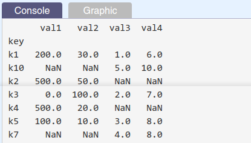

| Code  |               Title              	|
|:----:	|:--------------------------------:	|
| [📜](https://github.com/bayubagusbagaswara/dqlab-data-engineer/blob/master/7-Data-Manipulation-with-Pandas-Part-2/1-Penggabungan-Series-atau-DataFrame/Join.py) | Join |

# Quiz

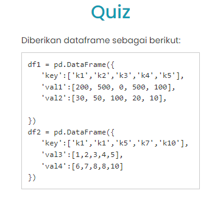

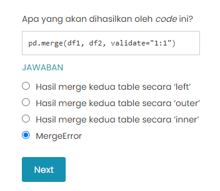
