# Pendahuluan

Pendahuluan
Kotak masuk email-ku tak hentinya menerima sejumlah link baru dari Andra untuk bab-bab yang akan kupelajari di modul Pandas part 2 ini. Banyak sekali referensi dari Andra!

“Pivot, Melt, Stack, dan Unstack, apa ini?” gumamku sendiri membaca subject email Andra.

Aku pun bergegas mengaksesnya:

Reference: https://pandas.pydata.org/pandas-docs/stable/user_guide/reshaping.html

Melakukan format ulang pada dataset itu sangatlah penting, biasanya hal ini dilakukan untuk mengetahui keseluruhan data secara cepat dengan chart atau visualisasi. Untuk orang yang sudah mahir menggunakan spreadsheet pastilah tau banyak tentang fitur pivot ini.

Di Pandas, ada beberapa teknik untuk melakukan pivot atau unpivot yang biasa disebut as melt di Pandas, terdapat pula konsep stack yang artinya menumpuk data dengan kolom yang lebih sedikit (stack) sama seperti konsep melt dan ada pula yang memperluas data dengan kolom yang lebih banyak (unstack) sama seperti konsep pivot.

# Dataset
Untuk memahami konsep pivot, melt, stack, dan unstack pada Pandas mari persiapkan dataset sederhana terlebih dahulu.

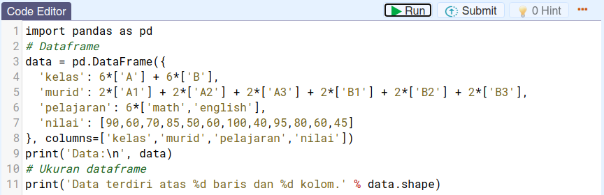

dengan output:

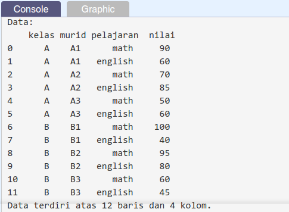

Tugas Praktek:

Carilah unique records/value pada keempat kolom dataframe 'data'.

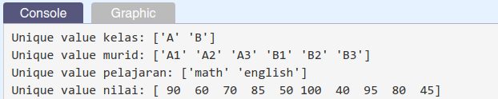

| Code  |               Title              	|
|:----:	|:--------------------------------:	|
| [📜](https://github.com/bayubagusbagaswara/dqlab-data-engineer/blob/master/7-Data-Manipulation-with-Pandas-Part-2/2-Pivot-Melt-Stack-Unstack/Dataset.py) | Dataset |

# Pivot
Untuk menerapkan menerapkan method .pivot() pada dataframe dapat dilakukan pada dataframe yang memiliki index tunggal ataupun index-nya adalah multi index. 

Untuk dataset yang masih sama, yaitu `data`.

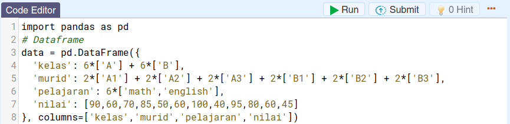

`Pivoting` dengan `single column` measurement.

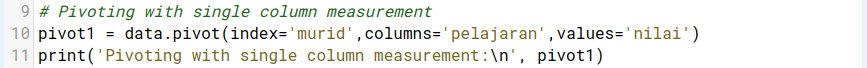

dengan output:

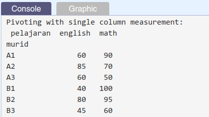

`Pivoting` dengan `multiple column` measurement.

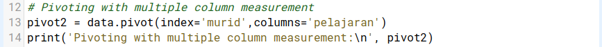

dengan output:

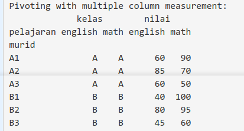

Penjelasan:

Apa yang berbeda dari kedua code di atas? Pada code pertama di specify values mana yang akan dilakukan pivot sedangkan di kedua tidak specific mana yang akan dilakukan pivot maka Pandas secara default men-treat kolom yang ada selain yang telah di specify as index dan columns as values instead.

Tugas Praktik:

Ketikkanlah kembali kode-kode yang diberikan di atas agar dapat lebih memahami konsep pivoting yang telah diberikan.

| Code  |               Title              	|
|:----:	|:--------------------------------:	|
| [📜](https://github.com/bayubagusbagaswara/dqlab-data-engineer/blob/master/7-Data-Manipulation-with-Pandas-Part-2/2-Pivot-Melt-Stack-Unstack/Pivot.py) | Pivot |

# Pivot_table
Apa yang terjadi kalau output pivot tabel memiliki duplicate index? Seperti yang diketahui, index di dataframe adalah unique identifier untuk setiap row, jadi tidak boleh ada duplikat dan setiap membuat pivot tabel, harus specify index as kolom yang mana dan columns-nya memakai kolom yang mana.

Perhatikan contoh yang diilustrasikan berikut ini!

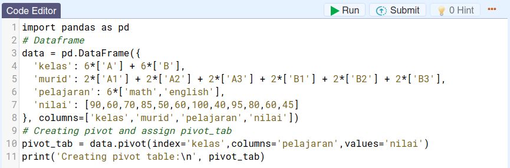

dengan output:

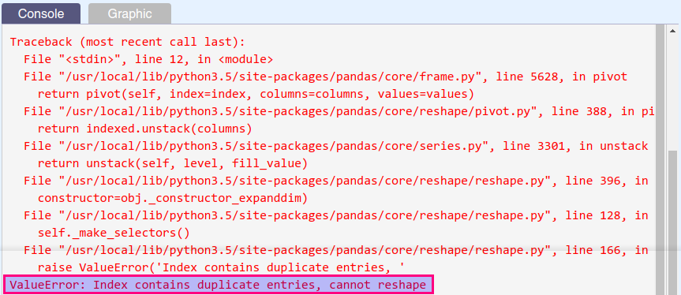

Hal ini dapat diatasi dengan melakukan method .pivot_table() pada dataframe. Metode ini sama seperti melakukan pivot pada tabel tapi juga melakukan groupby dan aggregation (aggfunc) pada level rows sehingga dipastikan tidak ada duplicate index di rows (secara default aggfunc = 'mean').

Perhatikan cuplikan berikut ini!

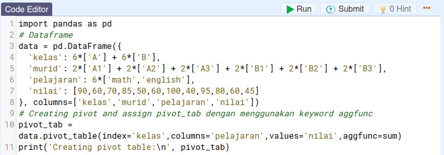

dengan output:

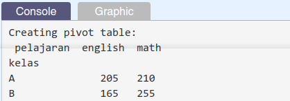

Keyword `aggfunc` yang digunakan pada method `.pivot_table()` dapat menggunakan nilai berikut:

- sum
- 'mean'
- 'median'
 
Tugas Praktek:

Seperti yang dicontohkan untuk meng-create pivot tabel dengan method .pivot_table() tetapi aggfunc yang digunakan adalah 'mean' dan 'median'.

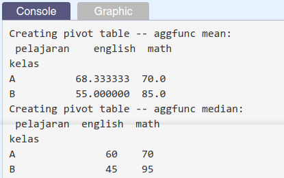

| Code  |               Title              	|
|:----:	|:--------------------------------:	|
| [📜](https://github.com/bayubagusbagaswara/dqlab-data-engineer/blob/master/7-Data-Manipulation-with-Pandas-Part-2/2-Pivot-Melt-Stack-Unstack/PivotTable.py) | Pivot Table |

# Melt - Part 1
Teknik melt melalui `pd.melt()` digunakan untuk mengembalikan kondisi data yang sudah dilakukan pivot menjadi sebelum pivot.

Mari diperhatikan kembali dataframe yang telah digunakan sebelumnya dan dataframenya sudah di pivot.

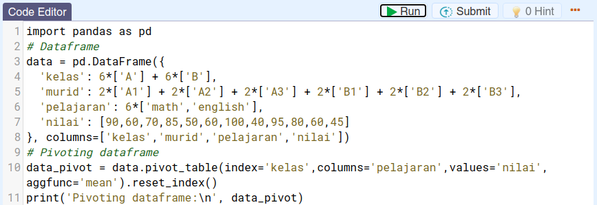

dengan bentuk dataframe dari output baris ke-11.

Akan melakukan teknik melting pada dataframe output di atas.

`[1] Melting` dataframe

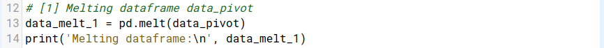

yang menghasilkan output:

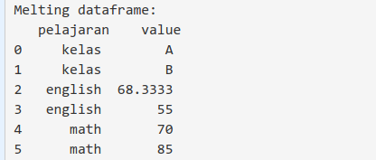

`[2] Dengan menspesifikasi keyword argument id_vars` yang ditujukan untuk membuat fix kolom yang sebagai id tiap barisnya.

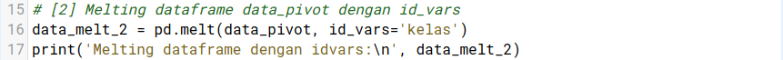

dengan output:

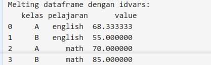

Tugas Praktek:

| Code  |               Title              	|
|:----:	|:--------------------------------:	|
| [📜](https://github.com/bayubagusbagaswara/dqlab-data-engineer/blob/master/7-Data-Manipulation-with-Pandas-Part-2/2-Pivot-Melt-Stack-Unstack/MeltPart1.py) | Melt |

# Melt - Part 2
Mari melanjutkan ke bagian kedua dari penggunaan teknik melt ini. Mari lihat kembali dataframe yang telah diperoleh melalui pivoting

dengan bentuk dataframe dari output baris ke-11.

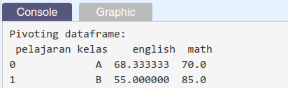

Lanjutkan dengan melakukan teknik melting pada dataframe output di atas untuk keyword argumen lainnya, yaitu

`[3] Dengan menspesifikasikan keyword argument value_vars` yang digunakan untuk menampilkan variasi value apa saja yang perlu dimunculkan di kolom variable. 

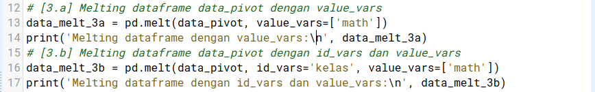

dengan output:

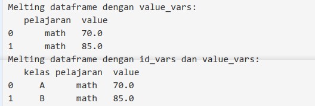

`[4] Dengan spesifikasikan keyword argument var_name dan value_name` yang digunakan untuk menampilkan nama kolom untuk variable dan value.

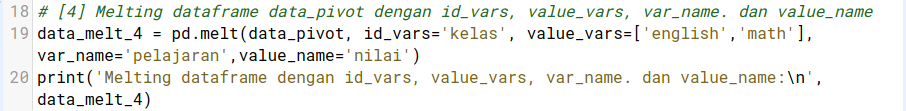

dengan output:

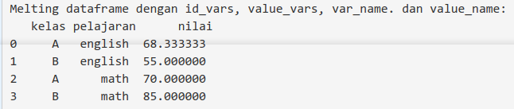

Tugas Praktik:

| Code  |               Title              	|
|:----:	|:--------------------------------:	|
| [📜](https://github.com/bayubagusbagaswara/dqlab-data-engineer/blob/master/7-Data-Manipulation-with-Pandas-Part-2/2-Pivot-Melt-Stack-Unstack/MeltPart2.py) | Melt |

# Stack & Unstack - Part 1
Konsep `stacking` dan `unstacking` sama dengan `melt dan pivot secara berurutan`, hanya saja tidak memasukkan index sebagai parameter di stack/unstack tapi harus set index terlebih dahulu, baru bisa melakukan stacking/unstacking dengan level yang bisa ditentukan sendiri.

Perhatikan kembali dataframe berikut dengan multi index-nya.

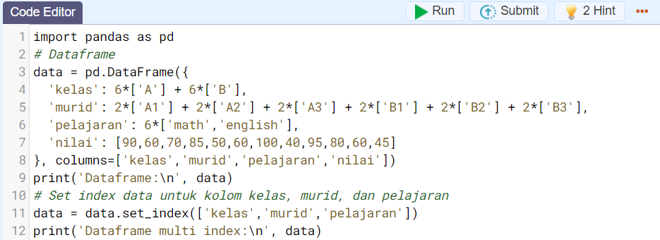

dengan output:

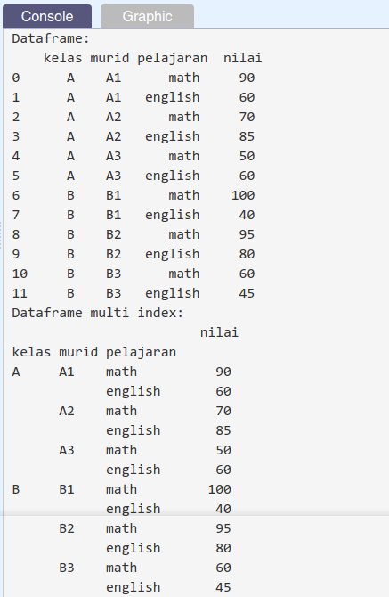

Mari terapkan bagaimana menggunakan teknik stacking dan unstacking ini pada dataframe multi index 'data':

`[1]` Unstacking dataframe

dengan output:

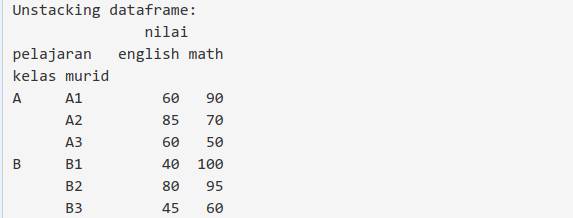

`[2]` Unstacking dengan specify level name

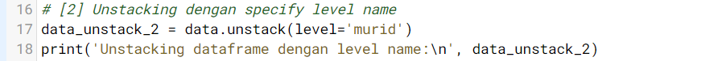

dengan output:

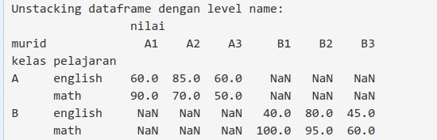

`[3]` Unstacking dengan specify level position

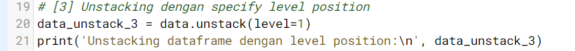

dengan output:

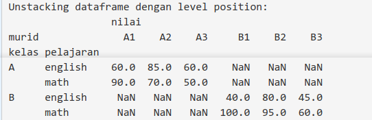

Tugas Praktek:

| Code  |               Title              	|
|:----:	|:--------------------------------:	|
| [📜](https://github.com/bayubagusbagaswara/dqlab-data-engineer/blob/master/7-Data-Manipulation-with-Pandas-Part-2/2-Pivot-Melt-Stack-Unstack/StackAndUnstackPart1.py) | Stack dan Unstack |

# Stack & Unstack - Part 2
Dalam bagian kedua dari Stack & Unstack ini akan membahas stacking dataframe. Untuk itu, mari diperhatikan dataframe berikut ini:

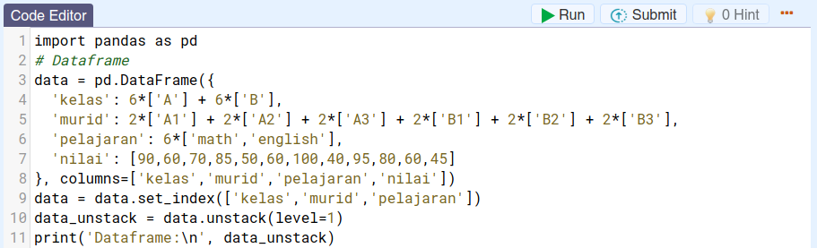

dengan dataframe yang dicetak pada langkah ke-11.

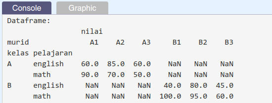

`[1]` Stacking dataframe 

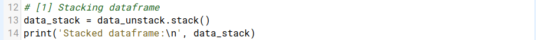

dengan output:

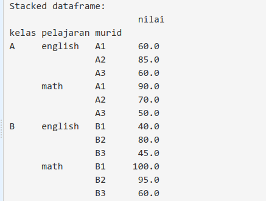

`[2]` Tukar posisi index setelah stacking dataframe

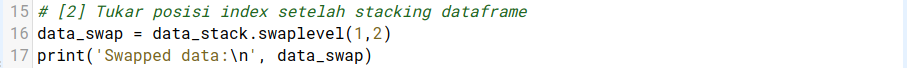

dengan output:

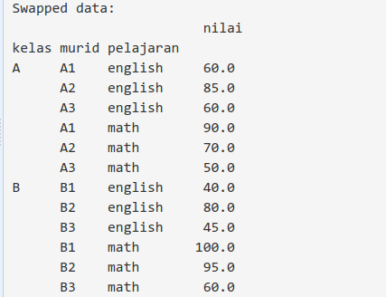

`[3]` Melakukan sort_index pada stacking dataframe

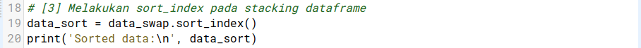

dengan output:

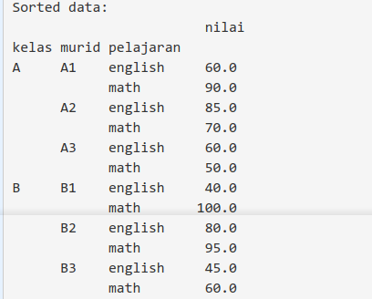

Tugas Praktik:

| Code  |               Title              	|
|:----:	|:--------------------------------:	|
| [📜](https://github.com/bayubagusbagaswara/dqlab-data-engineer/blob/master/7-Data-Manipulation-with-Pandas-Part-2/2-Pivot-Melt-Stack-Unstack/StackAndUnstackPart2.py) | Stack dan Unstack |

# Quiz

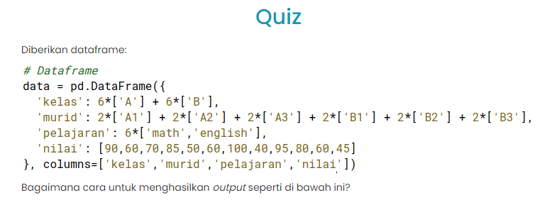

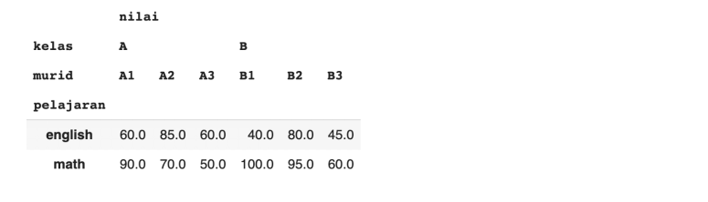

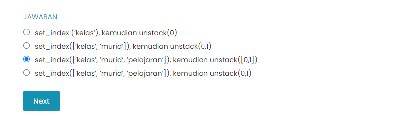