# Pendahuluan
Teknik agregasi diperlukan ketika mau melihat dataset dengan view yang berbeda, bisa set data tersebut akan dikelompokkan seperti apa, yang kemudian juga bisa menerapkan beberapa fungsi atau metode statistik ke hasil group dataset itu untuk mengetahui behavior dari data tersebut secara summary/overview.

Basic Concept of Groupby & Aggregation

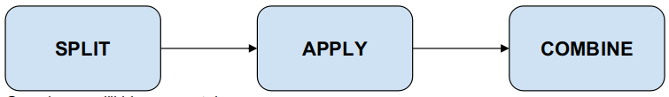

Groupby memiliki konsep untuk:

1. `Split`: melakukan indexing/multi-indexing dengan apa yang di specify as groupby menjadi kelompok
2. `Apply`: menerapkan fungsi pada masing-masing kelompok tersebut
3. `Combine`: mengumpulkan semua hasil fungsi dari tiap kelompok kembali menjadi dataframe

# Review Inspeksi Data
Mari review kembali terkait dengan inspeksi data yang pernah dilakukan pada modul sebelumnya. Akan menggunakan dataset https://storage.googleapis.com/dqlab-dataset/LO4/global_air_quality_4000rows.csv

`[1]` Load data dari csv

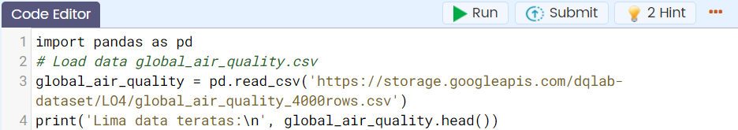

dengan output:

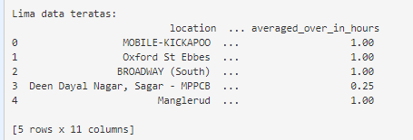

`[2]` Melakukan pengecekan terhadap data

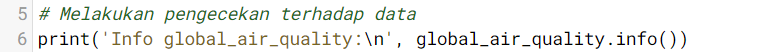

dengan output:

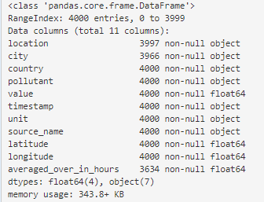

`[3]` Melakukan count tanpa groupby

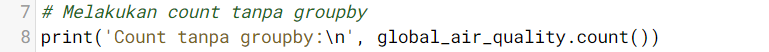

dengan output:

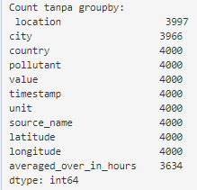

`[4]` Melakukan count dengan groupby

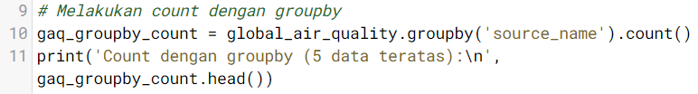

dengan output:

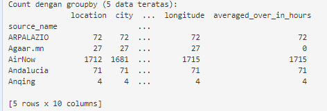

Terdapat perbedaan antara melakukan count dengan groupby dan tanpa groupby:

1. Terdapat index apa yang di specify as groupby
2. Perhitungan jadi berdasarkan apa yang di specify as groupby
3. Overall, lebih mudah untuk membaca data summary yang telah di groupby

| Code  |               Title              	|
|:----:	|:--------------------------------:	|
| [📜](https://github.com/bayubagusbagaswara/dqlab-data-engineer/blob/master/7-Data-Manipulation-with-Pandas-Part-2/3-Aggregation-dan-GroupBy/ReviewInpeksiData.py) | Stack dan Unstack |

# Groupby dan Aggregasi dengan Fungsi Statistik Dasar - Part 1
Pada subbab ini akan menerapkan groupby dan fungsi aggregasi mean dan std untuk menentukan nilai rata-rata dan standar deviasi dari masing-masing kelompok data dari dataset https://storage.googleapis.com/dqlab-dataset/LO4/global_air_quality_4000rows.csv dan di assign sebagai variabel gaq.

Akan buat variabel pollutant.

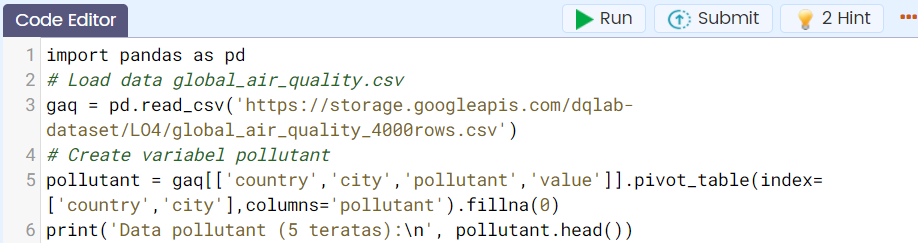

dengan output dataframenya di console:

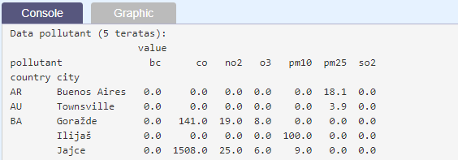

`[1]` Group berdasarkan country dan terapkan aggregasi mean, method .mean() setelah penerapan method .groupby() digunakan untuk mencari rata-rata dari tiap kelompok.

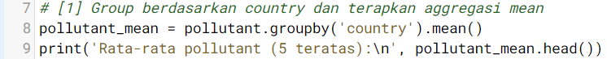

dengan output:

`[2]` Group berdasarkan country dan terapkan aggregasi std, method .std() setelah penerapan method .groupby() digunakan untuk mencari standard deviasi (penyimpangan) dari tiap kelompok.

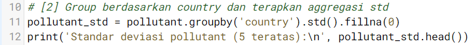

dengan ouput di console:

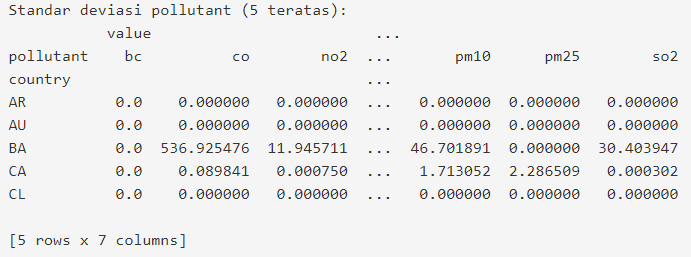

| Code  |               Title              	|
|:----:	|:--------------------------------:	|
| [📜](https://github.com/bayubagusbagaswara/dqlab-data-engineer/blob/master/7-Data-Manipulation-with-Pandas-Part-2/3-Aggregation-dan-GroupBy/GroupbyDanAggregasiDenganFungsiStatistikDasarPart1.py) | Groupby dan Aggregasi dengan Fungsi Statistik Dasar |

# Groupby dan Aggregasi dengan Fungsi Statistik Dasar - Part 2
Akan melanjutkan untuk fungsi statistik lainnya yaitu .sum() dan .nunique() untuk mengaggregasi dataset pollutant setelah di groupby.

`[3]` Group berdasarkan country dan terapkan aggregasi sum, method .sum() setelah penerapan method .groupby() digunakan untuk mencari total nilai dari tiap kelompok.

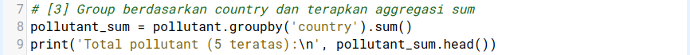

dengan output:

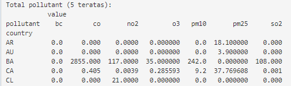

`[4]` Group berdasarkan country dan terapkan aggregasi nunique, method .nunique() setelah penerapan method .groupby() digunakan untuk mencari berapakah jumlah unique value dari tiap kelompok.

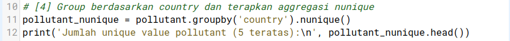

dengan output:

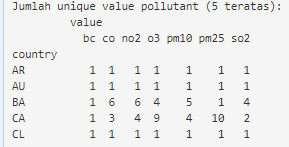

| Code  |               Title              	|
|:----:	|:--------------------------------:	|
| [📜](https://github.com/bayubagusbagaswara/dqlab-data-engineer/blob/master/7-Data-Manipulation-with-Pandas-Part-2/3-Aggregation-dan-GroupBy/GroupbyDanAggregasiDenganFungsiStatistikDasarPart2.py) | Groupby dan Aggregasi dengan Fungsi Statistik Dasar |

# Groupby dan Aggregasi dengan Fungsi Statistik Dasar - Part 3
Akan melanjutkan untuk fungsi statistik .min() dan .max() untuk mengaggregasi dataset pollutant setelah di groupby.

`[5]` Group berdasarkan country dan terapkan aggregasi min, method .min() setelah penerapan method .groupby() digunakan untuk memunculkan nilai terkecil dari tiap kelompok.

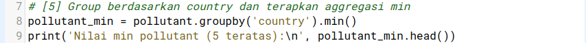

dengan output:

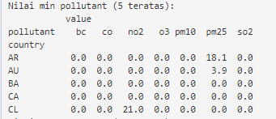

`[6]` Group berdasarkan country dan terapkan aggregasi max, method .max() setelah penerapan method .groupby() digunakan untuk memunculkan nilai terbesar dari tiap kelompok.

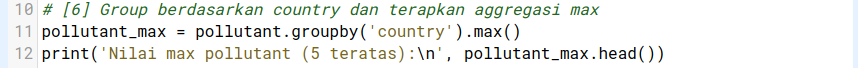

dengan output:

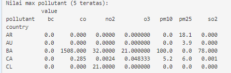

Tugas Praktik:

Gunakanlah method .first() dan .last() untuk aggregasi setelah penerapan .groupby() yang masing-masingnya bertujuan untuk memunculkan item pertama dan item terakhir dari tiap kelompok.

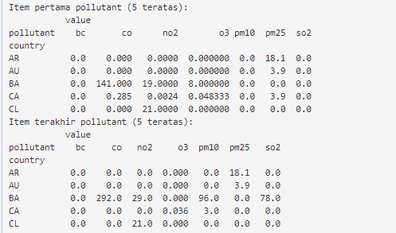

| Code  |               Title              	|
|:----:	|:--------------------------------:	|
| [📜](https://github.com/bayubagusbagaswara/dqlab-data-engineer/blob/master/7-Data-Manipulation-with-Pandas-Part-2/3-Aggregation-dan-GroupBy/GroupbyDanAggregasiDenganFungsiStatistikDasarPart3.py) | Groupby dan Aggregasi dengan Fungsi Statistik Dasar |

# Groupby dengan Multiple Aggregations
Kali ini akan menggunakan grouby dengan multiple aggregations yang berupa kombinasi antara beberapa fungsi. Mari perhatikan contoh berikut ini!

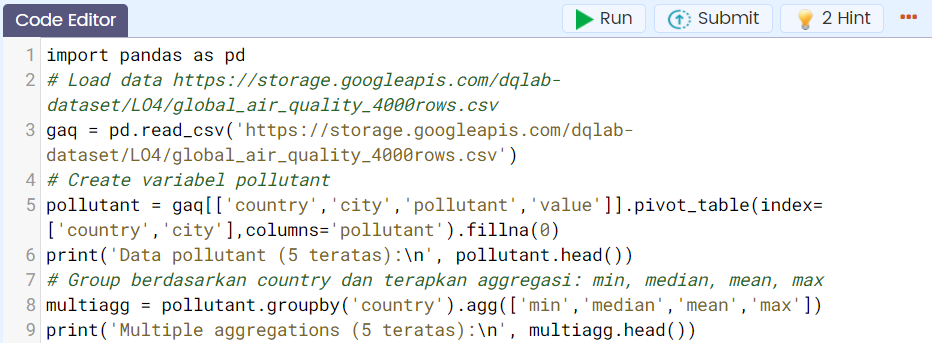

output yang diberikan oleh baris ke-9 adalah:

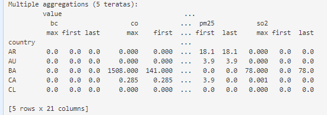

Tugas Praktik: 

Terapkanlah multiple aggregations pada dataframe pollutant dengan fungsi aggregasinya adalah 'min', 'median', 'mean', 'max'.

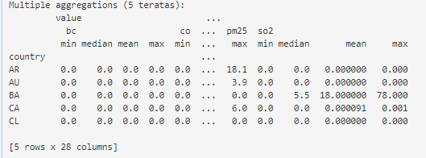

| Code  |               Title              	|
|:----:	|:--------------------------------:	|
| [📜](https://github.com/bayubagusbagaswara/dqlab-data-engineer/blob/master/7-Data-Manipulation-with-Pandas-Part-2/3-Aggregation-dan-GroupBy/GroupbyDenganMultipleAggregations.py) | Groupby dengan Multiple Aggregations |

# Groupby dengan Custom Aggregations
Dengan membuat sebuah Python function (user defined) dapat menggunakan sebagai custom aggregation pada dataframe yang telah di groupby.

Perhatikan contoh yang diberikan berikut ini!

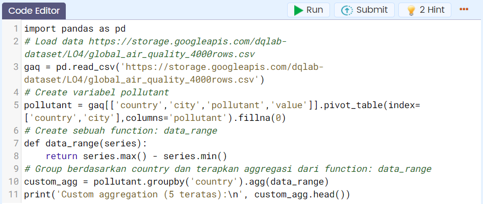

di sini dibuat sebuah fungsi untuk menentukan range pada setiap kelompok. Diperoleh output:

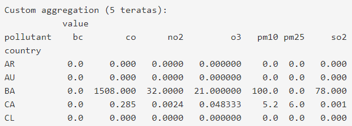

Tugas Praktek:

Tentukanlah inter quartile range (IQR) pada setiap kelompok data, dan kemudian tampilkanlah 5 data teratas saja.

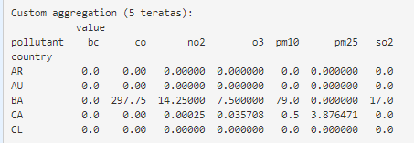

| Code  |               Title              	|
|:----:	|:--------------------------------:	|
| [📜](https://github.com/bayubagusbagaswara/dqlab-data-engineer/blob/master/7-Data-Manipulation-with-Pandas-Part-2/3-Aggregation-dan-GroupBy/GroupbyDenganCustomAggregations.py) | Groupby dengan Custom Aggregations |

# Groupby dengan Custom Aggregations by dict
Penggunaan custom aggregation lainnya pada dataframe yang telah di groupby dapat dilakukan dengan mempasskan sebuah dict yang berisi 'key' dict sebagai nama kolomnya dan 'value' dict adalah fungsi untuk aggregasi, baik user defined function atau yang telah tersedia.

Berdasarkan kode berikut ini:

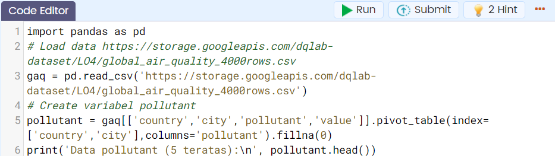

Telah dimiliki dataset yang akan di apply teknik custom aggregation dengan menggunakan dict ini yaitu:

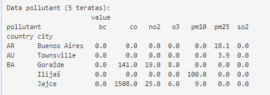

Akan apply teknik custom aggregation pada kolom 'o3' dan 'so' dengan fungsi aggregasi masing-masingnya adalah 'max' dan 'data_range'. Fungsi 'data_range' ini merupakan fungsi yang didefinisikan sendiri (user-defined) untuk menentukan jangkauan (range) data.

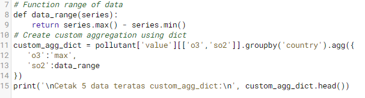

dengan output berupa:

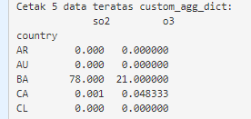

Tugas Praktik:

Dengan dataset yang masih sama seperti tersedia di code editor, tentukanlah median untuk kolom 'pm10' serta iqr untuk kolom 'pm25' dan 'so2'. Tampilkan pula 5 data teratas saja.

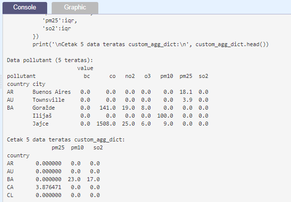

| Code  |               Title              	|
|:----:	|:--------------------------------:	|
| [📜](https://github.com/bayubagusbagaswara/dqlab-data-engineer/blob/master/7-Data-Manipulation-with-Pandas-Part-2/3-Aggregation-dan-GroupBy/GroupbyDenganCustomAggregationsByDict.py) | Groupby dengan Custom Aggregations By Dict |

# Quiz

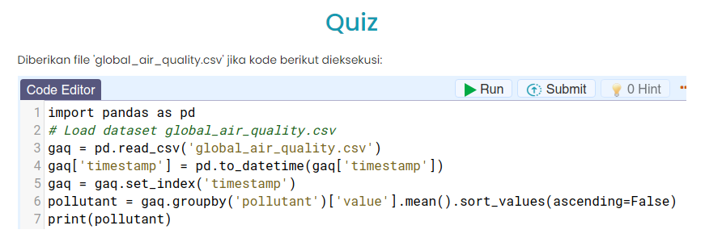

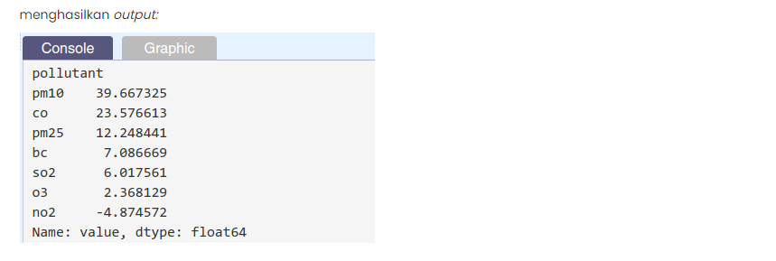

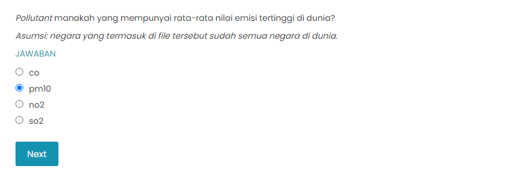