# Pendahuluan
Baru saja aku kelar dengan latihan dan kuis-kuis dari Bab 3, link referensi dari Andra untuk materi selanjutnya seputar “Time Series in Pandas” sudah muncul lagi! 

Tampaknya ini ‘ujian’ baru dari Andra yang ingin menilai kegigihan belajarku. Kutarik nafas panjang. Tidak apa-apa, ini demi jadi data analyst profesional. Aku pantang menyerah!

Aku mengklik link dari Andra dan kembali menelusuri isi materinya:

Ketika berurusan dengan big data, biasanya akan selalu terdapat entitas waktu kapan suatu event itu terjadi, waktu ini digunakan untuk mengenali event itu terjadi pada suatu frame tertentu dan dapat dijadikan index yang membuat setiap event menjadi unique.

Basic format datetime menurut ISO 8601 yaitu `YYYY-mm-dd HH:MM:SS`.

# Load Dataset as Time Series
Terkadang Pandas salah mengenali object datetime menjadi object string dan pandas menjadi tidak bisa memanfaatkan full benefit dari time index.

`Basic format datetime` menurut ISO 8601: `YYYY-mm-dd HH:MM:SS`.

Terdapat beberapa cara untuk mengubah kolom waktu menjadi format yang benar as datetime object di Pandas. 

`[1]` read_csv, terdapat keyword argument 'parse_dates', yang jika di set True dan set index untuk kolom waktu tersebut maka kolom datetime tersebut akan transform as datetime Pandas dan menjadi index.

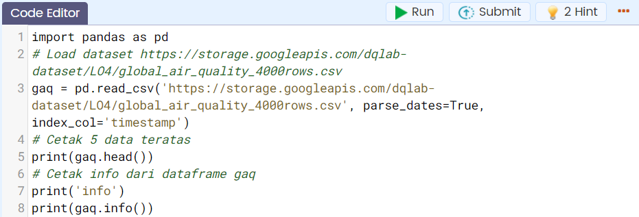

dengan output:

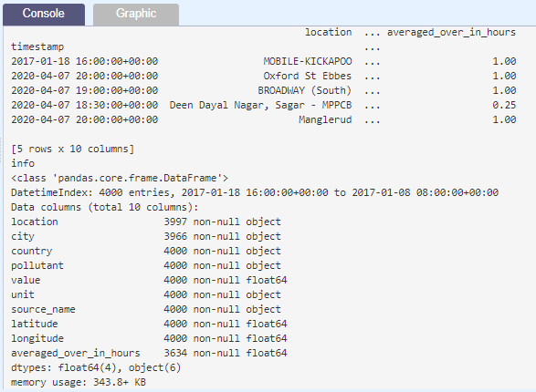

Tugas Praktek:

| Code  |               Title              	|
|:----:	|:--------------------------------:	|
| [📜](https://github.com/bayubagusbagaswara/dqlab-data-engineer/blob/master/7-Data-Manipulation-with-Pandas-Part-2/4-Time-Series-in-Pandas/LoadDatasetAsTimeSeries.py) | Load Dataset as Time Series |

# Convert to Datetime
Jika dataset yang telah terlebih dahulu atau telah terlanjur di load dengan pd.read_csv dan Pandas salah mengenali object datetime menjadi object string, maka dapat mengubah kolom tertentu dari dataset tersebut menjadi format datetime.

`[2]` `pd.to_datetime` digunakan untuk men-transform salah satu kolom di dataframe menjadi datetime Pandas dan kemudian set menjadi index. Mari perhatikan kembali contoh berikut:

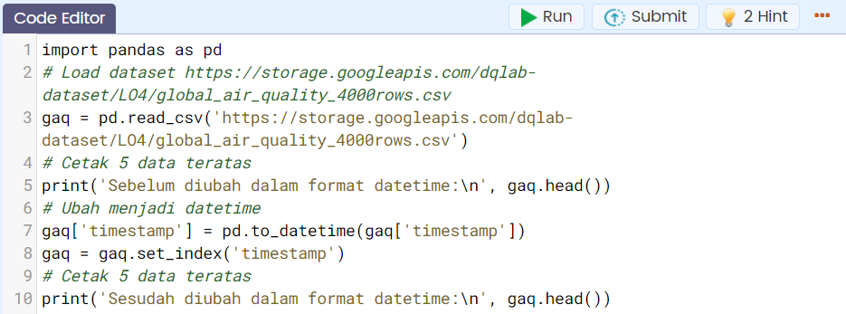

dengan output:

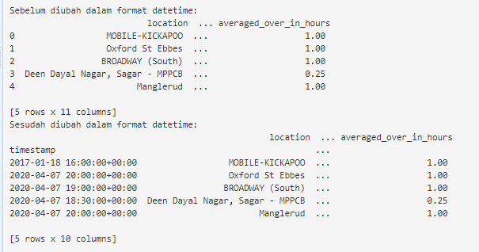

Dataframe awal index-nya masih berupa urutan bilangan bulat dari nol. Kemudian dengan menerapkan pd.to_datetime dan set_index, dataframe sudah memiliki index berupa datetime.

Tugas Praktek:

| Code  |               Title              	|
|:----:	|:--------------------------------:	|
| [📜](https://github.com/bayubagusbagaswara/dqlab-data-engineer/blob/master/7-Data-Manipulation-with-Pandas-Part-2/4-Time-Series-in-Pandas/ConvertToDatetime.py) | Convert to Datetime |

# Resampling untuk Time Series Data
Pandas time series juga memiliki fungsi resampling yang dapat berguna untuk:

`[1] Downsampling`

Mengurangi baris datetime menjadi frekuensi yang lebih lambat, bisa dibilang juga mengurangi rows dataset menjadi lebih sedikit

Contoh: mengubah kolom datetime yang awalnya daily menjadi monthly

`[2] Upsampling`

Kebalikan dari downsampling, menambah baris datetime menjadi frekuensi yang lebih cepat, menambah rows dataset dengan membuat kolom datetime menjadi lebih detail.

Contoh: mengubah kolom datetime yang awalnya daily menjadi hourly

Dari resampling ini, kemudian dapat menerapkan metode statistik untuk transform value data yang ada (ex: mean, sum, count, etc).

Tabel resampling untuk time series:

|  Input      |        Description          |
|:-----------:|:---------------------------:|
| 'Min', 'T'  | minute |
| 'H'         | hour |
| 'D'         | day |
| 'B'         | Business day |
| 'W'         | week |
| 'M'         | month |
| 'Q'         | quarter |
| 'A'         | year |

# Downsampling Data

Sekarang akan dicoba melakukan proses downsampling pada dataset https://storage.googleapis.com/dqlab-dataset/LO4/global_air_quality_4000rows.csv yang telah di load sebelumnya.

Perhatikan dataset awal:

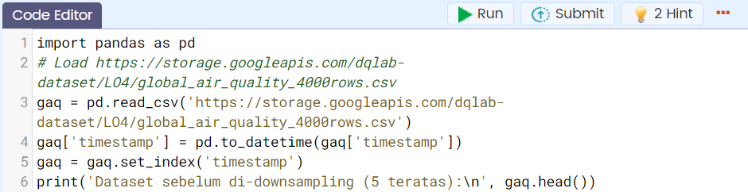

yaitu:

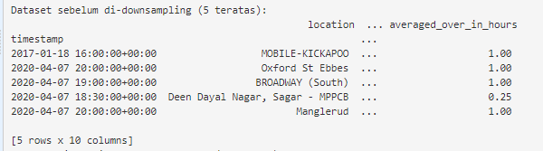

Dengan men-downsampling dari:

`[1]` Daily to monthly

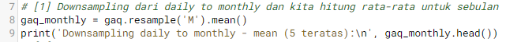

dengan output:

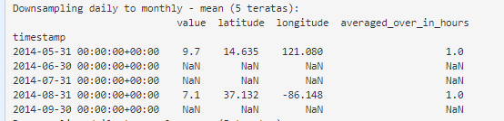

`[2]` Daily to yearly

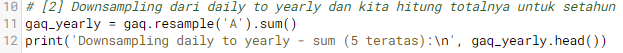

dengan output:

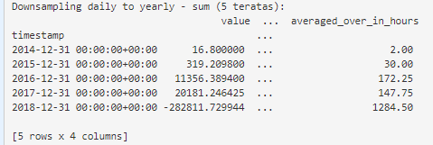

Tugas Praktek:

Kerjakanlah proses downsampling

- Daily to weekly dan apply max
- Daily to quaterly dan apply min

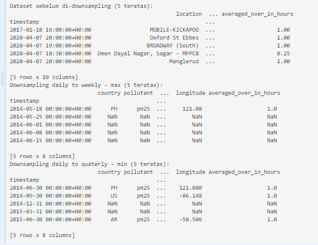

| Code  |               Title              	|
|:----:	|:--------------------------------:	|
| [📜](https://github.com/bayubagusbagaswara/dqlab-data-engineer/blob/master/7-Data-Manipulation-with-Pandas-Part-2/4-Time-Series-in-Pandas/DownsamplingData.py) | Downsampling Data |

# Upsampling Data
Di bagian sebelumnya kita telah melakukan proses downsampling. Proses upsampling akan kita bahas dalam bagian untuk dataset yang masih sama.

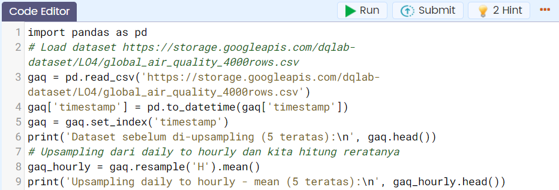

dengan output:

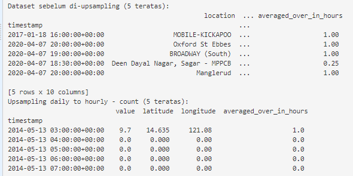

| Code  |               Title              	|
|:----:	|:--------------------------------:	|
| [📜](https://github.com/bayubagusbagaswara/dqlab-data-engineer/blob/master/7-Data-Manipulation-with-Pandas-Part-2/4-Time-Series-in-Pandas/UpsamplingData.py) | Upsampling Data |

# Resampling by Frequency
Pada bagian ini akan mempelajari bagaimanakah caranya me-resampling data (baik upsampling atau downsampling) berdasarkan frekuensi, misalnya sekali 2 minggu, tiap 12 jam, dsb.

Kondisi awal data yang dimiliki:

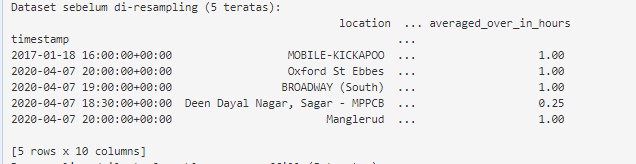

dengan output:

Untuk memahaminya silakan perhatikan contoh berikut ini:

`[1]` Data ini downsampling dari daily to 2 weekly, kemudian dihitung rata-ratanya, jika ada nilai NaN maka dapat diisi dengan fillna method = 'ffill'

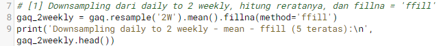

dengan output:

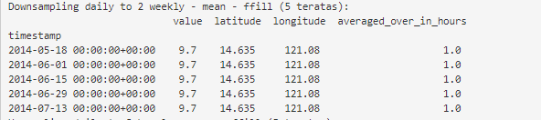

`[2]` Selanjutnya, data awal di upsampling dari daily to 8 hourly, kemudian hitung rata-ratanya, jika ada nilai NaN maka dapat di isi dengan fillna method = 'bfill'

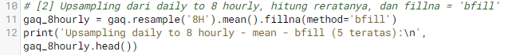

dengan output:

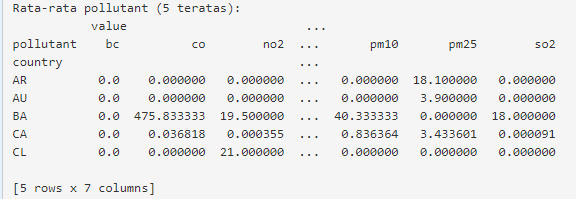

Tugas Praktik:

Kerjakanlah proses data awal resampling dari daily to bi-monthly, kemudian hitung rata-ratanya, jika ada nilai NaN maka dapat diisi dengan fillna method = 'bfill'

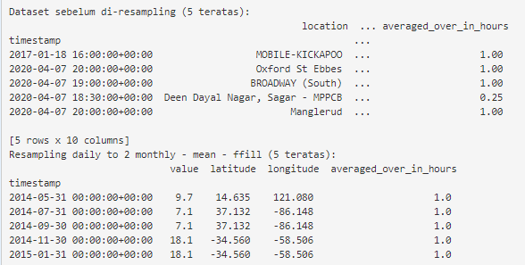

| Code  |               Title              	|
|:----:	|:--------------------------------:	|
| [📜](https://github.com/bayubagusbagaswara/dqlab-data-engineer/blob/master/7-Data-Manipulation-with-Pandas-Part-2/4-Time-Series-in-Pandas/ResamplingByFrequency.py) | Resampling By Frequency |

# Visualisasi
Selanjutnya untuk memvisualisasikan dengan menggunakan library matplotlib dataframe yang telah diolah (seperti yang telah dipelajari dari bab pertama hingga subbab sebelumnya di bab ini).

Terdapat beberapa plot styles yang dapat diterapkan dalam pembuatan visualisasi di matplotlib.

|  Color      |      Maker      |    Line     |
|:-----------:|:---------------:|:-----------:|
| b: blue     |   o: circle     | :dotted     |
| g: green    |   *: star       | -: dashed   |
| r: red      |   s: square     |             |
| c: cyan     |   +: plus       |             |

Visualisasi tentang average jumlah masing-masing polutan berdasarkan bulan waktunya.

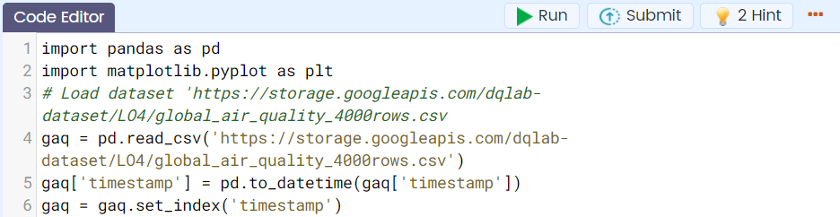

`[1]` Membuat pivot table yang menunjukkan waktu di barisnya dan masing-masing value dari pollutant-nya dalam kolom.

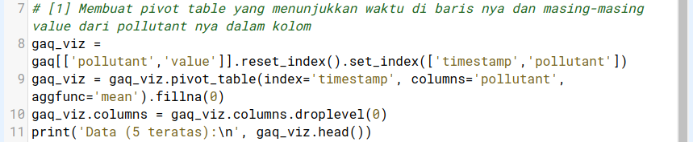

dengan output:

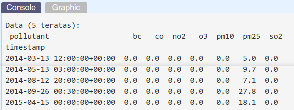

`[2]` Membuat fungsi yang memberikan default value 0 ketika value-nya di bawah 0 dan apply ke setiap elemen dari dataset tersebut, kemudian menampilkannya sebagai chart.

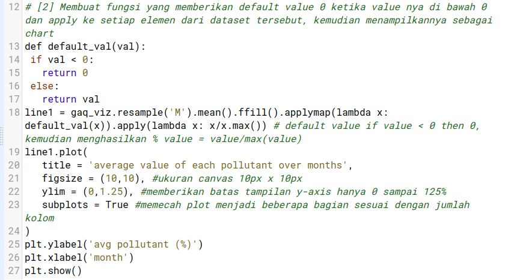

dengan output:

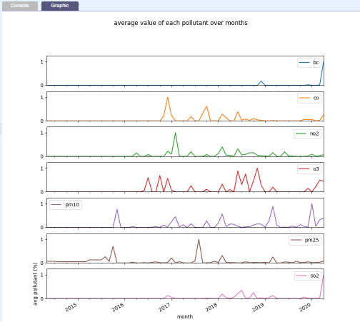

Tugas Praktik:

| Code  |               Title              	|
|:----:	|:--------------------------------:	|
| [📜](https://github.com/bayubagusbagaswara/dqlab-data-engineer/blob/master/7-Data-Manipulation-with-Pandas-Part-2/4-Time-Series-in-Pandas/Visualisasi.py) | Visualisasi |

# Quiz

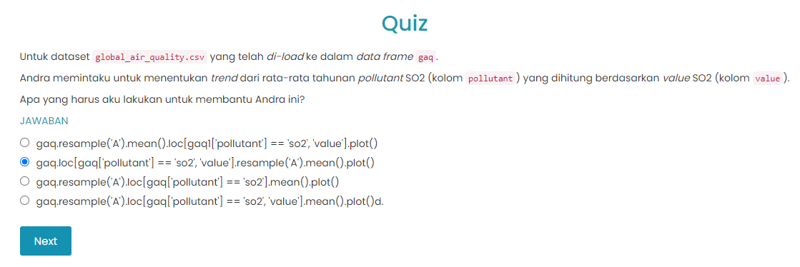