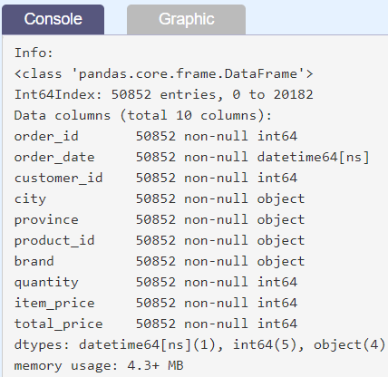
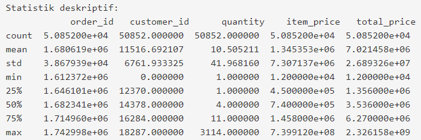
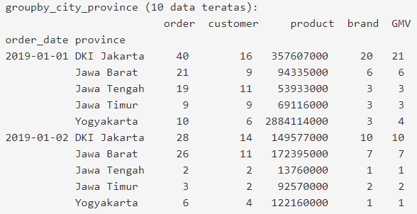
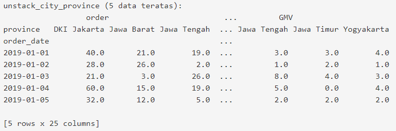
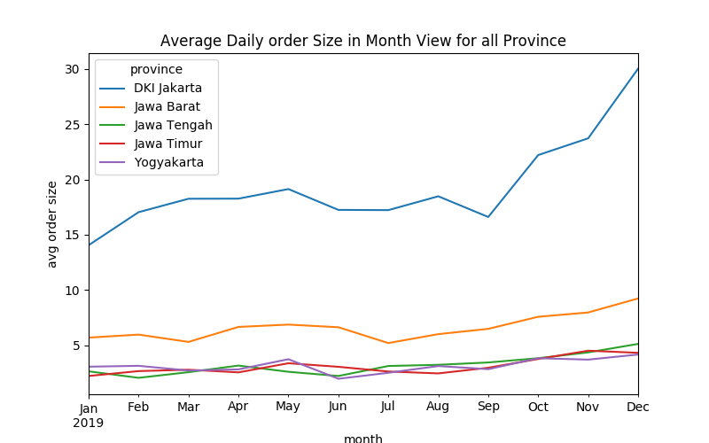
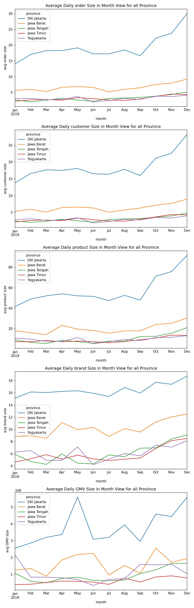

# Pendahuluan
“Aksara, coba ikut saya ke ruangan rapat sebentar. Ada yang mau saya tunjukkan,” pinta Andra.

Baru kali ini Andra mengajakku ke ruang rapat. Biasanya aku hanya mendengar ia mau rapat, dan sering kali ia sendiri juga yang menghampiriku. Aku pun segera beranjak. Ini pasti berkaitan dengan proyek yang dijanjikannya. Sesampaiku di ruang rapat, laptop Andra sudah terbuka dan menampilkan pantulan layar berupa data angka-angka. 

“Begini, Aksara. Perusahaan kita lagi butuh perbandingan performa dari setiap cabang di berbagai kota. Nanti ambil saja lima kota terbesar di Pulau Jawa untuk dianalisis dari segi order size, customer count, product count, brand count, dan GMV dalam basis bulanan. Sampai sini apakah cukup paham?”

Sebenarnya aku cukup paham, tapi untuk memastikannya aku pun bertanya, “Jadi, ini aku perlu pivot ya untuk setiap measure yang dibutuhkan, lalu mencari angkanya per bulan?”

“Benar. Sebelum saya beri deadline, dari kamu bisa selesai kapan?” tawar Andra. 

“Hmmm, datanya sendiri sudah bersih atau perlu aku cleaning lagi, Ndra?” tanyaku sembari menimbang-nimbang. 

“Datanya sudah bersih. Nanti akan coba saya kirimkan yang versi lengkapnya dalam tahun 2019 agar bisa kamu pertimbangkan estimasi waktu pengerjaan.”

“Oke, Ndra. Soalnya, kalau datanya sudah bersih, dua hari cukup sih. Tapi aku cek dulu deh data lengkap yang nanti dikirim.”

“Selamat bekerja, Aksara.”

# Performa Penjualan di Setiap Cabang - Part 1
Diberikan 4 csv files yang isinya retail data untuk tiap quarter:

- csv (data dari bulan January - March)       --> https://storage.googleapis.com/dqlab-dataset/10%25_original_randomstate%3D42/retail_data_from_1_until_3_reduce.csv
- csv (data dari bulan April - June)              --> https://storage.googleapis.com/dqlab-dataset/10%25_original_randomstate%3D42/retail_data_from_4_until_6_reduce.csv
- csv (data dari bulan July - September)      --> https://storage.googleapis.com/dqlab-dataset/10%25_original_randomstate%3D42/retail_data_from_7_until_9_reduce.csv
- csv (data dari bulan October - December)  --> https://storage.googleapis.com/dqlab-dataset/10%25_original_randomstate%3D42/retail_data_from_10_until_12_reduce.csv
 
`Goal:` Automation untuk pembuatan grafik dari measurement yang dibutuhkan.

Untuk part 1 ini yang perlu dilakukan:

`[1].` Load masing-masing data *.csv dengan Pandas

`[2].` Pengecekan dan Transformasi Data 

- Cek data sekilas (melihat bentuk data biasanya 5 data teratas)
- Cek list kolom untuk semua dataframe apakah seluruh kolom dari keempat dataframe yang terpisah itu sama
- Jika sama digabungkan.
- Cek informasi dataframe yang telah digabungkan
- Statistik deskriptif dari dataframe yang telah digabungkan.

Untuk representasi string gunakan kutip satu, misalnya: 'contoh string'.

| Code  |               Title              	|
|:----:	|:--------------------------------:	|
| [📜](https://github.com/bayubagusbagaswara/dqlab-data-engineer/blob/master/7-Data-Manipulation-with-Pandas-Part-2/5-Mini-Project/PerformaPenjualanDiSetiapCabangPart1.py) | Performa Penjualan di Setiap Cabang Part 1 |

# Performa Penjualan di setiap Cabang - Part 2
Melanjutkan penyelesaian persoalan ke langkah berikutnya.

`[3]` Transformasi Data 

- Jika ada data yang tidak seharusnya maka dapat dibuang
- Jika ada kolom yang seharusnya bertipe datetime64 ubahlah
- Cek kembali informasi dataframe 
- Tampilkan kembali statistik deskriptif dari dataframe

Untuk representasi string gunakan kutip satu, misalnya: 'contoh string'.

Sebagai kontrol, informasi terakhir (baris 32) berikut dengan statistik deskriptif (baris 34) adalah:

| Code  |               Title              	|
|:----:	|:--------------------------------:	|
| [📜](https://github.com/bayubagusbagaswara/dqlab-data-engineer/blob/master/7-Data-Manipulation-with-Pandas-Part-2/5-Mini-Project/PerformaPenjualanDiSetiapCabangPart2.py) | Performa Penjualan di Setiap Cabang Part 2 |

# Performa Penjualan di setiap Cabang - Part 3
Mari lanjutkan ke langkah berikutnya.

`[4].` Filter province yang hanya termasuk 5 provinsi besar di Jawa (DKI Jakarta, Jawa Barat, Jawa Tengah, Jawa Timur, dan Yogyakarta)

`[5].` Mengelompokkan data berdasarkan order_date dan province yang sudah di filter dan menghitung order unique count, customer unique count, product unique count, brand unique count, dan GMV (Gross Merchandise Volume = total_price untuk semua penjualan)

`[6].` Melakukan unstack untuk mendapatkan order_date di bagian baris dan province di bagian column

Untuk string direpresentasikan dengan kutip satu, misalnya 'contoh string'.

Sebagai kontrol, bahwa output langkah ke `[5]`

dan output langkah `[6]`

| Code  |               Title              	|
|:----:	|:--------------------------------:	|
| [📜](https://github.com/bayubagusbagaswara/dqlab-data-engineer/blob/master/7-Data-Manipulation-with-Pandas-Part-2/5-Mini-Project/PerformaPenjualanDiSetiapCabangPart3.py) | Performa Penjualan di Setiap Cabang Part 3 |

# Performa Penjualan di setiap Cabang - Part 4
Ayo lanjutkan ke langkah berikutnya:

`[7].` Slicing data untuk masing-masing measurement (kolom), misal: kolom order

`[8].` Lakukan resampling pada data tersebut untuk dilakukan perhitungan secara bulanan

Untuk string direpresentasikan dengan kutip satu, misalnya 'contoh string'.

| Code  |               Title              	|
|:----:	|:--------------------------------:	|
| [📜](https://github.com/bayubagusbagaswara/dqlab-data-engineer/blob/master/7-Data-Manipulation-with-Pandas-Part-2/5-Mini-Project/PerformaPenjualanDiSetiapCabangPart4.py) | Performa Penjualan di Setiap Cabang Part 4 |

# Performa Penjualan di setiap Cabang - Part 5
Sekarang dilanjutkan untuk langkah `#[9]` yaitu menampilkan grafik dari langkah `#[8]` yang telah dilakukan.

`[9].` Plot untuk hasil pada langkah `#[8]`

Untuk string direpresentasikan dengan kutip satu, misalnya 'contoh string'.

Output untuk langkah `[9]`

Dapat dilihat bahwa avg order size untuk DKI Jakarta tertinggi dan terus memiliki kenaikan, disusul oleh Jawa Barat dan kemudian 3 sisanya hampir berada dalam angka yang rata-rata sama.

| Code  |               Title              	|
|:----:	|:--------------------------------:	|
| [📜](https://github.com/bayubagusbagaswara/dqlab-data-engineer/blob/master/7-Data-Manipulation-with-Pandas-Part-2/5-Mini-Project/PerformaPenjualanDiSetiapCabangPart5.py) | Performa Penjualan di Setiap Cabang Part 5 |

# Performa Penjualan di setiap Cabang - Part 6
Langkah 7 s/d 9 yang telah dilakukan baru untuk satu measurement yaitu order. Berarti ada empat kali lagi kode seperti ini harus dibuat. Karena struktur code masih sama, dapat menggunakan perulangan sesuai dengan jumlah measurement yaitu 5, sehingga kelima measurement dapat ditampilkan grafiknya dalam satu canvas figure.

Mari memulai dengan membuat sebuah perulangan dengan dataframe `unstack_city_province` yang digunakan (hasil dari langkah ke 5 di part 2).

Visualisasi yang diharapkan adalah:

| Code  |               Title              	|
|:----:	|:--------------------------------:	|
| [📜](https://github.com/bayubagusbagaswara/dqlab-data-engineer/blob/master/7-Data-Manipulation-with-Pandas-Part-2/5-Mini-Project/PerformaPenjualanDiSetiapCabangPart6.py) | Performa Penjualan di Setiap Cabang Part 6 |

# Evaluasi Andra untuk Project yang Telah Disubmit
Aku baru selesai mengecek ulang hasil kerjaku sebelum kuberikan pada Andra. Sejauh pemeriksaanku semua tampak baik-baik saja. Aku pun menutup laptopku dan membawanya ke ruangan Andra. Harus kuakui, aku cukup berdebar-debar! Walaupun proyek pertama berjalan lancar, tetap saja rasanya tegang membayangkan tanggapan Andra terhadap hasil kerjaku. Semoga tidak mengecewakan. 

“Ndra, maaf ganggu. Ini hasil proyek kemarin sudah selesai. Aku menganalisis rata-rata jumlah order, customer, produk, brand, dan GMV per hari dalam bulanan untuk 5 provinsi besar di Pulau Jawa sesuai rikues. Mau dicek dulu?”

“Boleh, coba tolong dibawa ke mari laptop kamu.” 

Selang beberapa menit, Andra menyahut “Saya mau tanya. Kamu pakai define function di kodemu, gunanya untuk apa?”

“Buat automate pembuatan dan penyimpanan grafik, Ndra. Jadi tinggal state saja dataframe-nya yang mana dan pengelompokannya seperti apa.” jelasku. Ujian tanya jawab telah dimulai! Andra memang tipikal mentor yang akan menguji hasil pekerjaan. Perlahan cara ini melatihku untuk mengambil keputusan dan langkah yang benar-benar matang.

“Oke. Kenapa kamu enggak pakai command saja yang diulang sampai 5 kali kepada 5 measurement yang berbeda?” 

“Soalnya pakai looping akan lebih mudah, Ndra. Aku tinggal mengganti order pada Part 3 menjadi sebuah variable bernama measurement, lalu lakukan for loop untuk diulang ke semua measurement yang ada,” jawabku mantap.

Andra tersenyum. “Oke, sepertinya kamu benar-benar tahu apa yang kamu lakukan. Akan saya bawa ke rapat nanti untuk dibahas dengan kepala cabang, saya akan undang kamu ke rapat juga.”

Aku mengangguk antusias. 

# Hasil Belajarku :)
Walau harus bekerja keras, aku cukup puas dengan hasil kerjaku hari ini. Aku memandangi kode final yang sudah selesai kukerjakan. Diam-diam ada perasaan bangga menyelip di benakku! YES!

Akhirnya, aku telah menyelesaikan modul Data Manipulation with Pandas - Part 2. Materi-materi yang telah kupelajari dan praktikkan dalam modul ini aku telah mendapatkan pengetahuan (knowledge) dan praktek (skill) untuk:

- Dapat menerapkan teknik penggabungan data antar Series dan Dataframe dengan menggunakan concat, merge dan join.
- Dapat memahami konsep dan menerapkan teknik pivot, melt, stack dan unstack pada dataframe untuk memformat ulang bentuk data.
- Dapat memahami konsep dan menerapkan teknik groupby dan aggregation untuk mengurangi jumlah data.
- Mengenal dan memahami konsep time series di Pandas
- Latihan dalam mengerjakan project bisnis sederhana menggunakan pandas
 
Ada juga sejumlah catatan yang perlu aku ingat, yaitu

1. Jikalau terdapat berbagai multiple source untuk extract 1 informasi, maka pastikan struktur datanya adalah sama, list column dan data types.
2. Mengerti business understanding-nya sehingga jika diperlukan melakukan join maka bisa melakukan join dengan efektif dan tepat
3. Mengerti tujuan analisisnya sehingga bisa melakukan aggregation dan transform data (pivot, melt, etc) data dengan tepat dan efektif
4. Sebisa mungkin selalu set index pada kolom datetime sehingga slicing menjadi lebih mudah dan melakukan hal lain seperti downsampling ataupun upsampling
5. Selalu gunakan automation jika memungkinkan karena itu akan mempermudah hidupmu dan menghemat waktu
 
Pesan dari data mentor Karl Christian:

“Data Manipulation is redundant tasks if you have to specify all the parameters one by one, the key is trying to figure out the first phase, then replicate that command become a function that you can call to create a scalable output. This process can be called as Automation.”  By KARL CHRISTIAN, 2020
 