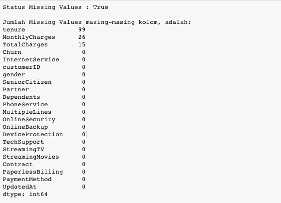
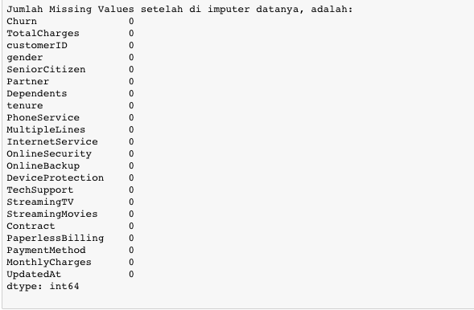

# Mengatasi Missing Values dengan Penghapusan Rows
Selanjutnya kita akan menghapus rows dari data-data yang tidak terdeteksi apakah dia churn atau tidak. Diasumsikan data modeller hanya mau menerima data yang benar ada flag churn-nya atau tidak.

Gunakan isnull() digunakan untuk mendeteksi missing values dan dropna() untuk menghapus data yang missing values.

Berikut adalah hasil yang diharapkan:

```bash
Total missing values data dari kolom Churn 43
Total Rows dan kolom Data setelah dihapus data Missing Values adalah (6950, 22)
```

| Code  |               Title              	|
|:----:	|:--------------------------------:	|
| [📜](https://github.com/bayubagusbagaswara/dqlab-data-engineer/blob/master/8-Data-Science-in-Telco-Data-Cleansing/4-Mengatasi-Missing-Values/MengatasiMissingValuesDenganPenghapusanRows.py) | Mengatasi Missing Values dengan Penghapusan Rows |

# Mengatasi Missing Values dengan Pengisian Nilai tertentu
Selain dengan menghapus rows dari data, menangani missing values bisa menggunakan nilai tertentu. Diasumsikan data modeller meminta pengisian missing values dengan kriteria berikut:

- `Tenure` pihak data modeller meminta setiap rows yang memiliki missing values untuk lama berlangganan di isi dengan 11.
- Variable yang bersifat numeric selain `Tenure` di isi dengan median dari masing-masing variable tersebut.

Tentukan:

- Apakah masih ada data yang missing values
- Jumlah missing values dari masing-masing variable
- Tangani missing values-nya

Hasil yang diharapkan:





| Code  |               Title              	|
|:----:	|:--------------------------------:	|
| [📜](https://github.com/bayubagusbagaswara/dqlab-data-engineer/blob/master/8-Data-Science-in-Telco-Data-Cleansing/4-Mengatasi-Missing-Values/MengatasiMissingValuesDenganPengisianNilaiTertentu.py) | Mengatasi Missing Values dengan Pengisian Nilai Tertentu |


# Kesimpulan
Setelah kita analisis lebih lanjut, ternyata masih ada missing values dari data yang kita sudah validkan Id Number pelanggannya. Missing values terdapat pada kolom `Churn`, `tenure`, `MonthlyCharges` & `TotalCharges`. Setelah kita tangani dengan cara penghapusan rows dan pengisian rows dengan nilai tertentu, terbukti sudah tidak ada missing values lagi pada data, terbukti dari jumlah missing values masing-masing variable yang bernilai 0. Selanjutnya kita akan melakukan penanganan pencilan (outlier).
