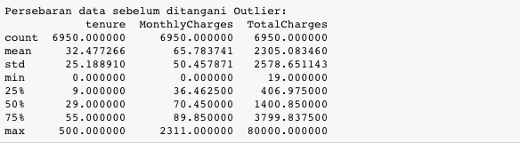
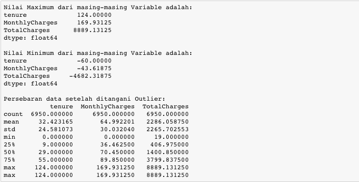

# Mendeteksi adanya Outlier (Boxplot)
Mendeteksi pencilan dari suatu nilai (outlier) salah satunya bisa melihat plot dari data tersebut menggunakan boxplot. Boxplot merupakan ringkasan distribusi sampel yang disajikan secara grafis yang bisa menggambarkan bentuk distribusi data (skewness), ukuran tendensi sentral dan ukuran penyebaran (keragaman). Berikut adalah tampilan umum dari boxplot dalam merepresentasikan outliers.

Penggunaan fungsi describe() pada kolom `tenure`, `MonthlyCharges`, dan `TotalCharges` ditunjukkan sebagai berikut.

Melalui fungsi describe() ini kita hanya memperoleh statistik deskriptif ketiga kolom ini. Agar outlier pada ketiga kolom ini dapat dideteksi maka kamu diminta untuk memvisualisasikannya menggunakan boxplot-nya. Setiap satu boxplot ada di satu canvas figure. 

| Code  |               Title              	|
|:----:	|:--------------------------------:	|
| [📜](https://github.com/bayubagusbagaswara/dqlab-data-engineer/blob/master/8-Data-Science-in-Telco-Data-Cleansing/5-Mengatasi-Outlier/MendeteksiAdanyaOutlierMenggunakanBoxplot.py) | Mendeteksi Adanya Outlier menggunakan Boxplot |

# Mengatasi Outlier
Setelah kita mengetahui variable mana saja yang terdapat pencilan (outlier), selanjutnya kita akan atasi outlier dengan menggunakan metode interquartile range (IQR). Untuk detail jelasnya, bisa dilihat di ilustrasi di bawah ini:

Gunakan hasil dari pengolahan di tahap sebelumnya df_load untuk di olah di tahap ini. Gunakan fungsi quantile() untuk melihat quantile tertentu, dan gunakan mask() untuk me-replace nilai. Tentukan:
- Nilai minimum dan maximum data di tolerir
- Ubah nilai yang di luar range minimum & maximum ke dalam nilai minimum dan maximum

Hasil yang diharapkan adalah sebagai berikut:

| Code  |               Title              	|
|:----:	|:--------------------------------:	|
| [📜](https://github.com/bayubagusbagaswara/dqlab-data-engineer/blob/master/8-Data-Science-in-Telco-Data-Cleansing/5-Mengatasi-Outlier/MengatasiOutlier.py) | Mengatasi Outlier |

# Kesimpulan

Dari ketiga boxplot dengan variable 'tenure','MonthlyCharges' & 'TotalCharges' terlihat jelas bahwasannya ada outlier. Hal ini bisa di identifikasi dari adanya titik-titik yang berada jauh dari gambar boxplot-nya. Kemudian kalau kita liat persebaran datanya dari kolom `max` nya juga ada nilai yang sangat tinggi sekali.

Kemudian nilai outlier tersebut ditangani dengan cara merubah nilainya ke nilai maximum & minimum dari interquartile range (IQR). Setelah di tangani outlier-nya, dan dilihat perseberan datanya, terlihat sudah tidak ada lagi nilai yang outlier.