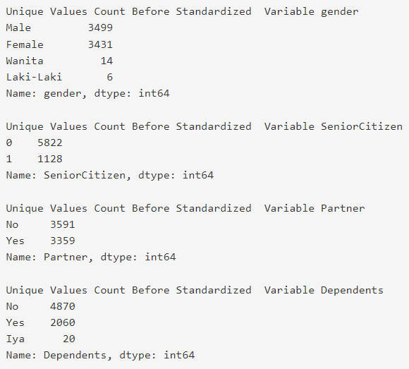
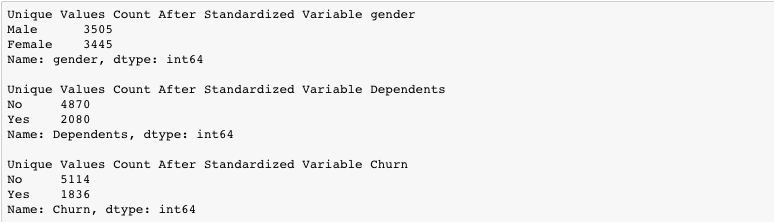

# Mendeteksi Nilai yang tidak Standar
Mendeteksi apakah ada nilai-nilai dari variable kategorik yang tidak standard. Hal ini biasanya terjadi dikarenakan kesalahan input data. Perbedaan istilah menjadi salah satu faktor yang sering terjadi, untuk itu dibutuhkan standardisasi dari data yang sudah ter-input.

Gunakan fungsi `value_counts()` untuk melihat jumlah data unique per variable-nya.

Adapun potongan dari hasil yang diharapkan adalah sebagai berikut:

Notes: Pada gambar hanya ditampilkan sebagian output yang diharapkan.

| Code  |               Title              	|
|:----:	|:--------------------------------:	|
| [📜](https://github.com/bayubagusbagaswara/dqlab-data-engineer/blob/master/8-Data-Science-in-Telco-Data-Cleansing/6-Menstandarisasi-Nilai/MendeteksiNilaiYangTidakStandar.py) | Mendeteksi Nilai yang tidak Standar |

# Menstandarisasi Variable Kategorik
Setelah kita mengeteahui variable mana saja yang ada nilai tidak standard, maka kita standardkan dengan pola terbanyak nya, dengan syarat tanpa mengubah maknanya. Contoh : Iya -> Yes Kemudian liat kembali unique values dari masing-masing variable yang sudah di ubah. Gunakan fungsi `replace()` untuk menstandardkan nilai.

Berikut hasil yang diharapkan:

| Code  |               Title              	|
|:----:	|:--------------------------------:	|
| [📜](https://github.com/bayubagusbagaswara/dqlab-data-engineer/blob/master/8-Data-Science-in-Telco-Data-Cleansing/6-Menstandarisasi-Nilai/MenstandarisasiVariableKategorik.py) | Menstandarisasi Variable Kategorik |

# Kesimpulan

Ketika kita amati lebih jauh dari jumlah unique value dari masing-masing variable kategorik, terlihat jelas bahwa ada beberapa variable yang tidak standar. Variable itu adalah:

- Gender (Female, Male, Wanita, Laki-Laki), yang bisa di standardkan nilainya menjadi (Female, Male) karena mempunyai makna yang sama.
- Dependents (Yes, No, Iya), yang bisa di standardkan nilainya menjadi (Yes, No) karena mempunyai makna yang sama.
- Churn (Yes, No, Churn), yang bisa di standardkan nilainya menjadi (Yes, No) karena mempunyai makna yang sama.

Setelah kita standardkan nilainya, dan kita amati kembali bentuk datanya, sudah terstandar dengan baik untuk unique value-nya.